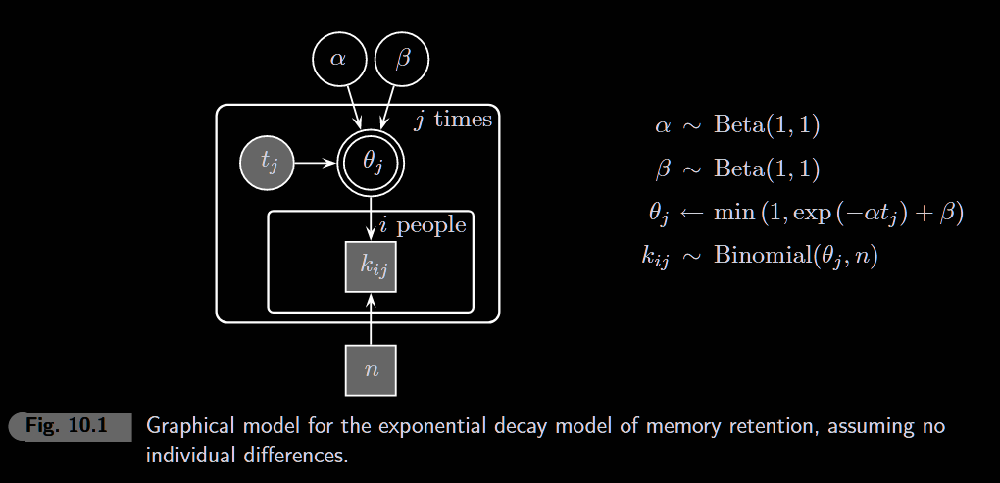
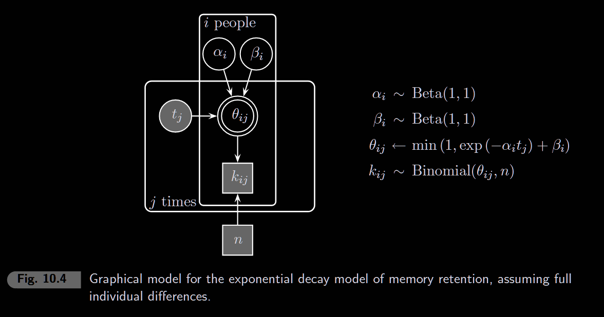
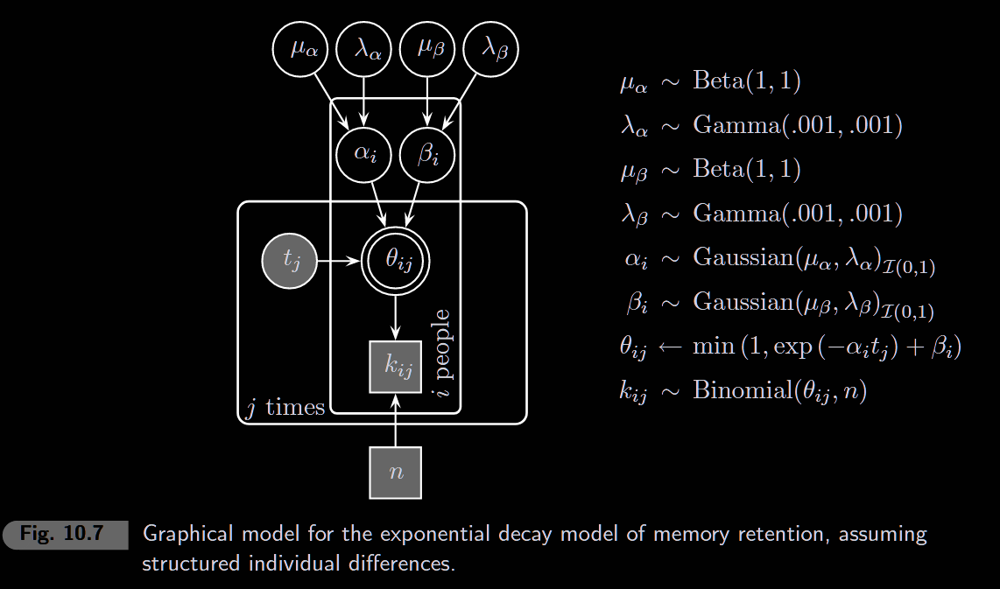

```{r setup, include=FALSE}
knitr::opts_chunk$set(echo = TRUE, warning = FALSE, message = FALSE)
```

```{r}
library(rjags)
library(coda)
library(ggplot2)
library(tidyverse)
library(patchwork)
```

------------------------------------------------------------------------

## Memory Retention Model

Memory decays over time following a classic "forgetting curve" - rapid initial forgetting that levels off to some baseline. We model this with an exponential decay function:

$$\theta(t) = \exp(-\alpha \cdot t) + \beta$$

-   **α** (alpha): Decay rate - how fast forgetting happens
-   **β** (beta): Asymptote - long-term retention level

```{r retention-function, fig.width=6, fig.height=3}
retention <- function(t, alpha, beta) pmin(1, exp(-alpha * t) + beta)

ggplot(data.frame(t = seq(0, 100, 0.5)), aes(x = t)) +
  stat_function(fun = ~retention(.x, 0.05, 0.2), aes(color = "α=0.05, β=0.2")) +
  stat_function(fun = ~retention(.x, 0.1, 0.2), aes(color = "α=0.10, β=0.2")) +
  stat_function(fun = ~retention(.x, 0.05, 0.4), aes(color = "α=0.05, β=0.4")) +
  labs(x = "Time", y = "Retention θ(t)", color = NULL) +
  ylim(0, 1) +
  theme_minimal()
```

------------------------------------------------------------------------

# 10.1 No individual differences



```{r data}
t <- c(1, 2, 4, 7, 12, 21, 35, 59, 99, 200)
nt <- length(t)
ns <- 4
n <- 18

k <- matrix(c(
  18, 18, 16, 13, 9, 6, 4, 4, 4, NA,
  17, 13,  9,  6, 4, 4, 4, 4, 4, NA,
  14, 10,  6,  4, 4, 4, 4, 4, 4, NA,
  NA, NA, NA, NA,NA,NA,NA,NA,NA, NA
), nrow = ns, ncol = nt, byrow = TRUE)
```

### JAGS Model

$$\theta(t) = \exp(-\alpha \cdot t) + \beta$$

```{r model}
model_string <- "
model {
  for (i in 1:ns) {
    for (j in 1:nt) {
       theta[i,j] <- min(1, exp(-alpha*t[j]) + beta)
       k[i,j] ~ dbin(theta[i,j], n)
       predk[i,j] ~ dbin(theta[i,j], n)
    }
  }

  alpha ~ dbeta(1, 1)
  beta ~ dbeta(1, 1)
}
"
```

### Run MCMC

```{r mcmc, results='hide'}
model <- jags.model(
  textConnection(model_string),
  data = list(k = k, n = n, t = t, ns = ns, nt = nt),
  inits = list(alpha = 0.5, beta = 0.1),
  n.chains = 1
)

samples <- coda.samples(model, c("alpha", "beta", "predk"), n.iter = 10000)
```

```{r joint-posterior, fig.width=2, fig.height=2}
posterior_df <- as.data.frame(as.matrix(samples))

ggplot(posterior_df, aes(x = alpha, y = beta)) +
  geom_point(alpha = 0.1, size = 0.5) +
  xlim(0, 1) + ylim(0, 1) +
  theme_minimal()
```

### Posterior Predictive Check

We generate `predk` predictions from the model and compare them to observed data `k`. If the model fits well, observed values should fall within the predicted distribution.

```{r posterior-predictive, fig.width=10, fig.height=3}
samples_matrix <- as.matrix(samples)

# Build data frame with observed and predicted intervals
pred_df <- expand.grid(subject = 1:4, time_idx = 1:9) %>%
  rowwise() %>%
  mutate(
    observed = k[subject, time_idx],
    pred = list(samples_matrix[, paste0("predk[", subject, ",", time_idx, "]")]),
    lower = quantile(unlist(pred), 0.025),
    upper = quantile(unlist(pred), 0.975)
  ) %>%
  ungroup() %>%
  select(-pred)

ggplot(pred_df, aes(x = time_idx)) +
  geom_errorbar(aes(ymin = lower, ymax = upper), width = 0.3, color = "gray50") +
  geom_point(aes(y = observed), size = 2) +
  geom_line(aes(y = observed)) +
  facet_wrap(~paste("Subject", subject), nrow = 1) +
  scale_x_continuous(breaks = 1:9, labels = t[1:9]) +
  ylim(0, 18) +
  labs(x = "Time Lag", y = "Retention Count") +
  theme_minimal() +
  theme(axis.text.x = element_text(size = 7))
```

# 10.2 Full individual differences



Now each subject has their own α and β parameters: α[i] and β[i].

### JAGS Model

```{r model2}
model_string2 <- "
model {
  for (i in 1:ns) {
  alpha[i] ~ dbeta(1, 1)
  beta[i] ~ dbeta(1, 1)
    for (j in 1:nt) {
       theta[i,j] <- min(1, exp(-alpha[i]*t[j]) + beta[i])
       k[i,j] ~ dbin(theta[i,j], n)
       predk[i,j] ~ dbin(theta[i,j], n)
    }
  }

}
"
```

### Run MCMC

```{r mcmc2, results='hide'}
model2 <- jags.model(
  textConnection(model_string2),
  data = list(k = k, n = n, t = t, ns = ns, nt = nt),
  inits = list(alpha = rep(0.5, ns), beta = rep(0.1, ns)),
  n.chains = 1
)

samples2 <- coda.samples(model2, c("alpha", "beta", "predk"), n.iter = 10000)
```

```{r joint-posterior2, fig.width=5, fig.height=3}
posterior_df2 <- as.data.frame(as.matrix(samples2))

# Plot each subject's alpha vs beta
df_plot <- data.frame(
  alpha = c(posterior_df2$`alpha[1]`, posterior_df2$`alpha[2]`,
            posterior_df2$`alpha[3]`, posterior_df2$`alpha[4]`),
  beta = c(posterior_df2$`beta[1]`, posterior_df2$`beta[2]`,
           posterior_df2$`beta[3]`, posterior_df2$`beta[4]`),
  subject = rep(1:4, each = nrow(posterior_df2))
)

ggplot(df_plot, aes(x = alpha, y = beta, color = factor(subject))) +
  geom_point(alpha = 0.05, size = 0.5) +
  xlim(0, 1) + ylim(0, 1) +
  labs(color = "Subject") +
  theme_minimal()
```

### Posterior Predictive Check

```{r posterior-predictive2, fig.width=10, fig.height=3}
samples_matrix2 <- as.matrix(samples2)

pred_df2 <- expand.grid(subject = 1:4, time_idx = 1:9) %>%
  rowwise() %>%
  mutate(
    observed = k[subject, time_idx],
    pred = list(samples_matrix2[, paste0("predk[", subject, ",", time_idx, "]")]),
    lower = quantile(unlist(pred), 0.025),
    upper = quantile(unlist(pred), 0.975)
  ) %>%
  ungroup() %>%
  select(-pred)

ggplot(pred_df2, aes(x = time_idx)) +
  geom_errorbar(aes(ymin = lower, ymax = upper), width = 0.3, color = "gray50") +
  geom_point(aes(y = observed), size = 2) +
  geom_line(aes(y = observed)) +
  facet_wrap(~paste("Subject", subject), nrow = 1) +
  scale_x_continuous(breaks = 1:9, labels = t[1:9]) +
  ylim(0, 18) +
  labs(x = "Time Lag", y = "Retention Count") +
  theme_minimal() +
  theme(axis.text.x = element_text(size = 7))
```

"**Exercise 10.2.1** What are the relative strengths and weaknesses of the full individual differences model and the no individual differences model?"

-   "The no individual differences model is able to use all of the available subjects’ data to make inferences and, by assumption, can make predictions about new subjects (because they are assumed to be the same.) The full individual differences model allows for any sort of variability between subjects, but requires that subject to provide data to make inferences and predictions about them, because each subject is a completely new and surprising instantiation of the memory retention model."

# 10.3 Structured individual differences

A hierarchical model: individual parameters α[i] and β[i] are drawn from group-level distributions. This allows **shrinkage** - subjects with less data borrow strength from the group.

### JAGS Model

```{r model3}
model_string3 <- "
model {
  for (i in 1:ns) {
    alpha[i] ~ dnorm(alphamu, alphalambda)T(0,)
    beta[i] ~ dnorm(betamu, betalambda)T(0,)
    for (j in 1:nt) {
       theta[i,j] <- min(1, exp(-alpha[i]*t[j]) + beta[i])
       k[i,j] ~ dbin(theta[i,j], n)
       predk[i,j] ~ dbin(theta[i,j], n)
    }
  }
  alphamu ~ dbeta(1, 1)
  alphalambda ~ dgamma(0.001, 0.001)T(0.001,)
  betamu ~ dbeta(1, 1)
  betalambda ~ dgamma(0.001, 0.001)T(0.001,)
}
"
```

### Run MCMC

```{r mcmc3, results='hide'}
model3 <- jags.model(
  textConnection(model_string3),
  data = list(k = k, n = n, t = t, ns = ns, nt = nt),
  inits = list(
    alphamu = 0.5, alphalambda = 1,
    betamu = 0.5, betalambda = 1,
    alpha = rep(0.5, ns), beta = rep(0.1, ns)
  ),
  n.chains = 1
)

samples3 <- coda.samples(model3, c("alpha", "beta", "predk"), n.iter = 10000)
```

```{r joint-posterior3, fig.width=6, fig.height=4}
posterior_df3 <- as.data.frame(as.matrix(samples3))

df_plot3 <- data.frame(
  alpha = c(posterior_df3$`alpha[1]`, posterior_df3$`alpha[2]`,
            posterior_df3$`alpha[3]`, posterior_df3$`alpha[4]`),
  beta = c(posterior_df3$`beta[1]`, posterior_df3$`beta[2]`,
           posterior_df3$`beta[3]`, posterior_df3$`beta[4]`),
  subject = rep(1:4, each = nrow(posterior_df3))
)

ggplot(df_plot3, aes(x = alpha, y = beta, color = factor(subject))) +
  geom_point(alpha = 0.05, size = 0.5) +
  xlim(0, 1) + ylim(0, 1) +
  labs(color = "Subject") +
  theme_minimal()
```

### Posterior Predictive Check

```{r posterior-predictive3, fig.width=10, fig.height=3}
samples_matrix3 <- as.matrix(samples3)

pred_df3 <- expand.grid(subject = 1:4, time_idx = 1:9) %>%
  rowwise() %>%
  mutate(
    observed = k[subject, time_idx],
    pred = list(samples_matrix3[, paste0("predk[", subject, ",", time_idx, "]")]),
    lower = quantile(unlist(pred), 0.025),
    upper = quantile(unlist(pred), 0.975)
  ) %>%
  ungroup() %>%
  select(-pred)

ggplot(pred_df3, aes(x = time_idx)) +
  geom_errorbar(aes(ymin = lower, ymax = upper), width = 0.3, color = "gray50") +
  geom_point(aes(y = observed), size = 2) +
  geom_line(aes(y = observed)) +
  facet_wrap(~paste("Subject", subject), nrow = 1) +
  scale_x_continuous(breaks = 1:9, labels = t[1:9]) +
  ylim(0, 18) +
  labs(x = "Time Lag", y = "Retention Count") +
  theme_minimal() +
  theme(axis.text.x = element_text(size = 7))
```

## 10.3.1 Modified Model (No Truncation)

### Understanding phi() and probit

```{r phi-plot, fig.width=8, fig.height=3}
x <- seq(-4, 4, 0.1)

df_transforms <- data.frame(
  x = x,
  phi = pnorm(x),
  logistic = plogis(x)
)

p1 <- ggplot(df_transforms, aes(x = x)) +
  geom_line(aes(y = phi, color = "phi"), linewidth = 1) +
  geom_line(aes(y = logistic, color = "ilogit"), linewidth = 1, linetype = "dashed") +
  labs(x = "Unbounded x", y = "Transformed", color = NULL,
       title = "(-∞,+∞) → (0,1)") +
  theme_minimal()

p2 <- ggplot(data.frame(x = c(0.01, 0.99)), aes(x = x)) +
  stat_function(fun = qnorm, aes(color = "probit"), linewidth = 1) +
  stat_function(fun = qlogis, aes(color = "logit"), linewidth = 1, linetype = "dashed") +
  labs(x = "p in (0,1)", y = "Transformed", color = NULL,
       title = "(0,1) → (-∞,+∞)") +
  theme_minimal()

p1 + p2
```

| Function         | R           | JAGS        | Direction         |
|------------------|-------------|-------------|-------------------|
| phi (normal CDF) | `pnorm(x)`  | `phi(x)`    | unbounded → (0,1) |
| probit           | `qnorm(p)`  | \-          | (0,1) → unbounded |
| logistic         | `plogis(x)` | `ilogit(x)` | unbounded → (0,1) |
| logit            | `qlogis(p)` | `logit(p)`  | (0,1) → unbounded |

So instead of truncating a normal to [0,1], we sample freely on (-∞,+∞) then transform:

```         
probit_alpha ~ Normal(μ, λ)     # unbounded
alpha = phi(probit_alpha)        # now in (0,1)
```

```{r model3b}
model_string3b <- "
model {
  for (i in 1:ns) {
    probit_alpha[i] ~ dnorm(mu_probit_alpha, lambda_probit_alpha)
    probit_beta[i] ~ dnorm(mu_probit_beta, lambda_probit_beta)
    alpha[i] <- phi(probit_alpha[i]) # we can also use ilogit()
    beta[i] <- phi(probit_beta[i])

    for (j in 1:nt) {
       theta[i,j] <- min(1, exp(-alpha[i]*t[j]) + beta[i])
       k[i,j] ~ dbin(theta[i,j], n)
       predk[i,j] ~ dbin(theta[i,j], n)
    }
  }

  mu_probit_alpha ~ dnorm(0, 1)
  lambda_probit_alpha ~ dgamma(0.1, 0.1)
  mu_probit_beta ~ dnorm(0, 1)
  lambda_probit_beta ~ dgamma(0.1, 0.1)
}
"
```

```{r mcmc3b, results='hide'}
model3b <- jags.model(
  textConnection(model_string3b),
  data = list(k = k, n = n, t = t, ns = ns, nt = nt),
  inits = list(
    mu_probit_alpha = 0, lambda_probit_alpha = 1,
    mu_probit_beta = 0, lambda_probit_beta = 1,
    probit_alpha = rep(0, ns), probit_beta = rep(-1, ns)
  ),
  n.chains = 1
)

samples3b <- coda.samples(model3b, c("alpha", "beta", "predk"), n.iter = 10000)
```

### Compare: Truncated vs Probit

```{r compare-models, fig.width=10, fig.height=4}
df_trunc <- as.data.frame(as.matrix(samples3))
df_probit <- as.data.frame(as.matrix(samples3b))

p1 <- ggplot() +
  geom_density(data = df_trunc, aes(x = `alpha[4]`, fill = "Truncated"), alpha = 0.5) +
  geom_density(data = df_probit, aes(x = `alpha[4]`, fill = "Probit"), alpha = 0.5) +
  labs(title = "Subject 4: α", x = "alpha", fill = "Model") +
  xlim(0, 1) + theme_minimal()

p2 <- ggplot() +
  geom_density(data = df_trunc, aes(x = `beta[4]`, fill = "Truncated"), alpha = 0.5) +
  geom_density(data = df_probit, aes(x = `beta[4]`, fill = "Probit"), alpha = 0.5) +
  labs(title = "Subject 4: β", x = "beta", fill = "Model") +
  xlim(0, 1) + theme_minimal()

p1 + p2
```
