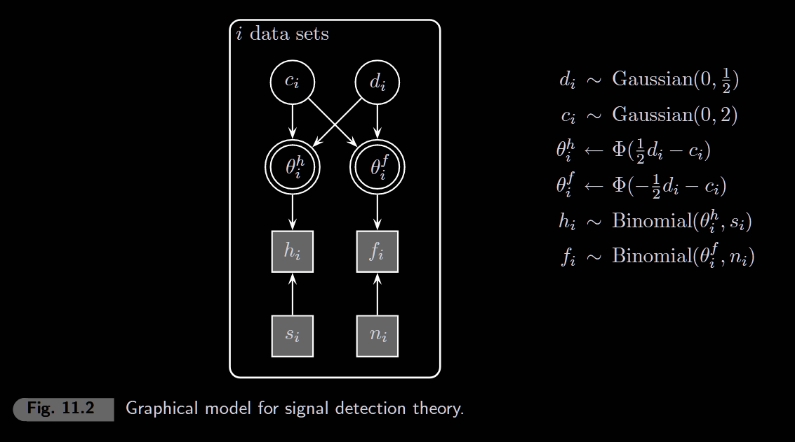
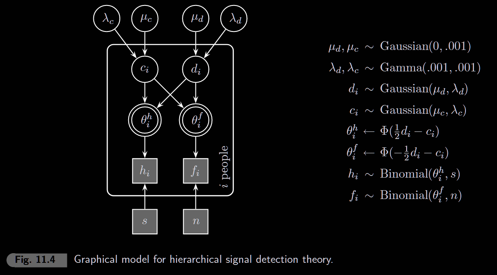
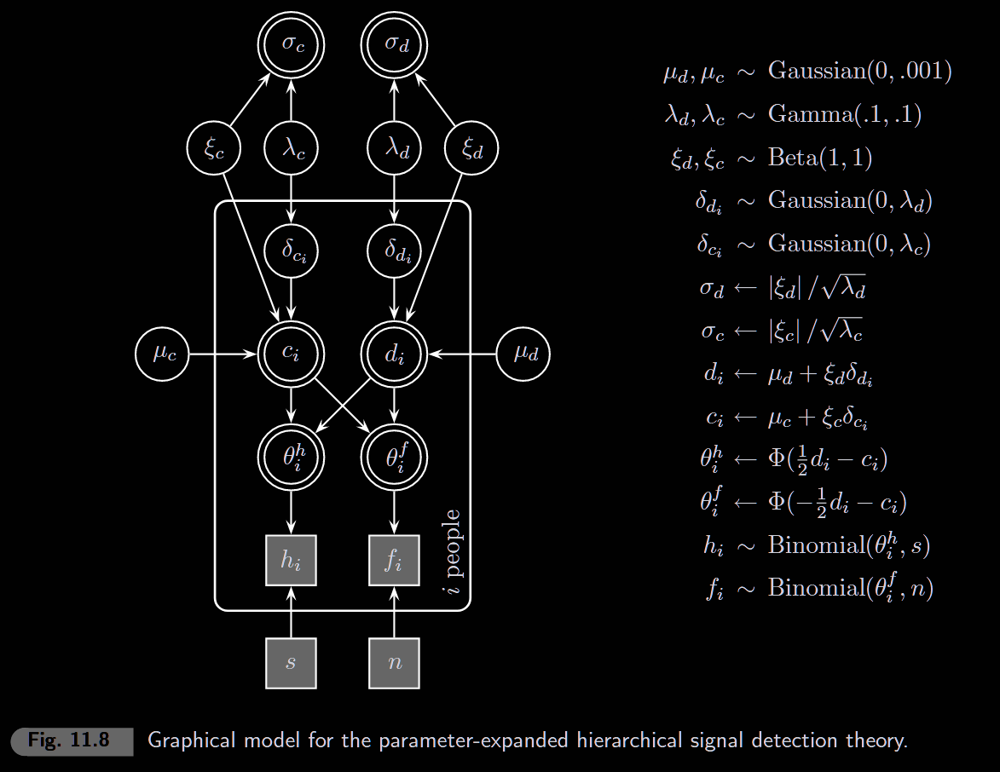

```{r setup, include=FALSE}
knitr::opts_chunk$set(echo = TRUE, warning = FALSE, message = FALSE)
```

```{r}
library(rjags)
library(coda)
library(ggplot2)
library(tidyverse)
library(patchwork)
```

------------------------------------------------------------------------

## Signal Detection Theory (SDT)

SDT separates **sensitivity** (can you tell signal from noise?) from **bias** (tendency to say "yes" or "no").

```{r sdt-diagram, fig.width=8, fig.height=4}
x <- seq(-3, 5, 0.01)
noise <- dnorm(x, 0, 1)
signal <- dnorm(x, 2, 1)  # d' = 2

df <- data.frame(x, noise, signal)

ggplot(df, aes(x = x)) +
  geom_line(aes(y = noise, color = "Noise"), linewidth = 1) +
  geom_line(aes(y = signal, color = "Signal"), linewidth = 1) +
  geom_vline(xintercept = 1, linetype = "dashed", color = "black") +
  annotate("text", x = 1.1, y = 0.35, label = "criterion (c)", hjust = 0) +
  annotate("segment", x = 0, xend = 2, y = 0.42, yend = 0.42,
           arrow = arrow(ends = "both", length = unit(0.1, "inches"))) +
  annotate("text", x = 1, y = 0.44, label = "d'") +
  labs(x = "Internal Response", y = "Probability Density", color = NULL) +
  theme_minimal()
```

**Key terms:**

| Response | Signal Present | Signal Absent          |
|----------|----------------|------------------------|
| "Yes"    | Hit (H)        | False Alarm (F)        |
| "No"     | Miss (M)       | Correct Rejection (CR) |

**Parameters:**

\- **d'** (d-prime): discriminability = distance between distributions

\- **c**: criterion/bias = where you place the decision boundary

**SDT equations (equal-variance Gaussian):** $$\theta_h = \Phi(d'/2 - c) \quad \text{(hit rate)}$$ $$\theta_f = \Phi(-d'/2 - c) \quad \text{(false alarm rate)}$$

------------------------------------------------------------------------

# 11.1 Signal Detection Theory

```{r data}
# Demo dataset: 3 subjects
k <- 3  # number of subjects

# Columns: Hits, False Alarms, Misses, Correct Rejections
data_matrix <- matrix(c(
  70, 50, 30, 50,   # Subject 1
   7,  5,  3,  5,   # Subject 2
  10,  0,  0, 10    # Subject 3
), nrow = k, ncol = 4, byrow = TRUE)

colnames(data_matrix) <- c("Hits", "FA", "Misses", "CR")
rownames(data_matrix) <- paste("Subject", 1:k)

h  <- data_matrix[, 1]  # hits
f  <- data_matrix[, 2]  # false alarms
MI <- data_matrix[, 3]  # misses
CR <- data_matrix[, 4]  # correct rejections

s <- h + MI  # total signal trials
n <- f + CR  # total noise trials

data_matrix
```

### Visualize the Data

```{r plot-data, fig.width=8, fig.height=4}
df_rates <- data.frame(
  subject = rep(1:k, 2),
  rate_type = rep(c("Hit Rate", "FA Rate"), each = k),
  rate = c(h/s, f/n)
)

ggplot(df_rates, aes(x = factor(subject), y = rate, fill = rate_type)) +
  geom_col(position = "dodge") +
  labs(x = "Subject", y = "Rate", fill = NULL) +
  ylim(0, 1) +
  theme_minimal()
```

### JAGS Model



```{r model}
model_string <- "
model {
  # Data
  for (i in 1:k) {
    h[i] ~ dbin(thetah[i], s[i])
    f[i] ~ dbin(thetaf[i], n[i])
  }
  
  
  
  # Priors
  for (i in 1:k) {
    d[i] ~ dnorm(0, 1/2)
    c[i] ~ dnorm(0, 2)
    thetah[i] <- phi(1/2*d[i] - c[i])
    thetaf[i] <- phi(-1/2*d[i] - c[i])
  }
}
"
```

### Run MCMC

```{r mcmc, results='hide'}
model <- jags.model(
  textConnection(model_string),
  data = list(h = h, f = f, s = s, n = n, k = k),
  inits = list(d = rep(0, k), c = rep(0, k)),
  n.chains = 1
)

samples <- coda.samples(model, c("d", "c", "thetah", "thetaf"), n.iter = 10000)
```

```{r plot-posteriors, fig.width=10, fig.height=6}
posterior_df <- as.data.frame(as.matrix(samples))

# d' posteriors
p1 <- ggplot() +
  geom_density(data = posterior_df, aes(x = `d[1]`, fill = "Subject 1"), alpha = 0.4) +
  geom_density(data = posterior_df, aes(x = `d[2]`, fill = "Subject 2"), alpha = 0.4) +
  geom_density(data = posterior_df, aes(x = `d[3]`, fill = "Subject 3"), alpha = 0.4) +
  labs(x = "d' (discriminability)", y = "Density", fill = NULL) +
  theme_minimal()

# c posteriors
p2 <- ggplot() +
  geom_density(data = posterior_df, aes(x = `c[1]`, fill = "Subject 1"), alpha = 0.4) +
  geom_density(data = posterior_df, aes(x = `c[2]`, fill = "Subject 2"), alpha = 0.4) +
  geom_density(data = posterior_df, aes(x = `c[3]`, fill = "Subject 3"), alpha = 0.4) +
  labs(x = "c (bias)", y = "Density", fill = NULL) +
  theme_minimal()

# Hit rate posteriors
p3 <- ggplot() +
  geom_density(data = posterior_df, aes(x = `thetah[1]`, fill = "Subject 1"), alpha = 0.4) +
  geom_density(data = posterior_df, aes(x = `thetah[2]`, fill = "Subject 2"), alpha = 0.4) +
  geom_density(data = posterior_df, aes(x = `thetah[3]`, fill = "Subject 3"), alpha = 0.4) +
  labs(x = "Hit Rate", y = "Density", fill = NULL) +
  xlim(0, 1) +
  theme_minimal()

# FA rate posteriors
p4 <- ggplot() +
  geom_density(data = posterior_df, aes(x = `thetaf[1]`, fill = "Subject 1"), alpha = 0.4) +
  geom_density(data = posterior_df, aes(x = `thetaf[2]`, fill = "Subject 2"), alpha = 0.4) +
  geom_density(data = posterior_df, aes(x = `thetaf[3]`, fill = "Subject 3"), alpha = 0.4) +
  labs(x = "False Alarm Rate", y = "Density", fill = NULL) +
  xlim(0, 1) +
  theme_minimal()

(p1 + p2) / (p3 + p4)
```

# 11.2 Hierarchical signal detection theory

Individual d' and c are drawn from group-level distributions - allows borrowing strength across subjects.

```{r data2}
# Load Heit & Rotello data
source("data/heit_rotello.RData")

# Induction condition
data_i <- std_i
h_i <- data_i[, 1]
f_i <- data_i[, 2]
MI_i <- data_i[, 3]
CR_i <- data_i[, 4]
s_i <- (h_i + MI_i)[1]  # same for all subjects
n_i <- (f_i + CR_i)[1]
k_i <- nrow(data_i)

# Deduction condition
data_d <- std_d
h_d <- data_d[, 1]
f_d <- data_d[, 2]
MI_d <- data_d[, 3]
CR_d <- data_d[, 4]
s_d <- (h_d + MI_d)[1]
n_d <- (f_d + CR_d)[1]
k_d <- nrow(data_d)

cat("Induction:", k_i, "subjects\n")
cat("Deduction:", k_d, "subjects\n")
```

### JAGS Model



```{r model2}
model_string2 <- "
model {
  # Data
  for (i in 1:k) {
    h[i] ~ dbin(thetah[i], s)
    f[i] ~ dbin(thetaf[i], n)
  }
  
  # Priors
  mud ~ dnorm(0, 0.001)
  muc ~ dnorm(0, 0.001)
  lambdad ~ dgamma(0.001, 0.001)
  lambdac ~ dgamma(0.001, 0.001)
  sigmad <- lambdad^(-1/2)
  sigmac <- lambdac^(-1/2)
  
  for (i in 1:k) {
    d[i] ~ dnorm(mud, lambdad)
    c[i] ~ dnorm(muc, lambdac)
    thetah[i] <- phi(1/2*d[i] - c[i])
    thetaf[i] <- phi(-1/2*d[i] - c[i])
  }
}
"
```

### Run MCMC (Induction)

```{r mcmc2i, results='hide'}
# Bad inits: high lambda = low sigma (near 0) - may cause stuck chains
model2i <- jags.model(
  textConnection(model_string2),
  data = list(h = h_i, f = f_i, s = s_i, n = n_i, k = k_i),
  inits = list(d = rep(0, k_i), c = rep(0, k_i), mud = 0, muc = 0, lambdad = 100, lambdac = 100),
  n.chains = 1
)

samples2i <- coda.samples(model2i, c("mud", "muc", "sigmad", "sigmac"), n.iter = 10000)
```

### Run MCMC (Deduction)

```{r mcmc2d, results='hide'}
# Bad inits: high lambda = low sigma (near 0)
model2d <- jags.model(
  textConnection(model_string2),
  data = list(h = h_d, f = f_d, s = s_d, n = n_d, k = k_d),
  inits = list(d = rep(0, k_d), c = rep(0, k_d), mud = 0, muc = 0, lambdad = 100, lambdac = 100),
  n.chains = 1
)

samples2d <- coda.samples(model2d, c("mud", "muc", "sigmad", "sigmac"), n.iter = 10000)
```

### Compare Induction vs Deduction

```{r compare-conditions, fig.width=8, fig.height=6}
df_i <- as.data.frame(as.matrix(samples2i))
df_d <- as.data.frame(as.matrix(samples2d))

p1 <- ggplot() +
  geom_point(data = df_i, aes(x = mud, y = muc, color = "Induction"), alpha = 0.05, size = 0.5) +
  geom_point(data = df_d, aes(x = mud, y = muc, color = "Deduction"), alpha = 0.05, size = 0.5) +
  labs(x = expression(mu[d]), y = expression(mu[c]), color = NULL) +
  theme_minimal()

p2 <- ggplot() +
  geom_density(data = df_i, aes(x = mud, fill = "Induction"), alpha = 0.4) +
  geom_density(data = df_d, aes(x = mud, fill = "Deduction"), alpha = 0.4) +
  labs(x = expression(mu[d]~"(group discriminability)"), fill = NULL) +
  theme_minimal()

p3 <- ggplot() +
  geom_density(data = df_i, aes(x = muc, fill = "Induction"), alpha = 0.4) +
  geom_density(data = df_d, aes(x = muc, fill = "Deduction"), alpha = 0.4) +
  labs(x = expression(mu[c]~"(group bias)"), fill = NULL) +
  theme_minimal()

p1 / (p2 + p3)
```

# 11.3 Parameter expansion

**Problem**: In hierarchical models, mean (μ) and variance (σ²) parameters can be highly correlated, causing slow MCMC mixing.

**Solution**: Reparameterize to break the dependency:

Instead of: `d[i] ~ dnorm(mud, lambdad)`

Use:

```         
deltad[i] ~ dnorm(0, lambdad)
d[i] <- mud + xid * deltad[i]
```

where `xid ~ dbeta(1,1)` is a scaling factor.

### JAGS Model



```{r model3}
model_string3 <- "
model {
  for (i in 1:k) {
    h[i] ~ dbin(thetah[i], s)
    f[i] ~ dbin(thetaf[i], n)
    thetah[i] <- phi(d[i]/2 - c[i])
    thetaf[i] <- phi(-d[i]/2 - c[i])

    # Parameter expansion
    deltad[i] ~ dnorm(0, lambdad)
    deltac[i] ~ dnorm(0, lambdac)
    d[i] <- mud + xid * deltad[i]
    c[i] <- muc + xic * deltac[i]
  }

  # Priors
  mud ~ dnorm(0, 0.001)
  muc ~ dnorm(0, 0.001)
  xid ~ dbeta(1, 1)
  xic ~ dbeta(1, 1)
  lambdad ~ dgamma(0.1, 0.1)
  lambdac ~ dgamma(0.1, 0.1)

  # Actual sigma (two steps for clarity)
  sigmadnew <- 1/sqrt(lambdad)
  sigmacnew <- 1/sqrt(lambdac)
  sigmad <- abs(xid) * sigmadnew
  sigmac <- abs(xic) * sigmacnew
}
"
```

### Run MCMC (Induction)

```{r mcmc3i, results='hide'}
model3i <- jags.model(
  textConnection(model_string3),
  data = list(h = h_i, f = f_i, s = s_i, n = n_i, k = k_i),
  inits = list(
    deltad = rep(0, k_i), deltac = rep(0, k_i),
    xid = 0.5, xic = 0.5,
    mud = 0, muc = 0,
    lambdad = 1, lambdac = 1
  ),
  n.chains = 1
)

samples3i <- coda.samples(model3i, c("mud", "muc", "sigmad", "sigmac"), n.iter = 10000)
```

### Run MCMC (Deduction)

```{r mcmc3d, results='hide'}
model3d <- jags.model(
  textConnection(model_string3),
  data = list(h = h_d, f = f_d, s = s_d, n = n_d, k = k_d),
  inits = list(
    deltad = rep(0, k_d), deltac = rep(0, k_d),
    xid = 0.5, xic = 0.5,
    mud = 0, muc = 0,
    lambdad = 1, lambdac = 1
  ),
  n.chains = 1
)

samples3d <- coda.samples(model3d, c("mud", "muc", "sigmad", "sigmac"), n.iter = 10000)
```

### The "Stuck at Zero" Problem

In hierarchical models, σ can get trapped near 0:

1.  **Small σ** → all individual d[i] forced close to group mean μd
2.  **d[i] ≈ μd** → posterior evidence for even smaller σ
3.  **Feedback loop** → σ stays stuck at 0

**Parameter expansion breaks this** by reparameterizing:

\- Instead of `d[i] ~ dnorm(mud, lambda)`

\- Use `d[i] = mud + xi * delta[i]` where `delta[i] ~ dnorm(0, lambda)`

The scaling factor `xi ~ dbeta(1,1)` separates the mean from the variance, breaking the μ-σ dependency that causes the sampler to get stuck.

### Trace Plots: Standard vs Expanded

```{r trace-plots, fig.width=10, fig.height=6}
df_3i <- as.data.frame(as.matrix(samples3i))
df_3d <- as.data.frame(as.matrix(samples3d))

# Trace for sigmac only
df_trace <- rbind(
  data.frame(iter = 1:nrow(df_i), sigmac = df_i$sigmac, model = "11.2 Standard"),
  data.frame(iter = 1:nrow(df_3i), sigmac = df_3i$sigmac, model = "11.3 Expanded")
)

ggplot(df_trace, aes(x = iter, y = sigmac)) +
  geom_line(alpha = 0.5) +
  facet_wrap(~model, ncol = 1) +
  labs(x = "Iteration", y = expression(sigma[c]),
       title = "Trace plots: σc - look for stuck chains near 0") +
  theme_minimal()
```
