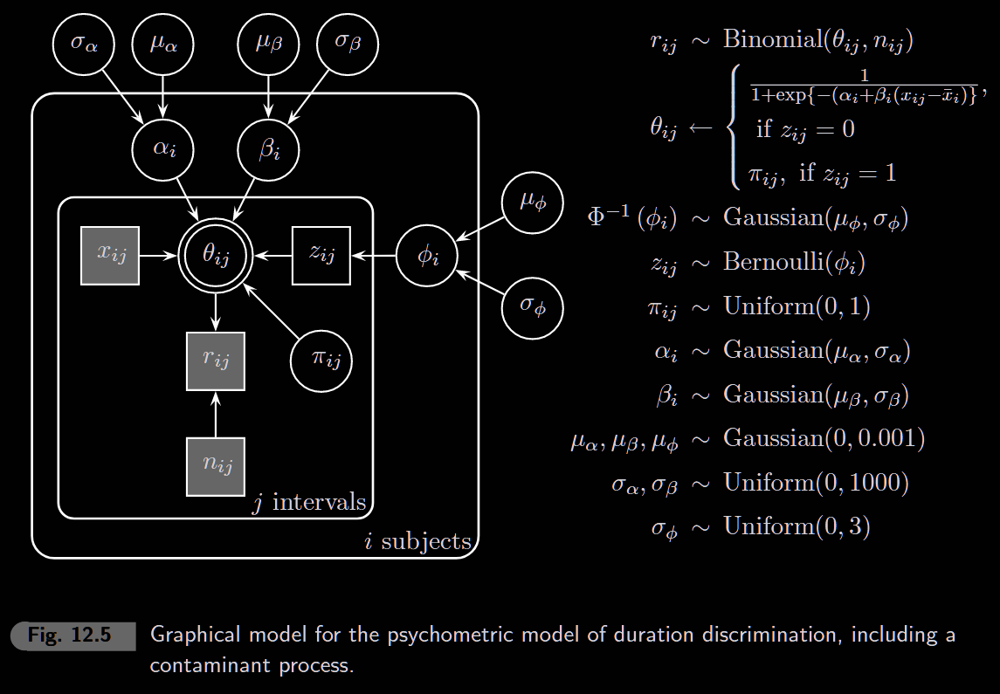

```{r setup, include=FALSE}
knitr::opts_chunk$set(echo = TRUE, warning = FALSE, message = FALSE)
library(rjags)
library(coda)
library(ggplot2)
library(tidyverse)
```

## What is a Psychometric Function?

A **psychometric function** describes how the probability of a response changes with stimulus intensity. It's the fundamental tool in psychophysics for measuring perception thresholds.

**Example Task:** A participant hears a standard tone (300ms) and a test tone. They report whether the test was "longer" or "shorter" than the standard.

```{r psychometric-concept, fig.width=8, fig.height=4}
# Parameters 
alpha <- 1
beta <- 0.3
xbar <- 0  # reference point

# Compute PSE and JND from parameters
pse <- xbar - alpha / beta        # where P = 0.5
jnd <- log(0.84 / 0.16) / beta    # stimulus change for 50% -> 84%

# Generate curve
x_seq <- seq(-10, 10, 0.01)
p <- 1 / (1 + exp(-(alpha + beta * (x_seq - xbar))))

ggplot(data.frame(x = x_seq, p = p), aes(x, p)) +
  geom_line(linewidth = 1.2) +
  geom_hline(yintercept = c(0.5, 0.84), linetype = "dashed", alpha = 0.5) +
  geom_vline(xintercept = c(pse, pse + jnd), linetype = "dashed", alpha = 0.5) +
  labs(x = "Test Interval (ms)", y = "P('Long' response)",
       title = paste0("PSE = ", round(pse), ", JND = ", round(jnd))) +
  theme_minimal()
```

**Key Parameters:**

-   **PSE** (Point of Subjective Equality): Stimulus level where P = 0.5 (perceived as equal to standard)
-   **JND** (Just Noticeable Difference): Stimulus change needed to go from 50% to 84% (one standard deviation in the underlying distribution)
-   **α** (alpha): Controls horizontal position (related to PSE)
-   **β** (beta): Controls steepness (related to sensitivity/JND)

**The Logistic Function:**

$$\psi(x) = \frac{1}{1 + e^{-(\alpha + \beta(x - \bar{x}))}}$$

This is equivalent to: $\text{logit}(\psi) = \alpha + \beta(x - \bar{x})$

------------------------------------------------------------------------

## 12.1 Psychophysical Functions

### Data

Eight subjects performed a time interval discrimination task comparing test intervals to a 300ms standard.

```{r load-data}
# Load data matrices (8 subjects, up to 28 stimulus levels)
x <- as.matrix(read.table("data/data_x.txt", sep = "\t"))      # stimulus values
n <- as.matrix(read.table("data/data_n.txt", sep = "\t"))      # number of trials
r <- as.matrix(read.table("data/data_r.txt", sep = "\t"))      # number of "long" responses
rprop <- as.matrix(read.table("data/data_rprop.txt", sep = "\t"))  # proportion "long"

nsubjs <- 8
nstim <- c(27, 24, 27, 22, 25, 26, 28, 28)  # stimuli per subject
xmean <- c(318.888, 311.0417, 284.4444, 301.5909,
           296.2000, 305.7692, 294.6429, 280.3571)
```

### Plot Raw Data

```{r plot-raw-data, fig.width=10, fig.height=5}
df_list <- list()
for (i in 1:nsubjs) {
  df_list[[i]] <- data.frame(
    subject = i,
    x = x[i, 1:nstim[i]],
    prop = rprop[i, 1:nstim[i]]
  )
}
df_raw <- bind_rows(df_list)

ggplot(df_raw, aes(x, prop)) +
  geom_point(size = 2, alpha = 0.7) +
  facet_wrap(~subject, nrow = 2, labeller = label_both) +
  labs(x = "Test Interval (ms)", y = "Proportion 'Long'") +
  theme_minimal()
```

### Model

```{r model-12-1}
model_string <- "
 model {
    for (i in 1:nsubjs) {
      alpha[i] ~ dnorm(mua, lambdaa)
      beta[i] ~ dnorm(mub, lambdab)
      for (j in 1:nstim[i]) {
        r[i,j] ~ dbin(theta[i,j], n[i,j])
        logit(theta[i,j]) <- alpha[i] + beta[i] * (x[i,j] - xmean[i])
      }
    }
    mua ~ dnorm(0, 0.001)
    mub ~ dnorm(0, 0.001)
    sigmaa ~ dunif(0, 1000)
    sigmab ~ dunif(0, 1000)
    lambdaa <- pow(sigmaa, -2)
    lambdab <- pow(sigmab, -2)
  }
"

# Initial values (sensitive - need good starting points)
set.seed(10)
inits <- list(
  mua = 0, mub = 0, sigmaa = 1, sigmab = 1,
  alpha = runif(nsubjs, -2, 2),
  beta = runif(nsubjs, 0, 0.5)
)

# Run model
model <- jags.model(
  textConnection(model_string),
  data = list(x = x, n = n, r = r, nsubjs = nsubjs, nstim = nstim, xmean = xmean),
  inits = inits,
  n.chains = 1
)

update(model, 1000)

samples <- coda.samples(
  model,
  variable.names = c("alpha", "beta"),
  n.iter = 5000
)
```

### Plot Fitted Psychometric Functions

```{r plot-fitted, fig.width=10, fig.height=5}
# Extract posterior means
posterior <- as.matrix(samples)
alpha_mean <- colMeans(posterior[, grep("alpha", colnames(posterior))])
beta_mean <- colMeans(posterior[, grep("beta", colnames(posterior))])

# Generate fitted curves
df_fit_list <- list()
for (i in 1:nsubjs) {
  x_seq <- seq(x[i, 1], x[i, nstim[i]], length.out = 100)
  logit_p <- alpha_mean[i] + beta_mean[i] * (x_seq - xmean[i])
  p <- 1 / (1 + exp(-logit_p))
  df_fit_list[[i]] <- data.frame(subject = i, x = x_seq, p = p)
}
df_fit <- bind_rows(df_fit_list)

ggplot() +
  geom_point(data = df_raw, aes(x, prop), size = 2, alpha = 0.5) +
  geom_line(data = df_fit, aes(x, p), color = "blue", linewidth = 1) +
  facet_wrap(~subject, nrow = 2, labeller = label_both) +
  labs(x = "Test Interval (ms)", y = "Proportion 'Long'",
       title = "Fitted Psychometric Functions") +
  theme_minimal()
```

### Calculate JND

```{r calculate-jnd}
# JND = stimulus difference for 50% -> 84% (one SD in logistic)
# For logistic: JND = log(0.84/0.16) / beta

jnd <- log(0.84 / 0.16) / beta_mean
pse <- xmean - alpha_mean / beta_mean  # where P = 0.5

data.frame(
  Subject = 1:8,
  PSE = round(pse, 1),
  JND = round(jnd, 1)
)
```

```{r uncertainty-plot, fig.width=10, fig.height=5}
set.seed(123)
  n_draws <- 100
  idx <- sample(1:nrow(posterior), n_draws)

  # Generate curves for each posterior sample
  df_uncertain <- list()
  for (i in 1:nsubjs) {
    x_seq <- seq(x[i, 1], x[i, nstim[i]], length.out = 100)
    for (k in 1:n_draws) {
      a <- posterior[idx[k], paste0("alpha[", i, "]")]
      b <- posterior[idx[k], paste0("beta[", i, "]")]
      p <- 1 / (1 + exp(-(a + b * (x_seq - xmean[i]))))
      df_uncertain[[length(df_uncertain) + 1]] <- data.frame(
        subject = i, draw = k, x = x_seq, p = p
      )
    }
  }
  df_uncertain <- bind_rows(df_uncertain)

  ggplot() +
    geom_line(data = df_uncertain, aes(x, p, group = draw), color = "grey", alpha = 0.5) +
    geom_point(data = df_raw, aes(x, prop), size = 2) +
    geom_line(data = df_fit, aes(x, p), color = "blue", linewidth = 1) +
    facet_wrap(~subject, nrow = 2, labeller = label_both) +
    labs(x = "Test Interval (ms)", y = "Proportion 'Long'",
         title = "Posterior Uncertainty in Psychometric Functions") +
    theme_minimal()
```

```{r jnd-posterior, fig.width=10, fig.height=5}
  # Compute JND for each posterior sample
  jnd_posterior <- matrix(NA, nrow = nrow(posterior), ncol = nsubjs)
  for (i in 1:nsubjs) {
    alpha_i <- posterior[, paste0("alpha[", i, "]")]
    beta_i <- posterior[, paste0("beta[", i, "]")]
    jnd_posterior[, i] <- log(0.84 / 0.16) / beta_i
  }

  # Convert to long format
  df_jnd <- data.frame(jnd_posterior)
  colnames(df_jnd) <- paste0("Subject ", 1:8)
  df_jnd_long <- pivot_longer(df_jnd, cols = everything(),
                               names_to = "subject", values_to = "jnd")

  ggplot(df_jnd_long, aes(x = jnd)) +
    geom_density(fill = "steelblue", alpha = 0.5) +
    facet_wrap(~subject, nrow = 2, scales = "free_y") +
    coord_cartesian(xlim = c(0, 150)) +
    labs(x = "JND (ms)", y = "Posterior Density",
         title = "Posterior Distributions of JND") +
    theme_minimal()

```

# 12.2 Psychophysical Functions with Contaminants



Sometimes subjects guess randomly (lapse of attention, button error). The **contaminant model** adds:

-   z[i,j] \~ Bernoulli(phi): is trial a contaminant?
-   If z=0: response follows psychometric function
-   If z=1: response is random (Beta(1,1) = uniform)

### Model

```{r model-12-2}
model_contaminant <- "
  model {
    for (i in 1:nsubjs) {
      # Subject-level parameters
      alpha[i] ~ dnorm(mua, lambdaa)   # Intercept for subject i
      beta[i] ~ dnorm(mub, lambdab)   # Slope for subject i
      probitphi[i] ~ dnorm(muphi, lambdaphi)  # Contamination rate (probit scale)
      phi[i] <- phi(probitphi[i])    # Transform to probability (0-1)

      for (j in 1:nstim[i]) {
        # Contamination mechanism
        z[i,j] ~ dbern(phi[i])  # Is this trial contaminated? (0=no, 1=yes)
        z1[i,j] <- z[i,j] + 1   # Convert to index (1=psychometric, 2=random)

        # Two response probabilities
        logit(thetalim[i,j,1]) <- alpha[i] + beta[i] * (x[i,j] - xmean[i])  # Psychometric
        pi[i,j] ~ dbeta(1,1)   # Random probability (uniform 0-1)
        thetalim[i,j,2] <- pi[i,j]   # Store in slot 2

        # Likelihood - pick based on z1
        r[i,j] ~ dbin(thetalim[i,j, z1[i,j]], n[i,j]) # Select slot 1 or 2
      }
    }

    # Hyperpriors for alpha/beta
    mua ~ dnorm(0, 0.001)
    mub ~ dnorm(0, 0.001)
    sigmaa ~ dunif(0, 1000)
    sigmab ~ dunif(0, 1000)
    lambdaa <- pow(sigmaa, -2)
    lambdab <- pow(sigmab, -2)

    # Hyperpriors for contamination rate
    muphi ~ dnorm(0, 1) # Tighter prior than alpha/beta
    sigmaphi ~ dunif(0, 3)
    lambdaphi <- pow(sigmaphi, -2)
  }
  "
```

```{r}
set.seed(10)
inits_contam <- list(
  mua = 0, mub = 0, sigmaa = 1, sigmab = 1,
  mup = 0, sigmap = 1,
  alpha = runif(nsubjs, -2, 2),
  beta = runif(nsubjs, 0, 0.5)
)

model2 <- jags.model(
  textConnection(model_contaminant),
  data = list(x = x, n = n, r = r, nsubjs = nsubjs, nstim = nstim, xmean = xmean),
  inits = inits_contam,
  n.chains = 1
)

update(model2, 1000)

samples2 <- coda.samples(
  model2,
  variable.names = c("alpha", "beta", "z"),
  n.iter = 5000
)
```

### Compare JND Distributions

```{r compare-jnd, fig.width=10, fig.height=5}
posterior2 <- as.matrix(samples2)

# JND from contaminant model
jnd_posterior2 <- matrix(NA, nrow = nrow(posterior2), ncol = nsubjs)
for (i in 1:nsubjs) {
  alpha_i <- posterior2[, paste0("alpha[", i, "]")]
  beta_i <- posterior2[, paste0("beta[", i, "]")]
  jnd_posterior2[, i] <- log(0.84 / 0.16) / beta_i
}

df_jnd_compare <- bind_rows(
  data.frame(jnd_posterior) %>%
    setNames(1:8) %>%
    pivot_longer(everything(), names_to = "subject", values_to = "jnd") %>%
    mutate(model = "Basic"),
  data.frame(jnd_posterior2) %>%
    setNames(1:8) %>%
    pivot_longer(everything(), names_to = "subject", values_to = "jnd") %>%
    mutate(model = "Contaminant")
)

ggplot(df_jnd_compare, aes(x = jnd, fill = model)) +
  geom_density(alpha = 0.5) +
  facet_wrap(~subject, nrow = 2, scales = "free_y") +
  coord_cartesian(xlim = c(0, 150)) +
  scale_fill_manual(values = c("Basic" = "grey50", "Contaminant" = "steelblue")) +
  labs(x = "JND (ms)", y = "Density") +
  theme_minimal()
```

"The changes are most pronounced for subject 4, the subject with a single clear outlier. For subject 4, inclusion of the contaminant process resulted in a different psychometric function, one that is further away from the outlier. A comparison of Figure 12.4 with Figure 12.2 reveals that, for subject 4, inclusion of the contaminant process decreased the JND (the distance between the two vertical dotted lines). Inclusion of the contaminant process did not affect the PSE; at the 50% point, the old and the new psychometric functions are almost identical, even for subject 4." (p.174)
