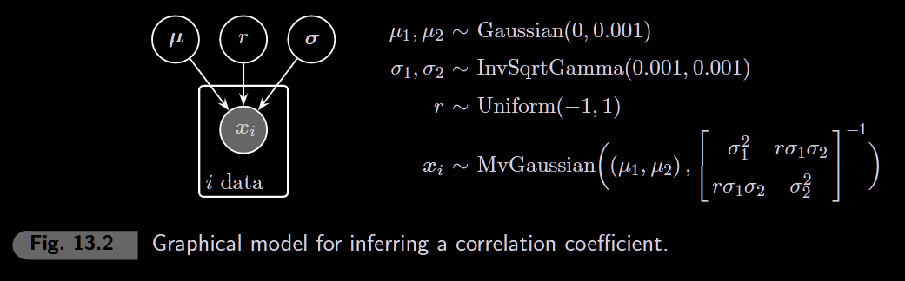
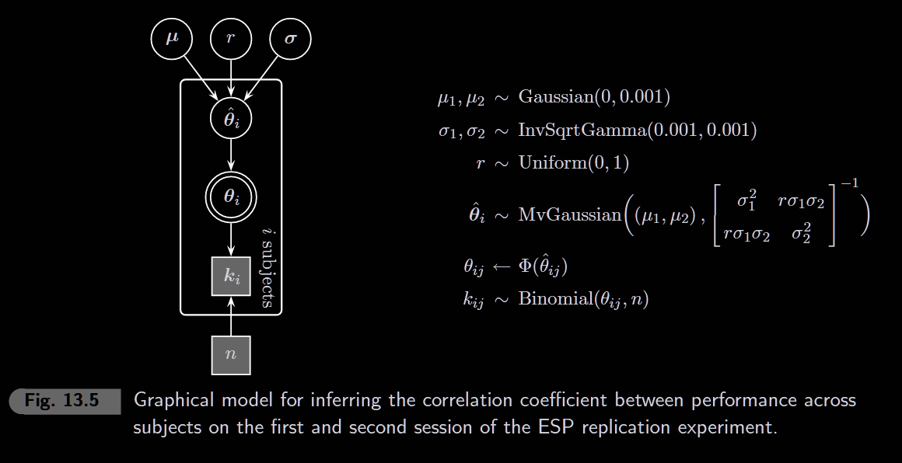

*“What is the principal distinction between Bayesian and classical statistics? It is that Bayesian statistics is fundamentally boring. There is so little to do: just specify the model and the prior, and turn the Bayesian handle. There is no room for clever tricks or an alphabetic cornucopia of definitions and optimality criteria. I have heard people who should know better use this ‘dullness’ as an argument against Bayesianism. One might as well complain that Newton’s dynamics, being based on three simple laws of motion and one of gravitation, is a poor substitute for the richness of Ptolemy’s epicyclic system.” (Dawid, 2000, p. 326)*

```{r setup, include=FALSE}
knitr::opts_chunk$set(echo = TRUE, warning = FALSE, message = FALSE)
library(rjags)
library(coda)
library(ggplot2)
library(tidyverse)
```

## 13.1 Evidence for Optional Stopping

### Background: Bem's ESP Experiments

In 2011, Daryl Bem published a controversial paper claiming evidence for extrasensory perception (ESP). He reported 9 experiments with varying sample sizes and effect sizes.

**The Optional Stopping Hypothesis:** If a researcher uses "optional stopping" (stopping data collection when results become significant), we'd expect a **negative correlation** between sample size (N) and effect size (E):

-   Small N → need large effect to reach significance
-   Large N → even small effects become significant

If this correlation exists, it suggests p-hacking rather than genuine effects.

### Data

```{r data}
# Bem's 9 experiments
N <- c(100, 150, 97, 99, 100, 150, 200, 100, 50)   # Sample sizes
E <- c(0.25, 0.20, 0.25, 0.20, 0.22, 0.15, 0.09, 0.19, 0.42)  # Effect sizes

df_bem <- data.frame(experiment = 1:9, N = N, E = E)
df_bem
```

### Plot: N vs E

```{r plot-ne, fig.width=6, fig.height=5}
ggplot(df_bem, aes(N, E)) +
  geom_point(size = 4) +
  geom_smooth(method = "lm", se = FALSE, linetype = "dashed", color = "grey50") +
  labs(x = "Sample Size (N)", y = "Effect Size (E)",
       title = "Bem's ESP Experiments",
       subtitle = paste("Observed correlation r =", round(cor(N, E), 3))) +
  theme_minimal()
```

### Model: Estimating Correlation



We model the N-E pairs as coming from a bivariate normal distribution and estimate the correlation r.

```{r model-13-1}
model_string <- "
model {
    for (i in 1:n) {
      x[i, 1:2] ~ dmnorm(mu[], TI[,])
    }

    # Priors
    mu[1] ~ dnorm(0, 1)
    mu[2] ~ dnorm(0, 1)
    lambda[1] ~ dgamma(0.001, 0.001)
    lambda[2] ~ dgamma(0.001, 0.001)
    r ~ dunif(-1, 1)

    # Build covariance matrix
    sigma[1] <- 1/sqrt(lambda[1])
    sigma[2] <- 1/sqrt(lambda[2])
    T[1,1] <- 1/lambda[1]
    T[1,2] <- r * sigma[1] * sigma[2]
    T[2,1] <- r * sigma[1] * sigma[2]
    T[2,2] <- 1/lambda[2]
    TI[1:2,1:2] <- inverse(T[1:2,1:2])
}
"

# Prepare data as matrix
x <- cbind(N, E)
n <- nrow(x)

inits <- list(r = 0, mu = c(0, 0), lambda = c(1, 1))

model <- jags.model(
  textConnection(model_string),
  data = list(x = x, n = n),
  inits = inits,
  n.chains = 1
)

update(model, 1000)

samples <- coda.samples(
  model,
  variable.names = c("r", "mu", "sigma"),
  n.iter = 5000
)
```

### Posterior of Correlation

```{r posterior-r, fig.width=6, fig.height=4}
posterior <- as.matrix(samples)
r_samples <- posterior[, "r"]

ggplot(data.frame(r = r_samples), aes(r)) +
  geom_histogram(aes(y = after_stat(density)), bins = 50, fill = "steelblue", alpha = 0.7) +
  geom_vline(xintercept = 0, linetype = "dashed", color = "red") +
  labs(x = "Correlation r", y = "Posterior Density",
       title = "Posterior Distribution of Correlation",
       subtitle = paste("95% CI:", round(quantile(r_samples, 0.025), 2),
                        "to", round(quantile(r_samples, 0.975), 2))) +
  theme_minimal()
```

### Bayes Factor: Evidence Against r = 0

```{r bayes-factor}
# Using Savage-Dickey density ratio
# BF10 = prior(r=0) / posterior(r=0)
library(polspline)

fit_posterior <- logspline(r_samples)
posterior_at_0 <- dlogspline(0, fit_posterior)
prior_at_0 <- 0.5  # Uniform(-1,1) has height 0.5

BF01 <- posterior_at_0 / prior_at_0  # Evidence FOR r=0
BF10 <- prior_at_0 / posterior_at_0  # Evidence AGAINST r=0

cat("Posterior density at r=0:", round(posterior_at_0, 3), "\n")
cat("Prior density at r=0:", prior_at_0, "\n")
cat("BF10 (evidence against r=0):", round(BF10, 2), "\n")
```

## 13.2 Evidence for Differences in Ability

### Background: Individual Differences in ESP

If ESP is real, people should have consistent abilities across trials. We test whether performance on Block 1 predicts performance on Block 2.

**Key Question:** Is there a **positive correlation** between Block 1 and Block 2 accuracy?

-   If yes → individual differences in ESP ability exist
-   If no → performance is random (no stable ability)

### Data

100 participants completed 2 blocks of 15 trials each with erotic pictures.

```{r data-ability}
# Proportion correct on erotic pictures
prc1 <- c(0.6000000, 0.5333333, 0.6000000, 0.6000000, 0.4666667,
          0.6666667, 0.6666667, 0.4000000, 0.6000000, 0.6000000,
          0.4666667, 0.6666667, 0.4666667, 0.6000000, 0.3333333,
          0.4000000, 0.4000000, 0.2666667, 0.3333333, 0.5333333,
          0.6666667, 0.5333333, 0.6000000, 0.4000000, 0.4666667,
          0.7333333, 0.6666667, 0.6000000, 0.6666667, 0.5333333,
          0.5333333, 0.6666667, 0.4666667, 0.3333333, 0.4000000,
          0.5333333, 0.4000000, 0.4000000, 0.3333333, 0.4666667,
          0.4000000, 0.4666667, 0.4666667, 0.5333333, 0.3333333,
          0.7333333, 0.2666667, 0.6000000, 0.5333333, 0.4666667,
          0.4000000, 0.5333333, 0.6666667, 0.4666667, 0.5333333,
          0.5333333, 0.4666667, 0.4000000, 0.4666667, 0.6666667,
          0.4666667, 0.3333333, 0.3333333, 0.3333333, 0.4000000,
          0.4000000, 0.6000000, 0.4666667, 0.3333333, 0.3333333,
          0.6666667, 0.5333333, 0.3333333, 0.6000000, 0.4666667,
          0.4666667, 0.4000000, 0.3333333, 0.4666667, 0.5333333,
          0.8000000, 0.4000000, 0.5333333, 0.5333333, 0.6666667,
          0.6666667, 0.6666667, 0.6000000, 0.6000000, 0.5333333,
          0.3333333, 0.4666667, 0.6666667, 0.5333333, 0.3333333,
          0.3333333, 0.2666667, 0.2666667, 0.4666667, 0.6666667)

prc2 <- c(0.3333333, 0.6000000, 0.5333333, 0.2666667, 0.6666667,
          0.5333333, 0.6666667, 0.4666667, 0.4666667, 0.6666667,
          0.4000000, 0.6666667, 0.2666667, 0.4000000, 0.4666667,
          0.3333333, 0.5333333, 0.6000000, 0.3333333, 0.4000000,
          0.4666667, 0.4666667, 0.6000000, 0.5333333, 0.5333333,
          0.6000000, 0.5333333, 0.6666667, 0.6000000, 0.2666667,
          0.4666667, 0.4000000, 0.6000000, 0.5333333, 0.4000000,
          0.4666667, 0.5333333, 0.3333333, 0.4000000, 0.4666667,
          0.8000000, 0.6000000, 0.2000000, 0.6000000, 0.4000000,
          0.4000000, 0.2666667, 0.2666667, 0.6000000, 0.4000000,
          0.4000000, 0.4000000, 0.4000000, 0.4000000, 0.6666667,
          0.7333333, 0.5333333, 0.5333333, 0.3333333, 0.6000000,
          0.5333333, 0.5333333, 0.4666667, 0.5333333, 0.4666667,
          0.5333333, 0.4000000, 0.4000000, 0.4666667, 0.6000000,
          0.6000000, 0.6000000, 0.4666667, 0.6000000, 0.6666667,
          0.5333333, 0.4666667, 0.6000000, 0.2000000, 0.5333333,
          0.4666667, 0.4000000, 0.5333333, 0.5333333, 0.5333333,
          0.5333333, 0.6000000, 0.6666667, 0.4000000, 0.4000000,
          0.5333333, 0.8000000, 0.6000000, 0.4000000, 0.2000000,
          0.6000000, 0.6666667, 0.4666667, 0.4666667, 0.4666667)

cat("Observed correlation:", round(cor(prc1, prc2), 3), "\n")
```

### Plot: Block 1 vs Block 2

```{r plot-ability, fig.width=6, fig.height=5}
df_ability <- data.frame(Block1 = prc1, Block2 = prc2)

ggplot(df_ability, aes(Block1, Block2)) +
  geom_point(alpha = 0.5) +
  geom_smooth(method = "lm", se = FALSE, linetype = "dashed", color = "grey50") +
  geom_abline(intercept = 0, slope = 1, linetype = "dotted") +
  labs(x = "Block 1 Accuracy", y = "Block 2 Accuracy",
       title = "ESP Ability Correlation",
       subtitle = paste("r =", round(cor(prc1, prc2), 3))) +
  theme_minimal()
```

### Model: Testing Positive Correlation



**Key difference from 13.1:** We test whether r \> 0 (positive correlation only).

Prior: `r ~ dunif(0, 1)` instead of `r ~ dunif(-1, 1)`

```{r model-13-2}
model_string2 <- "
model {
    for (i in 1:nsubjs) {
      thetap[i, 1:2] ~ dmnorm(mu[], TI[,])  # Latent probit ability
      for (j in 1:2) {
        theta[i, j] <- phi(thetap[i, j])    # Transform to probability
        k[i, j] ~ dbin(theta[i, j], ntrials) # Binomial likelihood
      }
    }

    # Priors
    mu[1] ~ dnorm(0, 0.001)
    mu[2] ~ dnorm(0, 0.001)
    lambda[1] ~ dgamma(0.001, 0.001)
    lambda[2] ~ dgamma(0.001, 0.001)
    r ~ dunif(0, 1)  # Only positive correlation

    # Build covariance matrix
    sigma[1] <- 1/sqrt(lambda[1])
    sigma[2] <- 1/sqrt(lambda[2])
    T[1,1] <- 1/lambda[1]
    T[1,2] <- r * sigma[1] * sigma[2]
    T[2,1] <- r * sigma[1] * sigma[2]
    T[2,2] <- 1/lambda[2]
    TI[1:2,1:2] <- inverse(T[1:2,1:2])
}
"

# Prepare data - convert proportions to counts
ntrials <- 15
k <- round(cbind(prc1, prc2) * ntrials)
nsubjs <- nrow(k)

inits2 <- list(r = 0.5, mu = c(0, 0), lambda = c(1, 1))

model2 <- jags.model(
  textConnection(model_string2),
  data = list(k = k, nsubjs = nsubjs, ntrials = ntrials),
  inits = inits2,
  n.chains = 1
)

update(model2, 1000)

samples2 <- coda.samples(
  model2,
  variable.names = c("r"),
  n.iter = 5000
)
```

### Posterior of Positive Correlation

```{r posterior-ability, fig.width=6, fig.height=4}
posterior2 <- as.matrix(samples2)
r_samples2 <- posterior2[, "r"]

ggplot(data.frame(r = r_samples2), aes(r)) +
  geom_histogram(aes(y = after_stat(density)), bins = 50, fill = "steelblue", alpha = 0.7) +
  geom_vline(xintercept = 0, linetype = "dashed", color = "red") +
  labs(x = "Correlation r", y = "Posterior Density",
       title = "Posterior Distribution of Positive Correlation",
       subtitle = paste("95% CI:", round(quantile(r_samples2, 0.025), 2),
                        "to", round(quantile(r_samples2, 0.975), 2))) +
  theme_minimal()
```

### Bayes Factor: Evidence for r = 0

```{r bayes-factor-ability}
# Savage-Dickey: BF = prior(r=0) / posterior(r=0)
fit_posterior2 <- logspline(r_samples2, lbound = 0, ubound = 1)
posterior_at_0_2 <- dlogspline(0, fit_posterior2)
prior_at_0_2 <- 1  # Uniform(0,1) has height 1

BF01_ability <- posterior_at_0_2/ prior_at_0_2

cat("Posterior density at r=0:", round(posterior_at_0_2, 3), "\n")
cat("Prior density at r=0:", prior_at_0_2, "\n")
cat("BF01 (evidence for r = 0):", round(BF01_ability, 2), "\n")
```
