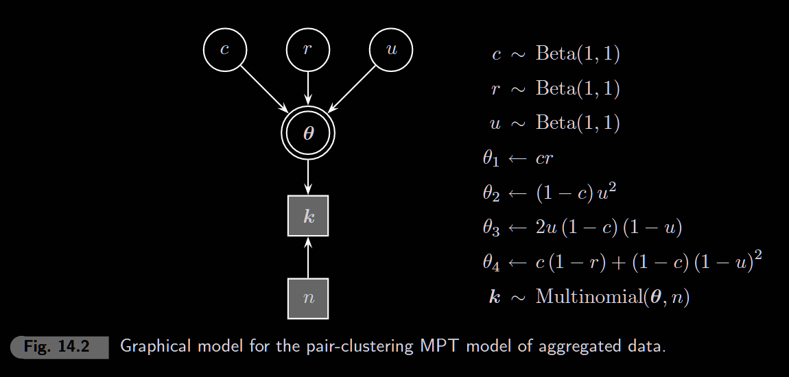

```{r setup, include=FALSE}
knitr::opts_chunk$set(echo = TRUE, warning = FALSE, message = FALSE)
library(rjags)
library(coda)
library(ggplot2)
library(tidyverse)
```

## Introduction to MPT Models

Multinomial Processing Trees (MPTs) are cognitive models that decompose observed categorical responses into underlying latent cognitive processes. Each "branch" of the tree represents a sequence of cognitive events with associated probabilities.

## 14.1 Pair-Clustering in Free Recall

### The Paradigm

Participants study **word pairs** (e.g., "cat-dog", "tree-house") and then freely recall as many words as possible. We observe 4 possible outcomes for each pair:

| Category | Outcome                            | Example                  |
|----------|------------------------------------|--------------------------|
| E1       | Both words recalled adjacently     | "cat dog ... tree house" |
| E2       | Both words recalled non-adjacently | "cat ... tree ... dog"   |
| E3       | Only one word recalled             | "cat ... tree house"     |
| E4       | Neither word recalled              | (missing pair)           |

### The Cognitive Model

The MPT model assumes three latent processes:

-   **c** (clustering): probability the pair is encoded as a cluster
-   **r** (retrieval): probability a cluster is retrieved intact
-   **u** (unit): probability a single word is recalled

### Category Probabilities

From the tree structure:

$$P(E1) = c \cdot r$$ $$P(E2) = (1-c) \cdot u^2$$ $$P(E3) = (1-c) \cdot 2u(1-u)$$ $$P(E4) = c(1-r) + (1-c)(1-u)^2$$

21 participants studied 20 word pairs across multiple trials.

```{r data}
# Aggregated counts across 21 subjects × 20 pairs = 420 total pairs
# Columns: E1 (adjacent), E2 (both non-adjacent), E3 (one word), E4 (neither)

# Trial 1 (first exposure)
k_trial1 <- c(
  E1 = 45,   # Both recalled adjacently
  E2 = 23,   # Both recalled non-adjacently
  E3 = 93,   # One word recalled
  E4 = 259   # Neither recalled
)

# Trial 2
k_trial2 <- c(
  E1 = 104,
  E2 = 34,
  E3 = 103,
  E4 = 179
)

# Trial 6 (after practice)
k_trial6 <- c(
  E1 = 252,
  E2 = 60,
  E3 = 61,
  E4 = 47
)

n <- 420  # Total word pairs (21 subjects × 20 pairs)

# Display data
df_trials <- data.frame(
  Category = c("E1 (both adjacent)", "E2 (both separate)",
               "E3 (one word)", "E4 (neither)"),
  Trial1 = k_trial1,
  Trial2 = k_trial2,
  Trial6 = k_trial6
)
df_trials
```

### Model: Basic MPT



```{r model-14-1}
model_string <- "
model {
    # Category probabilities (from tree structure)
    theta[1] <- c * r    # E1: clustered & retrieved
    theta[2] <- (1-c) * pow(u, 2)  # E2: not clustered, both recalled
    theta[3] <- (1-c) * 2 * u * (1-u)   # E3: not clustered, one recalled
    theta[4] <- c * (1-r) + (1-c) * pow(1-u, 2) # E4: failed retrieval OR neither

    # Likelihood
    k[1:4] ~ dmulti(theta[], n)

    # Priors
    c ~ dbeta(1, 1)
    r ~ dbeta(1, 1)
    u ~ dbeta(1, 1)
}
"

# Function to run model for a given trial
run_mpt <- function(k_data, n) {
  model <- jags.model(textConnection(model_string),
                      data = list(k = k_data, n = n), n.chains = 4, quiet = TRUE)
  update(model, 1000)
  coda.samples(model, variable.names = c("c", "r", "u"), n.iter = 5000)
}

# Run for all three trials
samples_t1 <- run_mpt(k_trial1, n)
samples_t2 <- run_mpt(k_trial2, n)
samples_t6 <- run_mpt(k_trial6, n)
```

### Posterior Distributions

```{r posteriors, fig.width=10, fig.height=3.5}
# Extract posteriors
post_t1 <- as.data.frame(as.matrix(samples_t1))
post_t2 <- as.data.frame(as.matrix(samples_t2))
post_t6 <- as.data.frame(as.matrix(samples_t6))

# Combine for plotting
df_post <- bind_rows(
  post_t1 %>% mutate(Trial = "Trial 1"),
  post_t2 %>% mutate(Trial = "Trial 2"),
  post_t6 %>% mutate(Trial = "Trial 6")
)

# Plot like the book: three panels for c, r, u
p1 <- ggplot(df_post, aes(x = c, color = Trial, linetype = Trial)) +
  geom_density(linewidth = 1) +
  xlim(0, 1) + labs(x = "c (clustering)", y = "Density") +
  theme_minimal() + theme(legend.position = "none")

p2 <- ggplot(df_post, aes(x = r, color = Trial, linetype = Trial)) +
  geom_density(linewidth = 1) +
  xlim(0, 1) + labs(x = "r (retrieval)", y = "") +
  theme_minimal() + theme(legend.position = "none")

p3 <- ggplot(df_post, aes(x = u, color = Trial, linetype = Trial)) +
  geom_density(linewidth = 1) +
  xlim(0, 1) + labs(x = "u (unit recall)", y = "") +
  theme_minimal()

gridExtra::grid.arrange(p1, p2, p3, ncol = 3)
```

### Exercise: Fixing u to a Constant

What happens if we treat u as a "nuisance parameter" and fix it to its posterior mean?

```{r fixed-u}
# Get posterior means of u from full Bayesian analysis
u_mean_t1 <- mean(post_t1$u)
u_mean_t6 <- mean(post_t6$u)

cat("Posterior mean of u:\n")
cat("  Trial 1:", round(u_mean_t1, 3), "\n")
cat("  Trial 6:", round(u_mean_t6, 3), "\n")

# Model with u fixed to constant
model_fixed_u <- "
model {
    theta[1] <- c * r
    theta[2] <- (1-c) * pow(u, 2)
    theta[3] <- (1-c) * 2 * u * (1-u)
    theta[4] <- c * (1-r) + (1-c) * pow(1-u, 2)

    k[1:4] ~ dmulti(theta[], n)

    c ~ dbeta(1, 1)
    r ~ dbeta(1, 1)
    # u is now DATA, not a parameter!
}
"

# Run with fixed u for Trial 1
model_fix1 <- jags.model(textConnection(model_fixed_u),
                         data = list(k = k_trial1, n = n, u = u_mean_t1),
                         n.chains = 4, quiet = TRUE)
update(model_fix1, 1000)
samples_fix1 <- coda.samples(model_fix1, variable.names = c("c", "r"), n.iter = 5000)
post_fix1 <- as.data.frame(as.matrix(samples_fix1))
```

### Compare: Full Bayesian vs Fixed u

```{r compare-approaches, fig.width=8, fig.height=3.5}
# Combine for comparison
df_compare <- bind_rows(
  post_t1 %>% select(c, r) %>% mutate(Approach = "Full Bayesian"),
  post_fix1 %>% mutate(Approach = "Fixed u")
)

p_c <- ggplot(df_compare, aes(x = c, fill = Approach)) +
  geom_density(alpha = 0.5) +
  labs(title = "Posterior of c", x = "c (clustering)") +
  theme_minimal()

p_r <- ggplot(df_compare, aes(x = r, fill = Approach)) +
  geom_density(alpha = 0.5) +
  labs(title = "Posterior of r", x = "r (retrieval)") +
  theme_minimal()

gridExtra::grid.arrange(p_c, p_r, ncol = 2)

# Compare SDs
cat("\nStandard Deviations:\n")
cat("Full Bayesian - c:", round(sd(post_t1$c), 4), "  r:", round(sd(post_t1$r), 4), "\n")
cat("Fixed u       - c:", round(sd(post_fix1$c), 4), "  r:", round(sd(post_fix1$r), 4), "\n")
```

"Plug-in" approaches (substituting point estimates for nuisance parameters) systematically underestimate uncertainty. Fully Bayesian inference properly propagates all sources of uncertainty to the parameters of interest.

## 14.2 Latent-Trait MPT Model

The basic model assumes all subjects share the same (c, r, u). But people differ! The **latent-trait** model gives each subject their own parameters drawn from a group distribution.

### Hierarchical Structure

$$c_i = \Phi(\mu_c + \xi_c \cdot \delta_{c,i})$$ $$r_i = \Phi(\mu_r + \xi_r \cdot \delta_{r,i})$$ $$u_i = \Phi(\mu_u + \xi_u \cdot \delta_{u,i})$$

Where: - $\Phi$ = probit function (maps real line to [0,1]) - $\mu$ = group mean (on probit scale) - $\xi$ = scaling factor for individual differences - $\delta_i$ = individual deviation (from multivariate normal)

### Individual-Level Data

```{r data-individual}
# Riefer et al. (2002) - 21 subjects, 20 word pairs each
# Each row = one subject, columns = [E1, E2, E3, E4]

k_subj_t1 <- matrix(c(
  2,4,4,10, 2,1,3,14, 2,2,5,11, 6,0,4,10, 1,0,4,15,
  1,0,2,17, 1,2,4,13, 4,1,6,9,  5,1,4,10, 1,0,9,10,
  5,0,3,12, 0,1,6,13, 1,5,7,7,  1,1,4,14, 2,2,3,13,
  2,1,5,12, 2,0,6,12, 1,0,5,14, 2,1,8,9,  3,0,2,15,
  1,2,3,14), ncol = 4, byrow = TRUE)

k_subj_t2 <- matrix(c(
  7,5,3,5,  5,2,3,10, 6,2,7,5,  9,4,2,5,  2,2,7,9,
  1,3,3,13, 5,0,5,10, 7,3,4,6,  7,3,6,4,  4,1,10,5,
  9,1,2,8,  3,1,6,10, 3,5,9,3,  2,0,6,12, 8,0,3,9,
  3,2,7,8,  7,1,5,7,  2,1,6,11, 5,3,5,7,  5,0,6,9,
  6,2,2,10), ncol = 4, byrow = TRUE)

k_subj_t6 <- matrix(c(
  14,3,1,2,  12,3,1,4,  18,0,1,1,  15,3,0,2, 7,1,10,2,
  3,6,11,0,  8,4,3,5,   17,1,1,1,  13,4,3,0, 11,6,1,2,
  16,1,2,1,  10,1,3,6,  7,13,0,0,  8,4,3,5,  16,1,1,2,
  5,4,7,4,   15,0,5,0,  6,3,6,5,   17,2,0,1, 17,1,0,2,
  8,3,6,3), ncol = 4, byrow = TRUE)

nsubjs <- 21
n_per_subj <- rep(20, nsubjs)  # 20 word pairs each
nparams <- 3  # c, r, u
I <- diag(nparams)  # Identity matrix for Wishart prior

```

### Model: Latent-Trait MPT

```{r}
model_latent <- "
model {
  for (i in 1:nsubjs) {
    # === Category Probabilities ===
    theta[i,1] <- c[i] * r[i]
    theta[i,2] <- (1-c[i]) * pow(u[i], 2)
    theta[i,3] <- (1-c[i]) * 2 * u[i] * (1-u[i])
    theta[i,4] <- c[i] * (1-r[i]) + (1-c[i]) * pow(1-u[i], 2)

    # === Likelihood ===
    k[i, 1:4] ~ dmulti(theta[i, 1:4], n[i])

    # === Probit Reparameterization ===
    # phi() = standard normal CDF, maps real line -> [0,1]
    c[i] <- phi(muchat + xichat * deltachat[i])
    r[i] <- phi(murhat + xirhat * deltarhat[i])
    u[i] <- phi(muuhat + xiuhat * deltauhat[i])

    # === Joint MVN for Individual Effects (captures correlations) ===
    deltahat[i, 1:nparams] ~ dmnorm(mudeltahat[], SigmaInv[,])
    deltachat[i] <- deltahat[i, 1]
    deltarhat[i] <- deltahat[i, 2]
    deltauhat[i] <- deltahat[i, 3]
  }

  # === Priors ===
  mudeltahat[1] <- 0
  mudeltahat[2] <- 0
  mudeltahat[3] <- 0
  muchat ~ dnorm(0, 1)
  murhat ~ dnorm(0, 1)
  muuhat ~ dnorm(0, 1)
  xichat ~ dunif(0, 100)
  xirhat ~ dunif(0, 100)
  xiuhat ~ dunif(0, 100)
  df <- nparams + 1
  SigmaInv[1:nparams, 1:nparams] ~ dwish(I[,], df)

  # === Derived Quantities ===
  muc <- phi(muchat)
  mur <- phi(murhat)
  muu <- phi(muuhat)
  Sigma[1:nparams, 1:nparams] <- inverse(SigmaInv[,])
  for (i1 in 1:nparams) {
    for (i2 in 1:nparams) {
      rho[i1, i2] <- Sigma[i1, i2] / sqrt(Sigma[i1, i1] * Sigma[i2, i2])
    }
  }
}
"
```

### Run Latent-Trait Model

```{r run-latent, results='hide'}
run_latent_mpt <- function(k_data) {
  model <- jags.model(textConnection(model_latent),
    data = list(k = k_data, n = n_per_subj, nsubjs = nsubjs, nparams = nparams, I = I),
    n.chains = 2, quiet = TRUE)
  update(model, 2000)
  coda.samples(model, variable.names = c("muc", "mur", "muu", "rho"), n.iter = 10000)
}

samples_lt1 <- run_latent_mpt(k_subj_t1)
samples_lt6 <- run_latent_mpt(k_subj_t6)
```

### Posteriors: Group-Level Parameters

```{r plot-latent, fig.width=10, fig.height=3.5}
post_lt1 <- as.data.frame(as.matrix(samples_lt1))
post_lt6 <- as.data.frame(as.matrix(samples_lt6))

df_lt <- bind_rows(
  post_lt1 %>% select(muc, mur, muu) %>% mutate(Trial = "Trial 1"),
  post_lt6 %>% select(muc, mur, muu) %>% mutate(Trial = "Trial 6")
)

p1 <- ggplot(df_lt, aes(x = muc, color = Trial, linetype = Trial)) +
  geom_density(linewidth = 1) + xlim(0, 1) +
  labs(x = "c (clustering)", y = "Density") +
  theme_minimal() + theme(legend.position = "none")

p2 <- ggplot(df_lt, aes(x = mur, color = Trial, linetype = Trial)) +
  geom_density(linewidth = 1) + xlim(0, 1) +
  labs(x = "r (retrieval)", y = "") +
  theme_minimal() + theme(legend.position = "none")

p3 <- ggplot(df_lt, aes(x = muu, color = Trial, linetype = Trial)) +
  geom_density(linewidth = 1) + xlim(0, 1) +
  labs(x = "u (unit recall)", y = "") +
  theme_minimal()

gridExtra::grid.arrange(p1, p2, p3, ncol = 3)
```

### 
