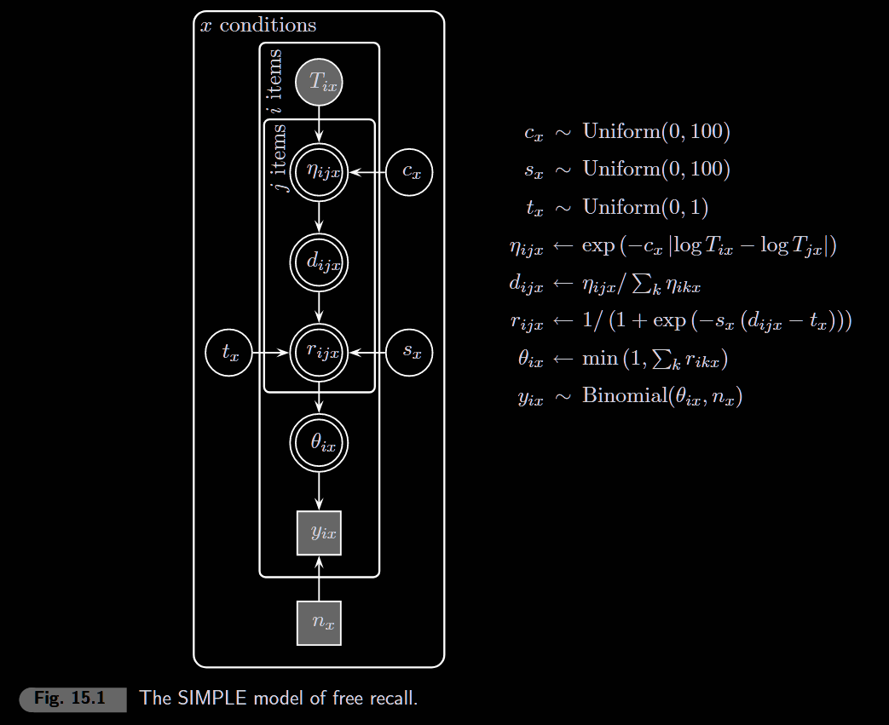
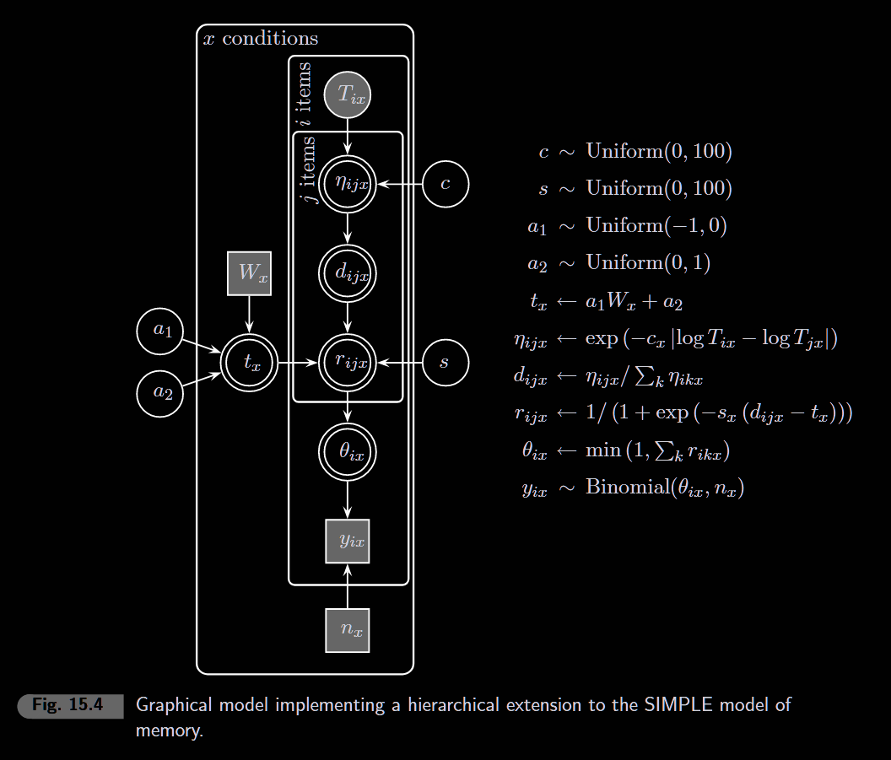

“Faced with a new problem, a classical statistician is free to invent
new estimators, confidence intervals or hypothesis tests . . . In
contrast, there is a unique Bayesian solution to any problem. That is
the posterior distribution, which expresses the investigator’s knowledge
about θ after observing x. The Bayesian statistician’s task is to
identify the posterior distribution as accurately as possible, which
usually entails identifying the prior distribution and the likelihood
and then applying Bayes’ theorem. There is no room for adhockery in
Bayesian statistics.” (O’Hagan & Forster, 2004, p. 19)

```{r setup, include=FALSE}
knitr::opts_chunk$set(echo = TRUE, warning = FALSE, message = FALSE)
library(rjags)
library(coda)
library(ggplot2)
library(tidyverse)
```

## Introduction: Serial Position Effects

When people study a list of words and then recall them freely, they show
characteristic patterns:

-   **Primacy effect**: Better recall for items at the beginning of the
    list
-   **Recency effect**: Better recall for items at the end of the list
-   **Asymmetry**: Recency is typically stronger than primacy

The **SIMPLE** model (Scale-Invariant Memory, Perception, and Learning;
Brown, Neath, & Chater, 2007) explains these effects through temporal
distinctiveness.

## The SIMPLE Model

### Core Idea

Items are represented by their **temporal position** (when they were
presented). Recall depends on how **distinctive** each item is relative
to others.

-   Items close in time are similar → hard to distinguish → worse recall
-   Items far apart in time are distinctive → easy to retrieve → better
    recall

### Model Components

**1. Similarity** between items i and j:
$$\eta_{ij} = e^{-c \cdot |ln(M_i) - ln(M_j)|}$$

Where:

\- $M_i$ = temporal distance of item i from recall

\- $c$ = distinctiveness parameter (higher = faster similarity decay)

**2. Discriminability** of item i when cued by j:
$$D_{ij} = \frac{\eta_{ij}}{\sum_k \eta_{ik}}$$

**3. Response probability** (sigmoid threshold):
$$R_{ij} = \frac{1}{1 + e^{-s(D_{ij} - t)}}$$

Where:

\- $s$ = slope (steepness of response function)

\- $t$ = threshold

**4. Overall recall probability** for item i:
$$\theta_i = \sum_j R_{ij}$$

### Data: Murdock (1962)

Classic free recall data with varying list lengths.

```{r data}
# Counts of correct recalls (y) and proportion correct (pc)
# 6 conditions with different list lengths and presentation rates

# Number of correct recalls per serial position
y <- matrix(c(
  994,806,691,634,634,835,965,1008,1181,1382,rep(0,30),
  794,640,576,512,486,486,512,512,538,640,742,794,1024,1126,1254,rep(0,25),
  836,623,562,517,441,471,441,395,350,441,456,486,456,593,608,684,897,1110,1353,1459,rep(0,20),
  699,410,304,243,258,243,228,213,304,350,395,319,365,410,456,608,958,1170,1277,1474,rep(0,20),
  576,360,240,228,240,240,228,216,240,240,240,240,228,240,216,204,240,228,240,240,264,252,288,324,444,480,660,912,1080,1188,rep(0,10),
  384,256,154,154,141,128,154,154,154,128,179,141,128,141,154,179,154,141,179,128,154,128,154,192,179,166,154,218,218,218,256,256,230,307,384,512,691,922,1114,1254
), nrow = 6, ncol = 40, byrow = TRUE)

# Proportion correct
pc <- matrix(c(
  0.69,0.56,0.48,0.44,0.44,0.58,0.67,0.70,0.82,0.96,rep(0,30),
  0.62,0.50,0.45,0.40,0.38,0.38,0.40,0.40,0.42,0.50,0.58,0.62,0.80,0.88,0.98,rep(0,25),
  0.55,0.41,0.37,0.34,0.29,0.31,0.29,0.26,0.23,0.29,0.30,0.32,0.30,0.39,0.40,0.45,0.59,0.73,0.89,0.96,rep(0,20),
  0.46,0.27,0.20,0.16,0.17,0.16,0.15,0.14,0.20,0.23,0.26,0.21,0.24,0.27,0.30,0.40,0.63,0.77,0.84,0.97,rep(0,20),
  0.48,0.30,0.20,0.19,0.20,0.20,0.19,0.18,0.20,0.20,0.20,0.20,0.19,0.20,0.18,0.17,0.20,0.19,0.20,0.20,0.22,0.21,0.24,0.27,0.37,0.40,0.55,0.76,0.90,0.99,rep(0,10),
  0.30,0.20,0.12,0.12,0.11,0.10,0.12,0.12,0.12,0.10,0.14,0.11,0.10,0.11,0.12,0.14,0.12,0.11,0.14,0.10,0.12,0.10,0.12,0.15,0.14,0.13,0.12,0.17,0.17,0.17,0.20,0.20,0.18,0.24,0.30,0.40,0.54,0.72,0.87,0.98
), nrow = 6, ncol = 40, byrow = TRUE)

# Experimental conditions
n <- c(1440, 1280, 1520, 1520, 1200, 1280)  # Total trials per condition
listlength <- c(10, 15, 20, 20, 30, 40)      # List lengths
lag <- c(2, 2, 2, 1, 1, 1)                    # Presentation rate (seconds)
offset <- c(15, 20, 25, 10, 15, 20)           # Time between last item and recall

dsets <- 6

# Compute temporal distances (M) for each item in each condition
m <- matrix(0, nrow = 6, ncol = 40)
for (x in 1:dsets) {
  # M[i] = time from item i to recall moment
  # Last item has smallest M, first item has largest
  m[x, 1:listlength[x]] <- offset[x] + seq((listlength[x]-1) * lag[x], 0, by = -lag[x])
}

# Transpose for JAGS (positions × conditions)
y <- t(y)
m <- t(m)
pc <- t(pc)
```

### Plot: Serial Position Curves

```{r plot-data, fig.width=10, fig.height=6}
# Prepare data for plotting
df_plot <- data.frame()
for (x in 1:dsets) {
  df_temp <- data.frame(
    Position = 1:listlength[x],
    Proportion = pc[1:listlength[x], x],
    Condition = paste0("List ", listlength[x], " (", lag[x], "s)")
  )
  df_plot <- bind_rows(df_plot, df_temp)
}

ggplot(df_plot, aes(x = Position, y = Proportion)) +
  geom_point() +
  geom_line() +
  facet_wrap(~Condition, scales = "free_x") +
  labs(title = "Serial Position Curves (Murdock, 1962)",
       x = "Serial Position", y = "Probability Correct") +
  theme_minimal() +
  ylim(0, 1)
```

### Model



```{r model-simple}
model_string <- "
model {
  # === Likelihood & Posterior Predictive ===
  for (x in 1:dsets) {
    for (i in 1:listlength[x]) {
      y[i,x] ~ dbin(theta[i,x], n[x])       # Observed data
      predy[i,x] ~ dbin(theta[i,x], n[x])   # Posterior predictive samples
      predpc[i,x] <- predy[i,x] / n[x]      # Convert to proportion
    }
  }

  # === SIMPLE Model Core ===
  for (x in 1:dsets) {
    for (i in 1:listlength[x]) {
      for (j in 1:listlength[x]) {
        sim[i,j,x] <- exp(-c[x] * abs(log(m[i,x]) - log(m[j,x])))
        disc[i,j,x] <- sim[i,j,x] / sum(sim[i, 1:listlength[x], x])
        resp[i,j,x] <- 1 / (1 + exp(-s[x] * (disc[i,j,x] - t[x])))
      }
      theta[i,x] <- min(0.999, sum(resp[i, 1:listlength[x], x]))
    }
  }

  # === Priors ===
  for (x in 1:dsets) {
    c[x] ~ dunif(0, 100)
    s[x] ~ dunif(0, 100)
    t[x] ~ dbeta(1, 1)
  }
}
"

# Run model (this may take a while - complex model)
inits <- list(c = rep(15, dsets), t = rep(0.5, dsets), s = rep(10, dsets))

model <- jags.model(textConnection(model_string),
  data = list(y = y, n = n, m = m, listlength = listlength, dsets = dsets),
  inits = inits, n.chains = 1, quiet = TRUE)

update(model, 1000)

samples <- coda.samples(model,
  variable.names = c("c", "s", "t", "predpc"),
  n.iter = 2000)
```

```{r parameters}
posterior <- as.data.frame(as.matrix(samples))
```

### Model Fit: Posterior Predictive (Book Style)

```{r model-fit, fig.width=10, fig.height=6}
par(mfrow = c(2, 3), mar = c(4, 4, 2, 1))
n_samples <- 20

for (x in 1:dsets) {
  plot(NULL, xlim = c(0, listlength[x] + 1), ylim = c(0, 1),
       xlab = "Serial Position", ylab = "Probability Correct",
       main = paste0("List ", listlength[x], " (", lag[x], "s)"), las = 1)

  # Grey points: posterior predictive samples (with jitter)
  for (i in 1:listlength[x]) {
    predpc_samples <- posterior[[paste0("predpc[", i, ",", x, "]")]]
    idx <- sample(length(predpc_samples), n_samples)
    points(i + runif(n_samples, -0.1, 0.1), predpc_samples[idx],
           col = "grey", pch = 16, cex = 0.6)
  }

  # Black points and line: observed data
  points(1:listlength[x], pc[1:listlength[x], x], pch = 19)
  lines(1:listlength[x], pc[1:listlength[x], x])
}
```

## 15.2 Hierarchical SIMPLE Model

### Core Idea

In 15.1, each condition had its own `c`, `s`, and `t` parameters. But
the threshold `t` seems to vary systematically with list length—longer
lists need lower thresholds for items to be recalled.

The hierarchical model captures this regularity:

-   **Shared** `c` (distinctiveness) and `s` (slope) across all
    conditions
-   **Threshold as linear function of list length**:
    $t_x = a_1 \cdot W_x + a_2$
-   Where $W_x$ is the number of words in condition $x$, and $a_1, a_2$
    are regression coefficients

This allows **generalization** to new list lengths not in the original
data.

### Data with Generalization

```{r data-hierarchical}
# Same Murdock data from 15.1
y_orig <- matrix(c(
  994,806,691,634,634,835,965,1008,1181,1382,rep(0,30),
  794,640,576,512,486,486,512,512,538,640,742,794,1024,1126,1254,rep(0,25),
  836,623,562,517,441,471,441,395,350,441,456,486,456,593,608,684,897,1110,1353,1459,rep(0,20),
  699,410,304,243,258,243,228,213,304,350,395,319,365,410,456,608,958,1170,1277,1474,rep(0,20),
  576,360,240,228,240,240,228,216,240,240,240,240,228,240,216,204,240,228,240,240,264,252,288,324,444,480,660,912,1080,1188,rep(0,10),
  384,256,154,154,141,128,154,154,154,128,179,141,128,141,154,179,154,141,179,128,154,128,154,192,179,166,154,218,218,218,256,256,230,307,384,512,691,922,1114,1254
), nrow = 6, ncol = 40, byrow = TRUE)

pc_orig <- matrix(c(
  0.69,0.56,0.48,0.44,0.44,0.58,0.67,0.70,0.82,0.96,rep(0,30),
  0.62,0.50,0.45,0.40,0.38,0.38,0.40,0.40,0.42,0.50,0.58,0.62,0.80,0.88,0.98,rep(0,25),
  0.55,0.41,0.37,0.34,0.29,0.31,0.29,0.26,0.23,0.29,0.30,0.32,0.30,0.39,0.40,0.45,0.59,0.73,0.89,0.96,rep(0,20),
  0.46,0.27,0.20,0.16,0.17,0.16,0.15,0.14,0.20,0.23,0.26,0.21,0.24,0.27,0.30,0.40,0.63,0.77,0.84,0.97,rep(0,20),
  0.48,0.30,0.20,0.19,0.20,0.20,0.19,0.18,0.20,0.20,0.20,0.20,0.19,0.20,0.18,0.17,0.20,0.19,0.20,0.20,0.22,0.21,0.24,0.27,0.37,0.40,0.55,0.76,0.90,0.99,rep(0,10),
  0.30,0.20,0.12,0.12,0.11,0.10,0.12,0.12,0.12,0.10,0.14,0.11,0.10,0.11,0.12,0.14,0.12,0.11,0.14,0.10,0.12,0.10,0.12,0.15,0.14,0.13,0.12,0.17,0.17,0.17,0.20,0.20,0.18,0.24,0.30,0.40,0.54,0.72,0.87,0.98
), nrow = 6, ncol = 40, byrow = TRUE)

n_orig <- c(1440, 1280, 1520, 1520, 1200, 1280)

dsets <- 6   # Number of observed datasets
gsets <- 9   # Total datasets (6 observed + 3 generalization)

# All conditions (6 observed + 3 generalization)
w <- c(10, 15, 20, 20, 30, 40, 10, 25, 50)              # List lengths
lag_all <- c(2, 2, 2, 1, 1, 1, 1, 1, 1)                 # Presentation rates
offset_all <- c(15, 20, 25, 10, 15, 20, 5, 12.5, 25)    # Offsets
listlength_h <- w                                        # Same as w
labs <- c("10-2", "15-2", "20-2", "20-1", "30-1", "40-1", "10-1", "25-1", "50-1")

# Compute temporal distances for all conditions
m_h <- matrix(0, nrow = gsets, ncol = 50)
for (x in 1:gsets) {
  m_h[x, 1:w[x]] <- offset_all[x] + seq((w[x]-1) * lag_all[x], 0, by = -lag_all[x])
}

# Expand y and n for generalization conditions (no observed data)
y_h <- matrix(0, nrow = gsets, ncol = 50)
y_h[1:6, 1:40] <- y_orig
n_h <- c(n_orig, 1200, 1200, 1200)

# Transpose for JAGS
y_h <- t(y_h)
m_h <- t(m_h)
pc_h <- t(pc_orig)
```

### Model



```{r model-hierarchical}
model_string_h <- "
model {
  # === Likelihood (only observed data, conditions 1-6) ===
  for (x in 1:dsets) {
    for (i in 1:listlength[x]) {
      y[i,x] ~ dbin(theta[i,x], n[x])
    }
  }

  # === SIMPLE Model Core (ALL 9 conditions for generalization) ===
  for (x in 1:gsets) {
    t[x] <- max(0, min(1, a[1]*w[x] + a[2]))  # Threshold bounded [0,1]
    for (i in 1:listlength[x]) {
      for (j in 1:listlength[x]) {
        sim[i,j,x] <- exp(-c * abs(log(m[i,x]) - log(m[j,x])))
        disc[i,j,x] <- sim[i,j,x] / sum(sim[i, 1:listlength[x], x])
        resp[i,j,x] <- 1 / (1 + exp(-s * (disc[i,j,x] - t[x])))
      }
      theta[i,x] <- min(0.999, sum(resp[i, 1:listlength[x], x]))
    }
  }

  # === Priors ===
  c ~ dunif(0, 100)       # Distinctiveness (shared)
  s ~ dunif(0, 100)       # Slope (shared)
  a[1] ~ dunif(-1, 0)     # Negative slope: longer lists -> lower threshold
  a[2] ~ dunif(0, 1)      # Intercept

  # === Posterior Predictive (ALL 9 conditions) ===
  for (x in 1:gsets) {
    for (i in 1:listlength[x]) {
      predy[i,x] ~ dbin(theta[i,x], n[x])
      predpc[i,x] <- predy[i,x] / n[x]
    }
  }
}
"

# Run model
inits_h <- list(c = 20.5, s = 9.5, a = c(-0.003, 0.63))

model_h <- jags.model(textConnection(model_string_h),
  data = list(y = y_h, n = n_h, m = m_h, w = w, listlength = listlength_h,
              dsets = dsets, gsets = gsets),
  inits = inits_h, n.chains = 1, quiet = TRUE)

update(model_h, 5000)  # Longer burn-in for complex model

samples_h <- coda.samples(model_h,
  variable.names = c("c", "s", "a", "t", "predpc"),
  n.iter = 10000)  # More samples for tighter posteriors
```

```{r posterior-hierarchical}
posterior_h <- as.data.frame(as.matrix(samples_h))
```

### Model Fit: All 9 Conditions (Figure 15.5)

```{r fit-hierarchical, fig.width=10, fig.height=9}
par(mfrow = c(3, 3), mar = c(4, 4, 2, 1))
n_samples <- 20

for (x in 1:gsets) {
  plot(NULL, xlim = c(0, 50), ylim = c(0, 1),
       xlab = "Serial Position", ylab = "Probability Correct",
       main = labs[x], las = 1)

  # Grey points: posterior predictive samples
  for (i in 1:listlength_h[x]) {
    predpc_samples <- posterior_h[[paste0("predpc[", i, ",", x, "]")]]
    idx <- sample(length(predpc_samples), n_samples)
    points(i + runif(n_samples, -0.1, 0.1), predpc_samples[idx],
           col = "grey", pch = 16, cex = 0.6)
  }

  # Black points/lines: observed data (only for conditions 1-6)
  if (x <= dsets) {
    points(1:listlength_h[x], pc_h[1:listlength_h[x], x], pch = 19)
    lines(1:listlength_h[x], pc_h[1:listlength_h[x], x])
  }
}
```

### Parameter Posteriors (Figure 15.6)

```{r params-hierarchical, fig.width=10, fig.height=4}
par(mfrow = c(1, 3))

# Threshold noise (s)
hist(posterior_h$s, breaks = 30, main = "Threshold Noise (s)",
     xlab = "s", ylab = "Density", freq = FALSE, col = "lightgray")

# Distinctiveness (c)
hist(posterior_h$c, breaks = 30, main = "Distinctiveness (c)",
     xlab = "c", ylab = "Density", freq = FALSE, col = "lightgray")

# Threshold as function of list length
plot(NULL, xlim = c(1, 50), ylim = c(0, 1),
     xlab = "List Length (W)", ylab = "Threshold (t)", main = "Threshold vs List Length")
n_lines <- 50
idx <- sample(nrow(posterior_h), n_lines)
for (i in idx) {
  a1 <- posterior_h$`a[1]`[i]
  a2 <- posterior_h$`a[2]`[i]
  pred_t <- a1 * (1:50) + a2
  lines(1:50, pred_t, col = "grey")
}
```
