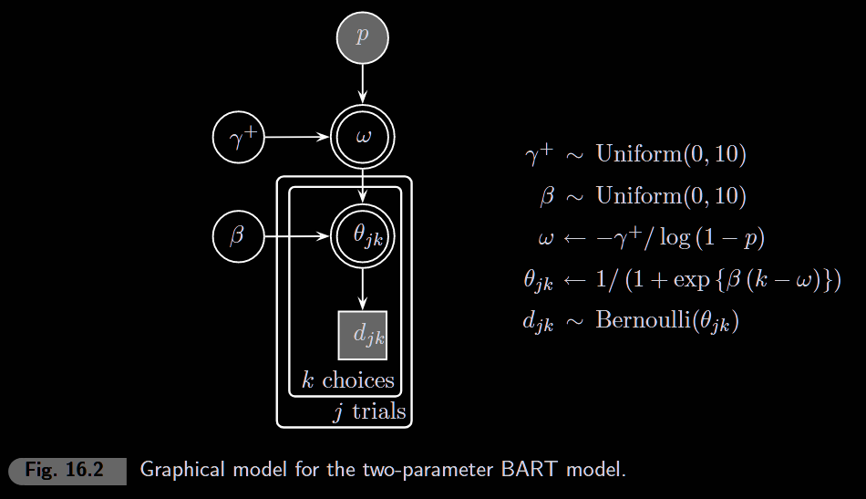
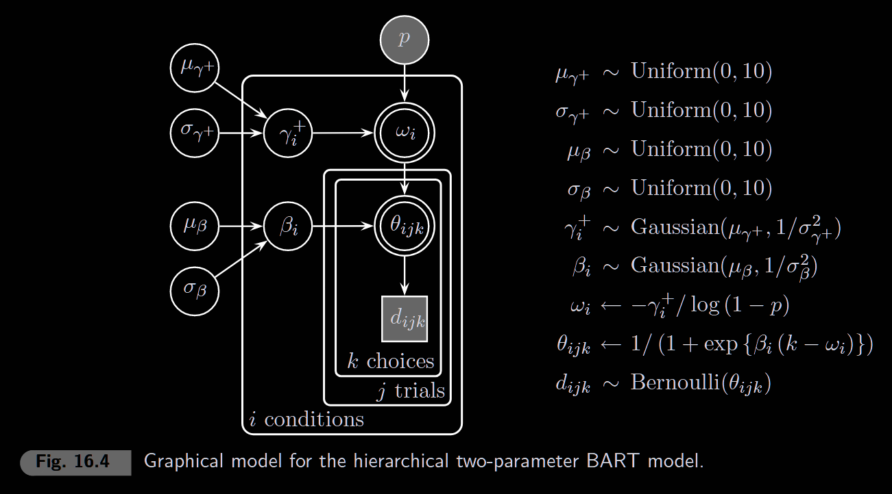

```{r setup, include=FALSE}
knitr::opts_chunk$set(echo = TRUE, warning = FALSE, message = FALSE)
library(rjags)
library(coda)
library(ggplot2)
```

## The Balloon Analogue Risk Task (BART)

The BART is a behavioral measure of risk-taking. On each trial:

1.  Participant sees a balloon and can **pump** it to earn money
2.  Each pump inflates the balloon and adds to potential reward
3.  But the balloon can **burst** at any pump, losing all accumulated reward
4.  Participant can **cash out** at any time to collect current reward

The key tradeoff: more pumps = more reward, but higher risk of losing everything.

### Cognitive Model

The model assumes participants have:

-   **γ⁺ (gplus)**: Target/optimal number of pumps (risk propensity)
-   **β (beta)**: Behavioral consistency (higher = more deterministic choices)

The optimal number of pumps given belief about burst probability p:

$$\omega = \frac{-\gamma^+}{\log(1-p)}$$

The probability of cashing out at pump k:

$$\theta_k = 1 - \frac{1}{1 + \exp(\beta(k - \omega))}$$

This is a sigmoid centered at ω—probability of stopping increases as pumps approach the target.

### Visualizing the Model Functions

```{r omega-plot, fig.width=10, fig.height=4}
par(mfrow = c(1, 2))

# === Plot 1: Omega as function of gplus (for different p values) ===
gplus_seq <- seq(0.1, 3, length.out = 100)
p_values <- c(0.05, 0.10, 0.15, 0.20, 0.25)
colors <- rainbow(length(p_values))

plot(NULL, xlim = c(0, 3), ylim = c(0, 15),
     xlab = expression(gamma^"+"), ylab = expression(omega),
     main = expression(paste("Optimal Pumps: ", omega == -gamma^"+" / log(1-p))))

for (i in seq_along(p_values)) {
  omega <- -gplus_seq / log(1 - p_values[i])
  lines(gplus_seq, omega, col = colors[i], lwd = 2)
}
legend("topleft", legend = paste("p =", p_values), col = colors, lwd = 2, bty = "n")

# === Plot 2: Omega as function of p (for different gplus values) ===
p_seq <- seq(0.01, 0.4, length.out = 100)
gplus_values <- c(0.5, 1.0, 1.5, 2.0)
colors <- rainbow(length(gplus_values))

plot(NULL, xlim = c(0, 0.4), ylim = c(0, 20),
     xlab = "Burst probability (p)", ylab = expression(omega),
     main = "Higher p -> Fewer optimal pumps")

for (i in seq_along(gplus_values)) {
  omega <- -gplus_values[i] / log(1 - p_seq)
  lines(p_seq, omega, col = colors[i], lwd = 2)
}
legend("topright", legend = paste("g+ =", gplus_values), col = colors, lwd = 2, bty = "n")
abline(v = 0.15, lty = 2, col = "gray")
text(0.16, 18, "p = 0.15", cex = 0.8)
```

```{r theta-plot, fig.width=10, fig.height=4}
par(mfrow = c(1, 2))

# === Plot 3: Theta (stopping prob) for different omega values ===
k_seq <- 1:15
omega_values <- c(3, 5, 7, 9)
beta_fixed <- 1.0
colors <- rainbow(length(omega_values))

plot(NULL, xlim = c(1, 15), ylim = c(0, 1),
     xlab = "Pump number (k)", ylab = expression(theta[k]),
     main = expression(paste("Stopping probability (", beta == 1, ")")))

for (i in seq_along(omega_values)) {
  theta <- 1 - 1 / (1 + exp(beta_fixed * (k_seq - omega_values[i])))
  lines(k_seq, theta, col = colors[i], lwd = 2)
  points(omega_values[i], 0.5, col = colors[i], pch = 19, cex = 1.5)
}
legend("topleft", legend = paste("ω =", omega_values), col = colors, lwd = 2, bty = "n")
abline(h = 0.5, lty = 2, col = "gray")

# === Plot 4: Theta for different beta values (steepness) ===
beta_values <- c(0.3, 0.5, 1.0, 2.0, 5.0)
omega_fixed <- 6
colors <- rainbow(length(beta_values))

plot(NULL, xlim = c(1, 12), ylim = c(0, 1),
     xlab = "Pump number (k)", ylab = expression(theta[k]),
     main = expression(paste("Effect of ", beta, " (", omega == 6, ")")))

for (i in seq_along(beta_values)) {
  theta <- 1 - 1 / (1 + exp(beta_values[i] * (k_seq - omega_fixed)))
  lines(k_seq, theta, col = colors[i], lwd = 2)
}
legend("topleft", legend = paste("β =", beta_values), col = colors, lwd = 2, bty = "n")
abline(v = omega_fixed, lty = 2, col = "gray")
abline(h = 0.5, lty = 2, col = "gray")
```

**Key insights from the plots:**

-   **ω increases with γ⁺**: Higher risk propensity → aim for more pumps
-   **ω decreases with p**: If you believe balloon bursts easily, pump less
-   **θ crosses 0.5 at k = ω**: The sigmoid is centered at the target
-   **β controls steepness**: Low β = gradual/noisy decisions; High β = sharp/deterministic

## 16.1 Single Subject: George Sober

### Data

```{r data}
p <- 0.15       # Assumed burst probability
ntrials <- 90   # Number of trials

# Read George's sober data
data_raw <- read.table("data/GeorgeSober.txt",
                       header = TRUE, fill = TRUE)

# Extract key columns
npumps <- data_raw$pumps                  # Number of pumps per trial
cash <- as.numeric(data_raw$cash != 0)      # 1 if cashed out, 0 if burst
options <- cash + npumps                    # Total decision points per trial

# Convert to binary decision matrix: d[trial, pump]
# 0 = pump again, 1 = cash out, NA = no decision (burst or already cashed)
d <- matrix(NA, ntrials, 30)
for (j in 1:ntrials) {
  if (npumps[j] > 0) {
    d[j, 1:npumps[j]] <- 0                  # Decided to pump
  }
  if (cash[j] == 1) {
    d[j, npumps[j] + 1] <- 1                # Decided to cash out
  }
}
```

### Model



```{r model}
model_string <- "
model {
  # Optimal number of pumps
  omega <- -gplus / log(1-p)

  # Likelihood
  for (j in 1:ntrials) {
    for (k in 1:options[j]) {
      # Clip exponent to prevent overflow
      theta[j,k] <- 1 - 1/(1 + max(-15, min(15, exp(beta*(k-omega)))))
      d[j,k] ~ dbern(theta[j,k])
    }
  }

  # Priors
  gplus ~ dunif(0, 10)
  beta ~ dunif(0, 10)
}
"

# Run model
model <- jags.model(textConnection(model_string),
  data = list(ntrials = ntrials, p = p, options = options, d = d),
  inits = list(gplus = 1.2, beta = 0.5),
  n.chains = 1, quiet = TRUE)

update(model, 2000)

samples <- coda.samples(model,
  variable.names = c("gplus", "beta", "omega"),
  n.iter = 5000)
```

```{r posterior}
posterior <- as.data.frame(as.matrix(samples))
```

### Parameter Posteriors

```{r params, fig.width=10, fig.height=4}
par(mfrow = c(1, 3))

# Number of pumps histogram
hist(npumps, breaks = 0:max(npumps + 1), col = "lightblue",
     main = "Data: # Pumps", xlab = "Number of Pumps", ylab = "Frequency")

# Gamma+ posterior
plot(density(posterior$gplus), main = expression(paste("Posterior ", gamma^"+")),
     xlab = expression(gamma^"+"), ylab = "Density", lwd = 2)

# Beta posterior
plot(density(posterior$beta), main = expression(paste("Posterior ", beta)),
     xlab = expression(beta), ylab = "Density", lwd = 2)
```

## 16.2 Hierarchical: Effect of Alcohol

George performed the BART under three conditions: **Sober**, **Tipsy**, and **Drunk**. Does alcohol affect risk-taking (γ⁺) or behavioral consistency (β)?

### Data: Three Conditions



```{r data-hier}
nconds <- 3
conditions <- c("Sober", "Tipsy", "Drunk")

# Read all three datasets
files <- c("data/GeorgeSober.txt", "data/GeorgeTipsy.txt", "data/GeorgeDrunk.txt")
data_list <- lapply(files, function(f) {
  read.table(f, header = TRUE, fill = TRUE)
})

# Extract into matrices
npumps_h <- matrix(NA, nconds, ntrials)
cash_h <- matrix(NA, nconds, ntrials)

for (i in 1:nconds) {
  npumps_h[i, ] <- data_list[[i]]$pumps
  cash_h[i, ] <- as.numeric(data_list[[i]]$cash != 0)
}

options_h <- cash_h + npumps_h

# Binary decision array: d[condition, trial, pump]
d_h <- array(NA, c(nconds, ntrials, 30))
for (i in 1:nconds) {
  for (j in 1:ntrials) {
    if (npumps_h[i, j] > 0) {
      d_h[i, j, 1:npumps_h[i, j]] <- 0
    }
    if (cash_h[i, j] == 1) {
      d_h[i, j, npumps_h[i, j] + 1] <- 1
    }
  }
}
```

### Hierarchical Model

```{r model-hier}
model_string_h <- "
model {
  # === Condition-level parameters ===
  for (i in 1:nconds) {
    gplus[i] ~ dnorm(mug, lambdag)T(0,)  # Risk propensity, truncated positive
    beta[i] ~ dnorm(mub, lambdab)T(0,) # Consistency, truncated positive
    omega[i] <- -gplus[i] / log(1-p) # Optimal pumps per condition

    # === Likelihood ===
    for (j in 1:ntrials) {
      for (k in 1:options[i,j]) {
        theta[i,j,k] <- 1 - 1/(1 + max(-15, min(15, exp(beta[i]*(k-omega[i])))))
        d[i,j,k] ~ dbern(theta[i,j,k])
      }
    }
  }

  # === Group-level priors ===
  mug ~ dunif(0, 10)  # Mean risk propensity
  sigmag ~ dunif(0, 10)  # SD of risk propensity
  mub ~ dunif(0, 10)   # Mean consistency
  sigmab ~ dunif(0, 10) # SD of consistency

  # Convert SD to precision (JAGS uses precision for dnorm)
  lambdag <- 1 / pow(sigmag, 2)
  lambdab <- 1 / pow(sigmab, 2)
}
"

# Run model
model_h <- jags.model(textConnection(model_string_h),
  data = list(nconds = nconds, ntrials = ntrials, p = p,
              options = options_h, d = d_h),
  inits = list(mug = 1.2, sigmag = 0.1, mub = 0.8, sigmab = 0.8),
  n.chains = 2, quiet = TRUE)

update(model_h, 2000)

samples_h <- coda.samples(model_h,
  variable.names = c("gplus", "beta", "mug", "sigmag", "mub", "sigmab"),
  n.iter = 5000)
```

```{r posterior-hier}
posterior_h <- as.data.frame(as.matrix(samples_h))
```

### Results by Condition

```{r results-hier, fig.width=10, fig.height=9}
par(mfrow = c(3, 3))

for (i in 1:nconds) {
  # Histogram
  hist(npumps_h[i, ], breaks = 0:10, col = "lightblue",
       main = paste(conditions[i], ": # pumps"), xlab = " ", xlim = c(0, 10))

  # Gamma+ posterior
  plot(density(posterior_h[[paste0("gplus[", i, "]")]]),
       main = bquote(.(conditions[i]) ~ ": " ~ gamma^"+"),
       xlab = expression(gamma^"+"), xlim = c(0.6, 1.8), lwd = 2)

  # Beta posterior
  plot(density(posterior_h[[paste0("beta[", i, "]")]]),
       main = bquote(.(conditions[i]) ~ ": " ~ beta),
       xlab = expression(beta), xlim = c(0.2, 1.4), lwd = 2)
}
```
