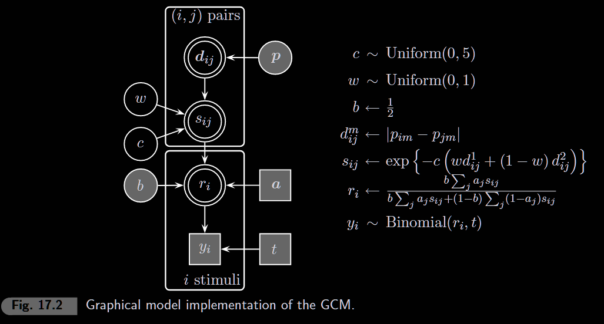
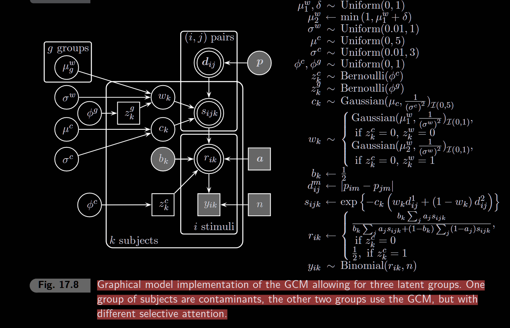

“[T]he most substantial and enduring advances [in cognitive science] have not been in the accumulation of empirical facts or the construction of models, but in the production of fruitful interactions between models and experimental research. Most experimental facts require continual reinterpretation and most models drop by the wayside like autumn leaves, but the results of interactions between models and experiments constitute most of our generalizable knowledge.” (Estes, 2002, p. 3)

```{r setup, include=FALSE}
knitr::opts_chunk$set(echo = TRUE, warning = FALSE, message = FALSE)
library(rjags)
library(coda)
library(ggplot2)
```

## The Generalized Context Model (GCM)

The GCM (Nosofsky, 1986) is an exemplar model of categorization. When classifying a new stimulus, people compare it to all stored exemplars in memory.

### Core Idea

1.  **Similarity**: Stimuli that are close in psychological space are similar
2.  **Exemplar retrieval**: Classification is based on summed similarity to all exemplars
3.  **Attention**: People can selectively attend to different stimulus dimensions

### Key Parameters

-   **c (generalization)**: How quickly similarity drops with distance. High c = sharp boundaries
-   **w (attention weight)**: Attention to dimension 1 (1-w for dimension 2)
-   **b (response bias)**: Bias toward category A (fixed at 0.5 = unbiased)

### Model Equations

**Similarity** between stimuli i and j: $$s_{ij} = \exp\left(-c \cdot [w \cdot d_1(i,j) + (1-w) \cdot d_2(i,j)]\right)$$

**Response probability** (probability of choosing category A for stimulus i): $$P(A|i) = \frac{b \sum_{j \in A} s_{ij}}{b \sum_{j \in A} s_{ij} + (1-b) \sum_{j \in B} s_{ij}}$$

### Visualizing the Similarity Function

```{r similarity-c, fig.width=10, fig.height=4}
par(mfrow = c(1, 2))

# === Plot 1: Similarity vs Distance for different c values ===
dist_seq <- seq(0, 2, length.out = 100)
c_values <- c(0.5, 1, 2, 3, 5)
colors <- rainbow(length(c_values))

plot(NULL, xlim = c(0, 2), ylim = c(0, 1),
     xlab = "Distance", ylab = "Similarity",
     main = "Effect of c (generalization)")

for (i in seq_along(c_values)) {
  sim <- exp(-c_values[i] * dist_seq)
  lines(dist_seq, sim, col = colors[i], lwd = 2)
}
legend("topright", legend = paste("c =", c_values), col = colors, lwd = 2, bty = "n")

# === Plot 2: Similarity gradient in 2D for different c ===
# Show how similarity "spreads" around a point
plot(NULL, xlim = c(0, 2), ylim = c(0, 1),
     xlab = "Distance", ylab = "Similarity",
     main = "Sharp vs Broad Generalization")

# Low c = broad generalization
lines(dist_seq, exp(-0.5 * dist_seq), col = "blue", lwd = 3)
text(1.5, exp(-0.5 * 1.5) + 0.05, "c = 0.5\n(broad)", col = "blue", cex = 0.8)

# High c = sharp boundaries
lines(dist_seq, exp(-3 * dist_seq), col = "red", lwd = 3)
text(0.6, exp(-3 * 0.6) + 0.05, "c = 3\n(sharp)", col = "red", cex = 0.8)
```

```{r similarity-w, fig.width=10, fig.height=4}
par(mfrow = c(1, 2))

# === Plot 3: Effect of attention weight w ===
# Two stimuli: one differs on dim1, other on dim2
w_seq <- seq(0, 1, length.out = 100)
c_fixed <- 2

# Stimulus A: d1 = 1, d2 = 0 (differs only on dimension 1)
# Stimulus B: d1 = 0, d2 = 1 (differs only on dimension 2)
sim_A <- exp(-c_fixed * (w_seq * 1 + (1 - w_seq) * 0))  # Only d1 matters
sim_B <- exp(-c_fixed * (w_seq * 0 + (1 - w_seq) * 1))  # Only d2 matters

plot(w_seq, sim_A, type = "l", col = "blue", lwd = 2,
     xlim = c(0, 1), ylim = c(0, 1),
     xlab = "Attention weight (w)", ylab = "Similarity to reference",
     main = "Selective Attention Effect (c = 2)")
lines(w_seq, sim_B, col = "red", lwd = 2)
legend("right", legend = c("Differs on dim 1", "Differs on dim 2"),
       col = c("blue", "red"), lwd = 2, bty = "n")
abline(v = 0.5, lty = 2, col = "gray")
text(0.52, 0.95, "equal\nattention", cex = 0.7)

# === Plot 4: Similarity matrix heatmap for different w ===
# Create example stimuli
x_example <- matrix(c(0,0, 0,1, 1,0, 1,1), nrow = 4, ncol = 2, byrow = TRUE)
d1_ex <- abs(outer(x_example[,1], x_example[,1], "-"))
d2_ex <- abs(outer(x_example[,2], x_example[,2], "-"))

# Compute similarity for w = 0.8 (attend mostly to dim 1)
c_ex <- 2
w_ex <- 0.8
sim_matrix <- exp(-c_ex * (w_ex * d1_ex + (1 - w_ex) * d2_ex))

image(1:4, 1:4, sim_matrix, col = heat.colors(20),
      xlab = "Stimulus j", ylab = "Stimulus i",
      main = paste0("Similarity Matrix (c=", c_ex, ", w=", w_ex, ")"))
# Add values
for (i in 1:4) {
  for (j in 1:4) {
    text(j, i, round(sim_matrix[i, j], 2), cex = 0.9)
  }
}
```

**Key insights:**

-   **c controls sharpness**: Low c → stimuli remain similar even at large distances (broad generalization). High c → similarity drops quickly (sharp category boundaries)
-   **w controls what matters**: w = 1 means only dimension 1 affects similarity. This lets the model "ignore" irrelevant dimensions
-   **Selective attention is learned**: If category membership depends only on dimension 1, the model learns high w

## 17.1 Basic GCM: Kruschke (1993) Data

The classic "5-4" category structure: 8 stimuli varying on 2 binary dimensions, with 5 in category A and 3 (or 4) in category B.

### Data

```{r data}
nstim <- 8
nsubj <- 40
n <- 8
t <- n * nsubj  # 320 total trials per stimulus

# Load data from KruschkeData.mat (extracted to text files)
y <- scan("data/gcm_y.txt")
a <- scan("data/gcm_a.txt")
d1 <- matrix(scan("data/gcm_d1.txt"), nrow = nstim, byrow = TRUE)
d2 <- matrix(scan("data/gcm_d2.txt"), nrow = nstim, byrow = TRUE)
```

### Model



```{r model}
model_string <- "
model {
  # 1. Similarity matrix 
  for (i in 1:nstim) {
    for (j in 1:nstim) {
      s[i,j] <- exp(-c * (w*d1[i,j] + (1-w)*d2[i,j]))
    }
  }

  # 2. Response probabilities
  for (i in 1:nstim) {
    for (j in 1:nstim) {
      # Indexing trick: a[j] selects index 1 (cat A) or 2 (cat B)
      tmp1[i,j,1] <- b * s[i,j] # Used when a[j]=1
      tmp1[i,j,2] <- 0
      tmp2[i,j,1] <- 0
      tmp2[i,j,2] <- (1-b) * s[i,j] # Used when a[j]=2

      numerator[i,j] <- tmp1[i,j, a[j]]
      denominator[i,j] <- tmp1[i,j, a[j]] + tmp2[i,j, a[j]]
    }
    r[i] <- sum(numerator[i,]) / sum(denominator[i,])
  }

  # 3. Likelihood 
  for (i in 1:nstim) {
    y[i] ~ dbin(r[i], t)
    predy[i] ~ dbin(r[i], t) # Posterior predictive
  }

  # 4. Priors
  c ~ dunif(0, 5)
  w ~ dbeta(1, 1)
  b <- 0.5
}
"

# Run model
model <- jags.model(textConnection(model_string),
  data = list(y = y, nstim = nstim, t = t, a = a, d1 = d1, d2 = d2),
  inits = list(c = 1, w = 0.5),
  n.chains = 2, quiet = TRUE)

update(model, 5000)

samples <- coda.samples(model,
  variable.names = c("c", "w", "predy"),
  n.iter = 10000)
```

```{r posterior}
posterior <- as.data.frame(as.matrix(samples))
#summary(samples[, c("c", "w")])
```

### Joint Posterior

```{r joint-posterior, fig.width=6, fig.height=5}
plot(posterior$c, posterior$w, pch = ".", col = rgb(0, 0, 0, 0.1),
     xlim = c(0, 5), ylim = c(0, 1),
     xlab = "Generalization (c)", ylab = "Attention Weight (w)",
     main = "Joint Posterior")
```

### Posterior Predictive

```{r posterior-pred, fig.width=8, fig.height=5}
# Load individual subject data (40 subjects × 8 stimuli)
x_ind <- matrix(scan("data/gcm_x.txt", quiet = TRUE), nrow = nsubj, byrow = TRUE)

# Extract predictions
pred_means <- sapply(1:nstim, function(i) {
  mean(posterior[[paste0("predy[", i, "]")]])
})

pred_lower <- sapply(1:nstim, function(i) {
  quantile(posterior[[paste0("predy[", i, "]")]], 0.025)
})

pred_upper <- sapply(1:nstim, function(i) {
  quantile(posterior[[paste0("predy[", i, "]")]], 0.975)
})

# Plot
plot(1:nstim, y / t, type = "n", ylim = c(0, 1),
     xlab = "Stimulus", ylab = "P(Category A)",
     main = "Data vs Model Predictions")

# Individual subject dots (with jitter)
for (i in 1:nstim) {
  points(i + runif(nsubj, -0.15, 0.15), x_ind[, i] / n,
         pch = 16, col = rgb(0.5, 0.5, 0.5, 0.4), cex = 0.8)
}

# Aggregate observed data (black line + points)
lines(1:nstim, y / t, lwd = 2)
points(1:nstim, y / t, pch = 19, cex = 1.5)

# Model predictions with uncertainty (red)
points(1:nstim + 0.2, pred_means / t, pch = 17, col = "red", cex = 1.2)
arrows(1:nstim + 0.2, pred_lower / t, 1:nstim + 0.2, pred_upper / t,
       code = 3, angle = 90, length = 0.05, col = "red", lwd = 1.5)

legend("bottomright", legend = c("Individual subjects", "Aggregate data", "Model prediction"),
       pch = c(16, 19, 17), col = c("gray", "black", "red"), bty = "n")
```

## 17.2 Individual Differences

Different people may have different generalization gradients and attention allocation. This section models subject-level parameters.

### Data with Individual Subjects

```{r data-individual}
# Load actual individual subject data from KruschkeData.mat
# x_ind is 40 subjects × 8 stimuli, need to transpose for y[stimulus, subject]
x_ind <- matrix(scan("data/gcm_x.txt", quiet = TRUE), nrow = nsubj, byrow = TRUE)
y_ind <- t(x_ind)  # Now 8 stimuli × 40 subjects
```

### Hierarchical Model

```{r model-individual}
model_string_ind <- "
model {
  for (i in 1:nstim) {
    for (k in 1:nsubj) {
      y[i,k] ~ dbin(r[i,k], n)
      predy[i,k] ~ dbin(r[i,k], n)
    }
  }

  for (i in 1:nstim) {
    for (k in 1:nsubj) {
      r[i,k] <- sum(numerator[i,k,]) / sum(denominator[i,k,])
    }
  }

  for (i in 1:nstim) {
    for (j in 1:nstim) {
      for (k in 1:nsubj) {
        numerator[i,k,j] <- equals(a[j],1) * b * s[i,k,j]
        denominator[i,k,j] <- equals(a[j],1) * b * s[i,k,j] + equals(a[j],2) * (1-b) * s[i,k,j]
      }
    }
  }

  for (i in 1:nstim) {
    for (j in 1:nstim) {
      for (k in 1:nsubj) {
        s[i,k,j] <- exp(-c[k] * (w[k]*d1[i,j] + (1-w[k])*d2[i,j]))
      }
    }
  }

  for (k in 1:nsubj) {
    c[k] ~ dunif(0, 5)
    w[k] ~ dbeta(1, 1)
  }
  b <- 0.5
}
"

# Run model
model_ind <- jags.model(textConnection(model_string_ind),
  data = list(y = y_ind, nstim = nstim, nsubj = nsubj, n = n,
              a = a, d1 = d1, d2 = d2),
  n.chains = 2, quiet = TRUE)

update(model_ind, 1000)

samples_ind <- coda.samples(model_ind,
  variable.names = c("c", "w"),
  n.iter = 5000)
```

```{r posterior-individual}
posterior_ind <- as.data.frame(as.matrix(samples_ind))
```

### Individual Parameter Estimates

```{r scatter-individual, fig.width=8, fig.height=6}
par(bg = "black", fg = "white", col.axis = "white", col.lab = "white", col.main = "white")

plot(NULL, xlim = c(0, 4), ylim = c(0, 1),
     xlab = "Generalization", ylab = "Attention Weight",
     main = "")

n_lines <- 50
idx <- sample(nrow(posterior_ind), n_lines)

for (k in 1:nsubj) {
  c_samples <- posterior_ind[[paste0("c[", k, "]")]][idx]
  w_samples <- posterior_ind[[paste0("w[", k, "]")]][idx]
  
  for (i in 1:n_lines) {
    segments(c_means[k], w_means[k], c_samples[i], w_samples[i],
             col = rgb(0.7, 0.7, 0.7, 0.15))
  }
}

points(c_means, w_means, pch = 19, col = "white", cex = 1.2)

text(c_means[3], w_means[3], "3", pos = 2, col = "white", cex = 0.8)
text(c_means[31], w_means[31], "31", pos = 2, col = "white", cex = 0.8)
text(c_means[33], w_means[33], "33", pos = 2, col = "white", cex = 0.8)
```

### Three Subjects Comparison

```{r three-subjects, fig.width=10, fig.height=4}
par(mfrow = c(1, 3))

subjects_of_interest <- c(3, 31, 33)

for (subj in subjects_of_interest) {
  subj_data <- y_ind[, subj] / n
  c_est <- round(c_means[subj], 2)
  w_est <- round(w_means[subj], 2)
  
  barplot(subj_data, names.arg = 1:nstim, ylim = c(0, 1),
          col = ifelse(a == 1, "steelblue", "coral"),
          main = paste0("Subject ", subj, " (c=", c_est, ", w=", w_est, ")"),
          xlab = "Stimulus", ylab = "P(Category A)")
  abline(h = 0.5, lty = 2, col = "gray")
}
```

## 17.3 Latent Groups Model

The individual differences model (17.2) assumes all subjects are trying to learn. But some might be:

-   **Contaminants**: Just guessing (responding 50/50)
-   **Different attention groups**: Some attend to dimension 1, others to dimension 2

This model infers latent group membership for each subject.

### Model Structure



Three possible groups: 1. **Group 1**: Learners with LOW attention weight (attend to dimension 2) 2. **Group 2**: Learners with HIGH attention weight (attend to dimension 1) 3. **Group 3**: Contaminants (guess randomly)

```{r model-latent}
model_string_latent <- "
model {
  #=============================================
  # LIKELIHOOD
  #=============================================
  for (i in 1:nstim) {
    for (k in 1:nsubj) {
      y[i,k] ~ dbin(r[i,k], n)
    }
    # Predictions for each group type
    for (g in 1:3) {
      predyg[g,i] ~ dbin(rpredg[g,i], n)
    }
  }

  #=============================================
  # RESPONSE PROBABILITIES
  # Key: contaminants (zc=1) just guess at 0.5
  #=============================================
  for (i in 1:nstim) {
    for (k in 1:nsubj) {
      # If zc[k]=0 (not contaminant): use GCM probability
      # If zc[k]=1 (contaminant): response = 0.5
      r[i,k] <- equals(zc[k], 0) * sum(numerator[i,k,]) / sum(denominator[i,k,])
               + equals(zc[k], 1) * 0.5
    }
    # Group predictions (groups 1 & 2 use GCM, group 3 = 0.5)
    for (g in 1:2) {
      rpredg[g,i] <- sum(numeratorpredg[g,i,]) / sum(denominatorpredg[g,i,])
    }
    rpredg[3,i] <- 0.5  # Contaminant group always guesses
  }

  #=============================================
  # GCM CORE: numerator/denominator for each subject
  #=============================================
  for (i in 1:nstim) {
    for (j in 1:nstim) {
      for (k in 1:nsubj) {
        numerator[i,k,j] <- equals(a[j], 1) * b * s[i,k,j]
        denominator[i,k,j] <- equals(a[j], 1) * b * s[i,k,j]
                             + equals(a[j], 2) * (1-b) * s[i,k,j]
      }
      # Same for group predictions
      for (g in 1:2) {
        numeratorpredg[g,i,j] <- equals(a[j], 1) * b * spredg[g,i,j]
        denominatorpredg[g,i,j] <- equals(a[j], 1) * b * spredg[g,i,j]
                                  + equals(a[j], 2) * (1-b) * spredg[g,i,j]
      }
    }
  }

  #=============================================
  # SIMILARITIES
  #=============================================
  for (i in 1:nstim) {
    for (j in 1:nstim) {
      for (k in 1:nsubj) {
        s[i,k,j] <- exp(-c[k] * (w[k]*d1[i,j] + (1-w[k])*d2[i,j]))
      }
      # Group-level similarities for predictions
      for (g in 1:2) {
        spredg[g,i,j] <- exp(-cpredg[g] * (wpredg[g]*d1[i,j] + (1-wpredg[g])*d2[i,j]))
      }
    }
  }

  #=============================================
  # SUBJECT PARAMETERS (hierarchical)
  # c[k] comes from group mean muc
  # w[k] comes from GROUP-SPECIFIC mean muw[zg1[k]]
  #=============================================
  for (k in 1:nsubj) {
    c[k] ~ dnorm(muc, lambdac)T(0,)           # Truncated > 0
    w[k] ~ dnorm(muw[zg1[k]], lambdaw)T(0,1)  # Truncated [0,1], group-specific mean!
  }

  # Predicted parameters for each attention group
  for (g in 1:2) {
    wpredg[g] ~ dnorm(muw[g], lambdaw)T(0,1)
    cpredg[g] ~ dnorm(muc, lambdac)T(0,)
  }

  #=============================================
  # LATENT MIXTURE INDICATORS
  # zc[k]: Is subject k a contaminant? (0=no, 1=yes)
  # zg[k]: Which attention group? (0=group1, 1=group2)
  # z[k]: Combined group label (1, 2, or 3)
  #=============================================
  phic ~ dbeta(1, 1)  # Prior prob of being contaminant
  phig ~ dbeta(1, 1)  # Prior prob of being in group 2

  for (k in 1:nsubj) {
    zc[k] ~ dbern(phic)     # Draw: contaminant or not?
    zg[k] ~ dbern(phig)     # Draw: which attention group?
    zg1[k] <- zg[k] + 1     # Convert to index (1 or 2)
    # Final group: 1 or 2 if learner, 3 if contaminant
    z[k] <- equals(zc[k], 0) * zg1[k] + 3 * equals(zc[k], 1)
  }

  #=============================================
  # HYPERPRIORS (group-level parameters)
  #=============================================
  # Mean generalization (scaled beta -> [0, 5])
  muctmp ~ dbeta(1, 1)
  muc <- 5 * muctmp

  # Mean attention weights for two groups
  # muw[2] >= muw[1] by construction (delta >= 0)
  muwtmp ~ dbeta(1, 1)
  muw[1] <- muwtmp              # Group 1: lower attention
  delta ~ dbeta(1, 1)
  muw[2] <- min(1, delta + muw[1])  # Group 2: higher attention

  # Standard deviations (scaled beta)
  sigmactmp ~ dbeta(1, 1)
  sigmac <- max(0.01, 3 * sigmactmp)
  sigmawtmp ~ dbeta(1, 1)
  sigmaw <- max(0.01, sigmawtmp)

  # Convert SD to precision
  lambdac <- 1 / pow(sigmac, 2)
  lambdaw <- 1 / pow(sigmaw, 2)

  b <- 0.5  # Response bias (fixed)
}
"

model_latent <- jags.model(textConnection(model_string_latent),
  data = list(y = y_ind, nstim = nstim, nsubj = nsubj, n = n,
              a = a, d1 = d1, d2 = d2),
  n.chains = 2, quiet = TRUE)

update(model_latent, 2000)

samples_latent <- coda.samples(model_latent,
  variable.names = c("c", "w", "z", "muw", "muc", "phic", "phig", "delta"),
  n.iter = 5000)
```

```{r posterior-latent}
posterior_latent <- as.data.frame(as.matrix(samples_latent))
```

### Group Membership Probabilities (Fig 17.9)

```{r group-membership, fig.width=10, fig.height=5}
# Compute membership probabilities for each subject
p_contaminant <- sapply(1:nsubj, function(k) {
  mean(posterior_latent[[paste0("z[", k, "]")]] == 3)
})

p_group1 <- sapply(1:nsubj, function(k) {
  mean(posterior_latent[[paste0("z[", k, "]")]] == 1)
})

p_group2 <- sapply(1:nsubj, function(k) {
  mean(posterior_latent[[paste0("z[", k, "]")]] == 2)
})

# Order subjects by: first group2 prob (descending), then contaminant prob
order_idx <- order(-p_group2, p_contaminant)

# Reorder probabilities
p_cont_ord <- p_contaminant[order_idx]
p_g1_ord <- p_group1[order_idx]
p_g2_ord <- p_group2[order_idx]

# Plot
plot(1:nsubj, p_g2_ord, type = "b", pch = 19, col = "coral", lwd = 2,
     ylim = c(0, 1), xlab = "Subject (ordered)", ylab = "Membership Probability",
     main = "Probability of Group Assignment")
lines(1:nsubj, p_g1_ord, type = "b", pch = 19, col = "steelblue", lwd = 2)
lines(1:nsubj, p_cont_ord, type = "b", pch = 19, col = "gray50", lwd = 2)

legend("left", legend = c("Attend Dim 1 (high w)", "Attend Dim 2 (low w)", "Contaminant"),
       col = c("coral", "steelblue", "gray50"), lwd = 2, pch = 19, bty = "n")
```

### Subjects in Parameter Space

```{r group-scatter, fig.width=6, fig.height=4}
# Get modal group and parameter means
z_modes <- sapply(1:nsubj, function(k) {
  z_samples <- posterior_latent[[paste0("z[", k, "]")]]
  as.numeric(names(sort(table(z_samples), decreasing = TRUE))[1])
})

c_means_lat <- sapply(1:nsubj, function(k) mean(posterior_latent[[paste0("c[", k, "]")]]))
w_means_lat <- sapply(1:nsubj, function(k) mean(posterior_latent[[paste0("w[", k, "]")]]))

cols <- c("steelblue", "coral", "gray50")[z_modes]

plot(c_means_lat, w_means_lat, pch = 19, col = cols, cex = 1.8,
     xlim = c(0, 4), ylim = c(0, 1),
     xlab = "Generalization (c)", ylab = "Attention Weight (w)",
     main = "Subjects Colored by Inferred Group")
legend("right", legend = c("Group 1 (low w)", "Group 2 (high w)", "Contaminant"),
       pch = 19, col = c("steelblue", "coral", "gray50"), bty = "n", pt.cex = 1.5)
```

### Psychological Interpretation: phic and delta

```{r phi-delta, fig.width=10, fig.height=4}
par(mfrow = c(1, 2))

hist(posterior_latent$phic, breaks = 40, col = "gray70", border = "white",
     main = expression(paste("Posterior of ", phi[c])),
     xlab = expression(phi[c] ~ "(Contaminant Proportion)"), xlim = c(0, 0.5), freq = FALSE)
abline(v = mean(posterior_latent$phic), col = "red", lwd = 2, lty = 2)

hist(posterior_latent$delta, breaks = 40, col = "steelblue", border = "white",
     main = expression(paste("Posterior of ", delta)),
     xlab = expression(delta ~ "(Attention Difference)"), xlim = c(0, 1), freq = FALSE)
abline(v = mean(posterior_latent$delta), col = "red", lwd = 2, lty = 2)
```

**Interpretations:**

-   **phic**: Proportion of subjects who are guessing. If phic \~ 0.1, about 10% are contaminants.
-   **delta**: Gap between group attention means (muw[2] = muw[1] + delta). Large delta means two distinct strategies exist.
