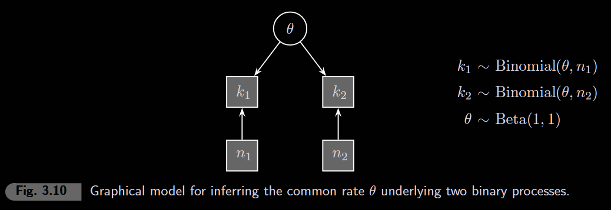
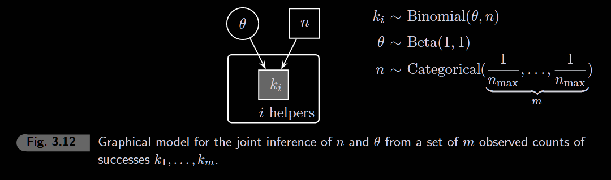

```{r setup, message=FALSE}
library(rjags)
library(coda)
library(ggplot2)
library(patchwork)
library(lattice)  # for xyplot, acfplot, densityplot

# Smaller figures globally
knitr::opts_chunk$set(fig.width = 4, fig.height = 2)
```

# 3.1 Inferring a rate


```{r parameters}
# ======================
# CHANGE THESE TO RERUN
# ======================
k      <- 5      # number of successes
n      <- 10     # number of trials
n_iter <- 10000  # MCMC samples (try 100000 for smoother histogram)
```

```{r model}
model_string <- "
model {
  # Prior: Beta(1,1) is uniform on [0,1]
  # Represents initial ignorance about the rate
  theta ~ dbeta(1, 1)

  # Likelihood: Binomial distribution
  # k successes out of n trials, given rate theta
  k ~ dbin(theta, n)
}
"

model <- jags.model(
  textConnection(model_string),
  data = list(k = k, n = n),
  n.chains = 4,
  quiet = TRUE
)

samples <- coda.samples(model, variable.names = "theta", n.iter = n_iter)
```

```{r results}
summary(samples)
plot(samples)
```

```{r posterior}
theta_samples <- as.vector(as.matrix(samples))

ggplot(data.frame(theta = theta_samples), aes(x = theta)) +
  geom_histogram(aes(y = after_stat(density)), bins = 50,
                 fill = "steelblue", color = "white") +
  stat_function(fun = dbeta, args = list(shape1 = 1 + k, shape2 = 1 + n - k),
                color = "red", linewidth = 1) +
  xlim(0, 1) +
  labs(
    title = paste0("Posterior of θ (k=", k, ", n=", n, ", ", n_iter, " samples)"),
    x = "θ",
    y = "Density"
  ) +
  theme_minimal()

```

-   **Posterior WIDTH** → controlled by data (n). More data = narrower = less uncertainty.
-   **Histogram SMOOTHNESS** → controlled by n_iter. More MCMC samples = better approximation.

# 3.2 Difference between two rates


```{r parameters-3.2}
# ======================
# CHANGE THESE TO RERUN
# ======================
k1 <- 0       # successes in group 1
n1 <- 1      # trials in group 1
k2 <- 0       # successes in group 2
n2 <- 5     # trials in group 2
n_iter <- 1000
```

```{r model-3.2}
model_string <- "
model {
  # Priors: uniform on [0,1] for both rates
  theta1 ~ dbeta(1, 1)
  theta2 ~ dbeta(1, 1)

  # Likelihoods: binomial for each group
  k1 ~ dbin(theta1, n1)
  k2 ~ dbin(theta2, n2)

  # Derived quantity: difference between rates
  delta <- theta1 - theta2
}
"

model <- jags.model(
  textConnection(model_string),
  data = list(k1 = k1, n1 = n1, k2 = k2, n2 = n2),
  n.chains = 4,
  quiet = TRUE
)

samples <- coda.samples(model, variable.names = c("theta1", "theta2", "delta"), n.iter = n_iter)
```

```{r results-3.2}
#summary(samples)
```

```{r posterior-3.2}
samples_df <- as.data.frame(as.matrix(samples))

ggplot(samples_df, aes(x = delta)) +
  geom_histogram(bins = 50,
                 fill = "steelblue", color = "black") +
  geom_vline(xintercept = 0, color = "red", linetype = "dashed", linewidth = 1) +
  xlim(-1, 1) +
  labs(
    title = paste0("Posterior of δ = θ1 - θ2"),
    subtitle = paste0("Group 1: ", k1, "/", n1, " | Group 2: ", k2, "/", n2),
    x = "δ (difference in rates)",
    y = "Density"
  ) +
  theme_minimal()
```

```{r probability-3.2}
# What's the probability that theta1 > theta2?
mean(samples_df$delta < 0)
```

# 3.3 Inferring a common rate


```{r parameters-3.3}
# ======================
# CHANGE THESE TO RERUN
# ======================
k1 <- 0       # successes in group 1
n1 <- 10      # trials in group 1
k2 <- 10       # successes in group 2
n2 <- 10      # trials in group 2
n_iter <- 1000
```

```{r model-3.3}
model_string <- "
model {
  # Prior: single shared rate
  theta ~ dbeta(1, 1)

  # Likelihoods: both groups share the same theta
  k1 ~ dbin(theta, n1)
  k2 ~ dbin(theta, n2)
}
"

model <- jags.model(
  textConnection(model_string),
  data = list(k1 = k1, n1 = n1, k2 = k2, n2 = n2),
  n.chains = 4,
  quiet = TRUE
)

samples <- coda.samples(model, variable.names = "theta", n.iter = n_iter)
```

```{r results-3.3}
#summary(samples)
```

```{r posterior-3.3}
theta_samples <- as.vector(as.matrix(samples))

# Combined data: k1 + k2 successes out of n1 + n2 trials
k_total <- k1 + k2
n_total <- n1 + n2

ggplot(data.frame(theta = theta_samples), aes(x = theta)) +
  geom_histogram(aes(y = after_stat(density)), bins = 50,
                 fill = "steelblue", color = "white") +
  stat_function(fun = dbeta, args = list(shape1 = 1 + k_total, shape2 = 1 + n_total - k_total),
                color = "red", linewidth = 1) +
  xlim(0, 1) +
  labs(
    title = "Posterior of θ (common rate)",
    subtitle = paste0("Combined: ", k_total, "/", n_total),
    x = "θ",
    y = "Density"
  ) +
  theme_minimal()
```

"The analysis wants you to believe that the most plausible value for the common rate is around 0.5. This example highlights that the posterior distributions generated by a Bayesian analysis are conditional on the truth of the observed data, and of the model. If the model is wrong in an important way, the posteriors will be correct for that model, but probably not useful for the real problem. If a single rate really did underly k1 = 0 and k2 = 10 then the rate must be near a half, since it is the most likely way to generate those data. But the basic assumption of a single rate seems problematic. The data suggest that a rate of 0.5 is one of the least plausible values. Perhaps the data are generated by two different rates, instead of one common rate."

# 3.4 Prior and posterior prediction

```{r parameters-3.4}
# ======================
# CHANGE THESE TO RERUN
# ======================
k      <- 24     # observed successes
n      <- 121      # trials
n_iter <- 10000
```

```{r model-3.4}
model_string <- "
model {
  # Prior on rate
  theta ~ dbeta(1, 1)

  # Observed data (this updates theta)
  k ~ dbin(theta, n)

  # Posterior predictive: new data using updated theta
  postpredk ~ dbin(theta, n)

  # Prior predictive: separate theta that ignores data
  thetaprior ~ dbeta(1, 1)
  priorpredk ~ dbin(thetaprior, n)
}
"

model <- jags.model(
  textConnection(model_string),
  data = list(k = k, n = n),
  n.chains = 4,
  quiet = TRUE
)

samples <- coda.samples(
  model,
  variable.names = c("theta", "postpredk", "priorpredk"),
  n.iter = n_iter
)
```

```{r results-3.4}
samples_df <- as.data.frame(as.matrix(samples))
```

```{r predictive-comparison, fig.width=16, fig.height=15}
# Reshape for plotting
pred_df <- data.frame(
  k = c(samples_df$priorpredk, samples_df$postpredk),
  type = rep(c("Prior Predictive", "Posterior Predictive"), each = nrow(samples_df))
)

ggplot(pred_df, aes(x = k, fill = type)) +
  geom_histogram(binwidth = 1, position = "dodge", color = "white") +
  geom_vline(xintercept = k, color = "red", linetype = "dashed", linewidth = 1) +
  scale_x_continuous(breaks = 0:n) +
  labs(
    title = "Prior vs Posterior Predictive",
    subtitle = paste0("Observed k = ", k, " (red line)"),
    x = "Predicted k",
    y = "Count",
    fill = ""
  ) +
  theme_minimal()
```

**Prior predictive**: flat across all k values (before seeing data, anything is possible)

**Posterior predictive**: concentrated near observed k (after learning θ ≈ k/n, we expect similar data)

## Exercise 3.4.1: All four distributions

```{r four-distributions, fig.width=6, fig.height=5}
# Prior vs Posterior (continuous θ)
p1 <- ggplot(data.frame(theta = samples_df$theta), aes(x = theta)) +
  stat_function(fun = dbeta, args = list(shape1 = 1, shape2 = 1),
                aes(color = "Prior"), linewidth = 1) +
  stat_function(fun = dbeta, args = list(shape1 = 1 + k, shape2 = 1 + n - k),
                aes(color = "Posterior"), linewidth = 1) +
  xlim(0, 1) +
  scale_color_manual(values = c("Prior" = "gray50", "Posterior" = "steelblue")) +
  labs(title = "Prior vs Posterior", x = "θ", y = "Density", color = "") +
  theme_minimal() +
  theme(legend.position = "bottom")

# Prior Predictive vs Posterior Predictive (discrete k)
pred_df <- data.frame(
  k = c(samples_df$priorpredk, samples_df$postpredk),
  type = rep(c("Prior Predictive", "Posterior Predictive"), each = nrow(samples_df))
)

p2 <- ggplot(pred_df, aes(x = k, fill = type)) +
  geom_histogram(binwidth = 1, position = "dodge", alpha = 0.7) +
  geom_vline(xintercept = k, color = "red", linetype = "dashed") +
  scale_x_continuous(breaks = 0:n) +
  scale_fill_manual(values = c("Prior Predictive" = "gray50", "Posterior Predictive" = "steelblue")) +
  labs(title = "Prior vs Posterior Predictive", x = "k", y = "Count", fill = "") +
  theme_minimal() +
  theme(legend.position = "bottom")

p1 / p2
```

**Top**: Prior (flat) vs Posterior (peaked) - data updates belief about θ

**Bottom**: Prior Predictive (flat) vs Posterior Predictive (peaked) - data updates predictions

"θ is your answer, posterior predictive is your sanity check."

"In practice, many analyses skip posterior predictive for simple models (binomial, normal) where assumptions are obvious. But for complex models (hierarchical, mixture, cognitive models), posterior predictive checks are essential before trusting your θ."

# 3.5 Posterior prediction for common rate



```{r parameters-3.5}
# ======================
# CHANGE THESE TO RERUN
# ======================
k1 <- 0       # observed successes group 1
n1 <- 10      # trials group 1
k2 <- 10      # observed successes group 2
n2 <- 10      # trials group 2
n_iter <- 10000
```

```{r model-3.5}
model_string <- "
model {
  # Prior: single shared rate
  theta ~ dbeta(1, 1)

  # Likelihoods: both groups share theta
  k1 ~ dbin(theta, n1)
  k2 ~ dbin(theta, n2)

  # Posterior predictive for both groups
  postpredk1 ~ dbin(theta, n1)
  postpredk2 ~ dbin(theta, n2)
}
"

model <- jags.model(
  textConnection(model_string),
  data = list(k1 = k1, n1 = n1, k2 = k2, n2 = n2),
  n.chains = 4,
  quiet = TRUE
)

samples <- coda.samples(
  model,
  variable.names = c("theta", "postpredk1", "postpredk2"),
  n.iter = n_iter
)

samples_df <- as.data.frame(as.matrix(samples))
```

```{r plots-3.5, fig.width=6, fig.height=3}
# Left: Posterior of theta
p1 <- ggplot(samples_df, aes(x = theta)) +
  geom_density(fill = "steelblue", alpha = 0.7) +
  xlim(0, 1) +
  labs(title = "Posterior of θ", x = "Rate", y = "Density") +
  theme_minimal()

# Right: 2D posterior predictive
pred_counts <- as.data.frame(table(samples_df$postpredk1, samples_df$postpredk2))
names(pred_counts) <- c("k1", "k2", "freq")
pred_counts$k1 <- as.numeric(as.character(pred_counts$k1))
pred_counts$k2 <- as.numeric(as.character(pred_counts$k2))

p2 <- ggplot(pred_counts, aes(x = k1, y = k2, size = freq)) +
  geom_point(alpha = 0.6) +
  geom_point(aes(x = k1, y = k2), data = data.frame(k1 = k1, k2 = k2),
             shape = 4, size = 4, stroke = 2, color = "red") +
  scale_size_continuous(range = c(0.5, 6)) +
  labs(title = "Posterior Predictive", x = "Success Count 1", y = "Success Count 2") +
  theme_minimal() +
  theme(legend.position = "none")

p1 | p2
```

The **X** marks observed data (k1=`r k1`, k2=`r k2`). If model fits well, X should be where big dots are. Here X is in the corner — the model predicts similar counts for both groups, but we observed extreme opposites. This suggests a common rate is a poor assumption.

# 3.6 Joint distributions



This model infers both the rate θ AND the number of trials n from observed success counts.

```{r parameters-3.6}
# ======================
# CHANGE THESE TO RERUN
# ======================
k <- c(16, 18, 22, 25, 28)  # observed successes from m helpers
m <- length(k)               # number of helpers
n_max <- 500                 # maximum possible n
n_iter <- 100000
```

```{r model-3.6}
model_string <- "
model {
  # Likelihood: each helper i observed k[i] successes
  # All helpers share the same rate theta and total trials n
  for (i in 1:m) {
    k[i] ~ dbin(theta, n)
  }

  # Prior on rate: uniform between 0 and 1
  theta ~ dbeta(1, 1)

  # Prior on n: discrete uniform from 1 to n_max
  # dcat draws an integer from 1 to length(p) with given probabilities
  n ~ dcat(p[])

  # Build probability vector: each value 1 to n_max equally likely
  # p[1] = p[2] = ... = p[n_max] = 1/n_max
  for (i in 1:n_max){
    p[i] <- 1/n_max
  }
}
"

model <- jags.model(
  textConnection(model_string),
  data = list(k = k, m = m, n_max = n_max),
  n.chains = 1,
  quiet = TRUE
)

samples <- coda.samples(
  model,
  variable.names = c("theta", "n"),
  n.iter = n_iter,
  n.thin = 1000
)

samples_df <- as.data.frame(as.matrix(samples))
```

```{r, fig.width=6, fig.height=6}
 xyplot(samples, density = FALSE)
```

```{r acf-3.6, fig.width=6, fig.height=4}
# Autocorrelation: bars should drop to zero quickly
acf_theta <- acf(samples_df$theta, lag.max = 200, plot = FALSE)
acf_n <- acf(samples_df$n, lag.max = 200, plot = FALSE)

acf_df <- data.frame(
  lag = rep(acf_theta$lag, 2),
  acf = c(acf_theta$acf, acf_n$acf),
  param = rep(c("θ", "n"), each = length(acf_theta$lag))
)

ggplot(acf_df, aes(x = lag, y = acf)) +
  geom_hline(yintercept = 0) +
  geom_hline(yintercept = c(-0.1, 0.1), linetype = "dashed", color = "blue") +
  geom_bar(stat = "identity", width = 0.7, fill = "steelblue") +
  facet_wrap(~param) +
  labs(x = "Lag", y = "Autocorrelation") +
  theme_minimal()
```

The samples “sweep” through high and low values in a systematic way, showing the dependency of a sample on those immediately preceding. This is a deviation from the ideal situation in which posterior samples are independent draws from the joint posterior.

```{r plots-3.6, fig.width=5, fig.height=5}
# Expected value (mean)
mean_n <- mean(samples_df$n)
mean_theta <- mean(samples_df$theta)

# Mode (most frequent combination)
joint_table <- table(samples_df$n, round(samples_df$theta, 2))
mode_idx <- which.max(joint_table)
mode_n <- as.numeric(rownames(joint_table)[row(joint_table)[mode_idx]])
mode_theta <- as.numeric(colnames(joint_table)[col(joint_table)[mode_idx]])

# Joint scatter plot
p_joint <- ggplot(samples_df, aes(x = n, y = theta)) +
  geom_point(alpha = 0.1, size = 0.5) +
  annotate("point", x = mean_n, y = mean_theta, shape = 4, size = 3, stroke = 1.5, color = "darkred") +
  annotate("point", x = mode_n, y = mode_theta, shape = 1, size = 3, stroke = 1.5, color = "darkred") +
  labs(x = "Number of Surveys", y = "Rate of Return") +
  theme_minimal()

# Marginal histogram for n (bottom)
p_n <- ggplot(samples_df, aes(x = n)) +
  geom_histogram(binwidth = 5, fill = "gray70") +
  theme_void()

# Marginal histogram for theta (right)
p_theta <- ggplot(samples_df, aes(x = theta)) +
  geom_histogram(binwidth = 0.02, fill = "gray70") +
  coord_flip() +
  theme_void()

# Combine with patchwork
p_n + plot_spacer() + p_joint + p_theta +
  plot_layout(ncol = 2, nrow = 2, widths = c(4, 1), heights = c(1, 4))
```

**X** = expected value (mean), **○** = mode (maximum likelihood)
