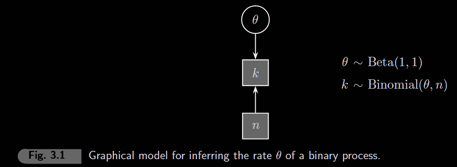
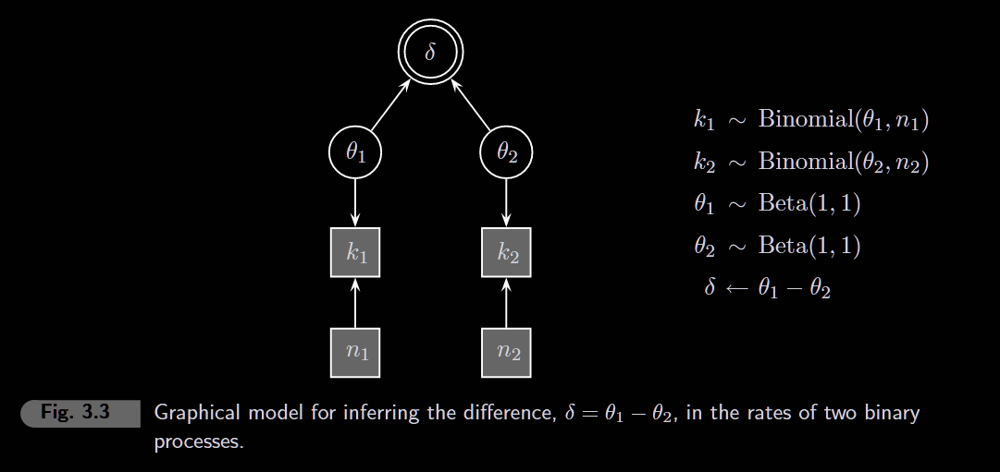
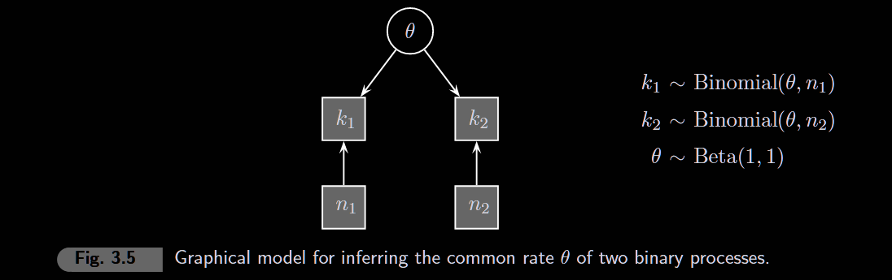
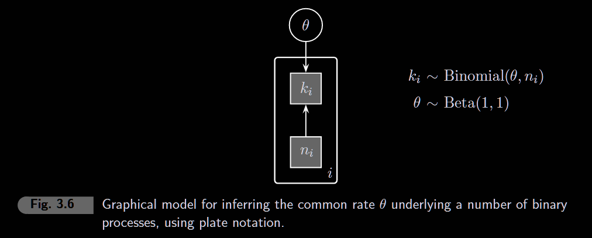

```{r setup, message=FALSE}
library(rjags)
library(coda)
library(ggplot2)
```

# 3.1 Inferring a rate



```{r parameters}
# ======================
# CHANGE THESE TO RERUN
# ======================
k      <- 5      # number of successes
n      <- 10     # number of trials
n_iter <- 10000  # MCMC samples (try 100000 for smoother histogram)
```

```{r model}
model_string <- "
model {
  # Prior: Beta(1,1) is uniform on [0,1]
  # Represents initial ignorance about the rate
  theta ~ dbeta(1, 1)

  # Likelihood: Binomial distribution
  # k successes out of n trials, given rate theta
  k ~ dbin(theta, n)
}
"

model <- jags.model(
  textConnection(model_string),
  data = list(k = k, n = n),
  n.chains = 4,
  quiet = TRUE
)

samples <- coda.samples(model, variable.names = "theta", n.iter = n_iter)
```

```{r results}
summary(samples)
plot(samples)
```

```{r posterior}
theta_samples <- as.vector(as.matrix(samples))

ggplot(data.frame(theta = theta_samples), aes(x = theta)) +
  geom_histogram(aes(y = after_stat(density)), bins = 50,
                 fill = "steelblue", color = "white") +
  stat_function(fun = dbeta, args = list(shape1 = 1 + k, shape2 = 1 + n - k),
                color = "red", linewidth = 1) +
  xlim(0, 1) +
  labs(
    title = paste0("Posterior of θ (k=", k, ", n=", n, ", ", n_iter, " samples)"),
    x = "θ",
    y = "Density"
  ) +
  theme_minimal()

```

-   **Posterior WIDTH** → controlled by data (n). More data = narrower = less uncertainty.
-   **Histogram SMOOTHNESS** → controlled by n_iter. More MCMC samples = better approximation.

# 3.2 Difference between two rates



```{r parameters-3.2}
# ======================
# CHANGE THESE TO RERUN
# ======================
k1 <- 0       # successes in group 1
n1 <- 1      # trials in group 1
k2 <- 0       # successes in group 2
n2 <- 5     # trials in group 2
n_iter <- 1000
```

```{r model-3.2}
model_string <- "
model {
  # Priors: uniform on [0,1] for both rates
  theta1 ~ dbeta(1, 1)
  theta2 ~ dbeta(1, 1)

  # Likelihoods: binomial for each group
  k1 ~ dbin(theta1, n1)
  k2 ~ dbin(theta2, n2)

  # Derived quantity: difference between rates
  delta <- theta1 - theta2
}
"

model <- jags.model(
  textConnection(model_string),
  data = list(k1 = k1, n1 = n1, k2 = k2, n2 = n2),
  n.chains = 4,
  quiet = TRUE
)

samples <- coda.samples(model, variable.names = c("theta1", "theta2", "delta"), n.iter = n_iter)
```

```{r results-3.2}
#summary(samples)
```

```{r posterior-3.2}
samples_df <- as.data.frame(as.matrix(samples))

ggplot(samples_df, aes(x = delta)) +
  geom_histogram(bins = 50,
                 fill = "steelblue", color = "black") +
  geom_vline(xintercept = 0, color = "red", linetype = "dashed", linewidth = 1) +
  xlim(-1, 1) +
  labs(
    title = paste0("Posterior of δ = θ1 - θ2"),
    subtitle = paste0("Group 1: ", k1, "/", n1, " | Group 2: ", k2, "/", n2),
    x = "δ (difference in rates)",
    y = "Density"
  ) +
  theme_minimal()
```

```{r probability-3.2}
# What's the probability that theta1 > theta2?
mean(samples_df$delta < 0)
```

# 3.3 Inferring a common rate





```{r parameters-3.3}
# ======================
# CHANGE THESE TO RERUN
# ======================
k1 <- 0       # successes in group 1
n1 <- 10      # trials in group 1
k2 <- 10       # successes in group 2
n2 <- 10      # trials in group 2
n_iter <- 1000
```

```{r model-3.3}
model_string <- "
model {
  # Prior: single shared rate
  theta ~ dbeta(1, 1)

  # Likelihoods: both groups share the same theta
  k1 ~ dbin(theta, n1)
  k2 ~ dbin(theta, n2)
}
"

model <- jags.model(
  textConnection(model_string),
  data = list(k1 = k1, n1 = n1, k2 = k2, n2 = n2),
  n.chains = 4,
  quiet = TRUE
)

samples <- coda.samples(model, variable.names = "theta", n.iter = n_iter)
```

```{r results-3.3}
#summary(samples)
```

```{r posterior-3.3}
theta_samples <- as.vector(as.matrix(samples))

# Combined data: k1 + k2 successes out of n1 + n2 trials
k_total <- k1 + k2
n_total <- n1 + n2

ggplot(data.frame(theta = theta_samples), aes(x = theta)) +
  geom_histogram(aes(y = after_stat(density)), bins = 50,
                 fill = "steelblue", color = "white") +
  stat_function(fun = dbeta, args = list(shape1 = 1 + k_total, shape2 = 1 + n_total - k_total),
                color = "red", linewidth = 1) +
  xlim(0, 1) +
  labs(
    title = "Posterior of θ (common rate)",
    subtitle = paste0("Combined: ", k_total, "/", n_total),
    x = "θ",
    y = "Density"
  ) +
  theme_minimal()
```

"The analysis wants you to believe that the most plausible value for the common rate is around 0.5. This example highlights that the posterior distributions generated by a Bayesian analysis are conditional on the truth of the observed data, and of the model. If the model is wrong in an important way, the posteriors will be correct for that model, but probably not useful for the real problem. If a single rate really did underly k1 = 0 and k2 = 10 then the rate must be near a half, since it is the most likely way to generate those data. But the basic assumption of a single rate seems problematic. The data suggest that a rate of 0.5 is one of the least plausible values. Perhaps the data are generated by two different rates, instead of one common rate."

# 3.4 Prior and posterior prediction
