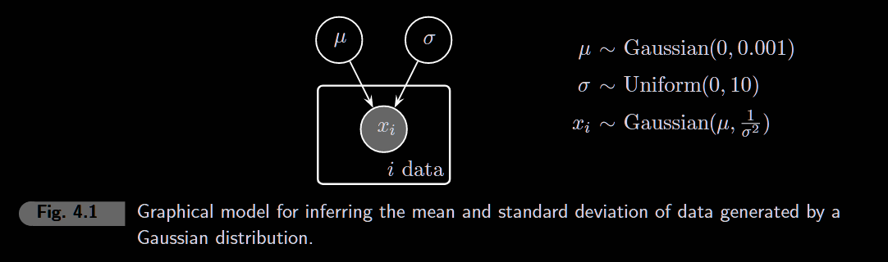
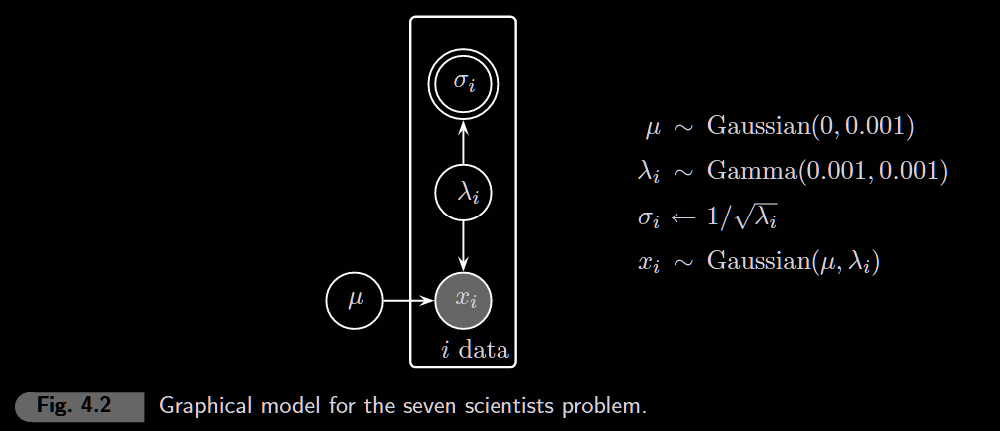
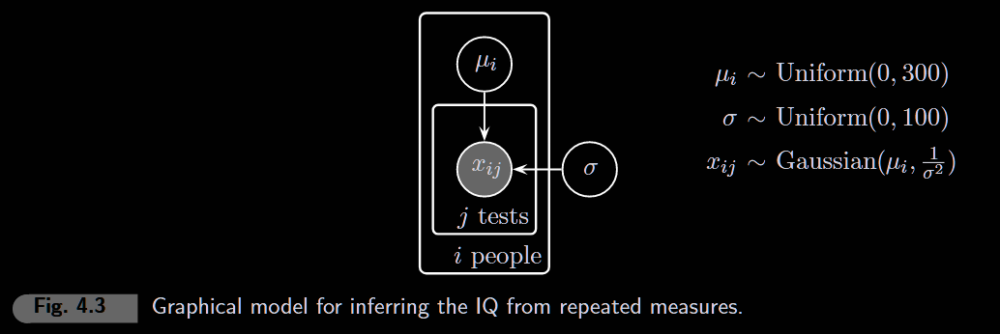

```{r setup, message=FALSE}
library(rjags)
library(coda)
library(ggplot2)
library(patchwork)
library(lattice)

knitr::opts_chunk$set(fig.width = 5, fig.height = 3)
```

# 4.1 Inferring a mean and standard deviation



```{r parameters-4.1}
# ======================
# CHANGE THESE TO RERUN
# ======================
x <- c(1.1, 1.9, 2.3, 1.8)  # observed data
n <- length(x)
n_iter <- 10000
```

```{r model-4.1}
model_string <- "
model {
  # Likelihood: each observation comes from normal with mean mu and precision lambda
  for (i in 1:n) {
    x[i] ~ dnorm(mu, sigma^(-2))
  }

  # Prior on mean: vague normal
  mu ~ dnorm(0, 10^(-2))

  # Prior on precision: vague gamma
  sigma ~ dunif(0, 10)

}
"

model <- jags.model(
  textConnection(model_string),
  data = list(x = x, n = n),
  n.chains = 4,
  quiet = TRUE
)

update(model, 1000)  # burn-in

samples <- coda.samples(
  model,
  variable.names = c("mu", "sigma"),
  n.iter = n_iter
)

samples_df <- as.data.frame(as.matrix(samples))
```

```{r diagnostics-4.1}
plot(samples, density = FALSE)
```

```{r posterior-4.1, fig.width=6, fig.height=3}
p1 <- ggplot(samples_df, aes(x = mu)) +
  geom_histogram(aes(y = after_stat(density)), bins = 50,
                 fill = "steelblue", color = "white") +
  geom_vline(xintercept = mean(x), color = "red", linetype = "dashed") +
  labs(title = "Posterior of μ", subtitle = "Red = sample mean", x = "μ", y = "Density") +
  theme_minimal()

p2 <- ggplot(samples_df, aes(x = sigma)) +
  geom_histogram(aes(y = after_stat(density)), bins = 50,
                 fill = "steelblue", color = "white") +
  geom_vline(xintercept = sd(x), color = "red", linetype = "dashed") +
  labs(title = "Posterior of σ", subtitle = "Red = sample SD", x = "σ", y = "Density") +
  theme_minimal()

p1 | p2
```

```{r joint-4.1, fig.width=5, fig.height=4}
ggplot(samples_df, aes(x = mu, y = sigma)) +
  geom_point(alpha = 0.1, size = 0.5) +
  labs(title = "Joint posterior", x = "μ", y = "σ") +
  theme_minimal()
```

# 4.2 The seven scientists



Seven scientists measure the same quantity. Each has different precision (some careful, some sloppy). We want to infer the true value μ and each scientist's σ.

```{r parameters-4.2}
# ======================
# CHANGE THESE TO RERUN
# ======================
x <- c(-27.020, 3.570, 8.191, 9.898, 9.603, 9.945, 10.056)  # measurements
n <- length(x)
n_iter <- 10000
```

```{r model-4.2}
model_string <- "
model {
  # Likelihood
  for (i in 1:n) {
    x[i] ~ dnorm(mu, lambda[i])
  }
  
  
  # Priors
  mu ~ dnorm(0, 0.001)
  
  for (i in 1:n) {
      lambda[i] ~ dgamma(0.001, 0.001)
      sigma[i] <- 1/sqrt(lambda[i])
  }
  
  
}
"

model <- jags.model(
  textConnection(model_string),
  data = list(x = x, n = n),
  n.chains = 4,
  quiet = TRUE
)

update(model, 1000)

samples <- coda.samples(
  model,
  variable.names = c("mu", "sigma"),
  n.iter = n_iter
)

samples_df <- as.data.frame(as.matrix(samples))
```

```{r posterior-mu-4.2, fig.width=5, fig.height=3}
# Posterior of true value mu
ggplot(samples_df, aes(x = mu)) +
  geom_histogram(aes(y = after_stat(density)), bins = 100,
                 fill = "steelblue", color = "white") +
  labs(title = "Posterior of μ (true value)", x = "μ", y = "Density") +
  theme_minimal()
```

```{r posterior-sigma-4.2, fig.width=6, fig.height=4}
# Posterior of each scientist's noise level
sigma_cols <- grep("sigma", names(samples_df), value = TRUE)
sigma_summary <- data.frame(
  scientist = factor(1:n),
  measurement = x,
  mean_sigma = sapply(sigma_cols, function(col) mean(samples_df[[col]])),
  lower = sapply(sigma_cols, function(col) quantile(samples_df[[col]], 0.025)),
  upper = sapply(sigma_cols, function(col) quantile(samples_df[[col]], 0.975))
)

ggplot(sigma_summary, aes(x = scientist, y = mean_sigma)) +
  geom_point(size = 3) +
  geom_errorbar(aes(ymin = lower, ymax = upper), width = 0.2) +
  geom_text(aes(label = paste0("x=", round(measurement, 1))), vjust = -1, size = 3) +
  labs(title = "Posterior of σ (noise) for each scientist",
       subtitle = "Higher σ = less reliable",
       x = "Scientist", y = "σ (noise level)") +
  theme_minimal()
```

**Conclusions:** Scientist 1 (measured -27) has huge σ → unreliable outlier. Scientists 4-7 cluster around μ ≈ 10 with small σ → most reliable.

# 4.3 Repeated measurement of IQ



```{r parameters-4.3}
# ======================
# CHANGE THESE TO RERUN
# ======================
# Each row = one person, each column = one test
x <- matrix(c(
  90, 95, 100,   # person 1
  105, 110, 115, # person 2
  150, 155, 160  # person 3
), nrow = 3, byrow = TRUE)

n <- nrow(x)  # number of people
m <- ncol(x)  # number of tests per person
n_iter <- 10000
```

```{r model-4.3}
model_string <- "
model {
  # Likelihood
  for (i in 1:n) {
    for (j in 1:m) {
      x[i,j] ~ dnorm(mu[i], sigma^(-2))
    }
  }
  
  # Priors
  for (i in 1:n) {
    mu[i] ~ dnorm(100, .0044)
  }
  
  sigma ~ dunif(0, 100)
}
"

model <- jags.model(
  textConnection(model_string),
  data = list(x = x, n = n, m = m),
  n.chains = 4,
  quiet = TRUE
)

update(model, 1000)

samples <- coda.samples(
  model,
  variable.names = c("mu", "sigma"),
  n.iter = n_iter
)

samples_df <- as.data.frame(as.matrix(samples))
```

```{r posterior-4.3, fig.width=6, fig.height=4}
# Posterior of each person's true IQ
mu_cols <- grep("mu", names(samples_df), value = TRUE)
mu_summary <- data.frame(
  person = factor(1:n),
  mean_mu = sapply(mu_cols, function(col) mean(samples_df[[col]])),
  lower = sapply(mu_cols, function(col) quantile(samples_df[[col]], 0.025)),
  upper = sapply(mu_cols, function(col) quantile(samples_df[[col]], 0.975))
)

ggplot(mu_summary, aes(x = person, y = mean_mu)) +
  geom_point(size = 3) +
  geom_errorbar(aes(ymin = lower, ymax = upper), width = 0.2) +
  labs(title = "Posterior of μ (true IQ) for each person",
       x = "Person", y = "μ (true IQ)") +
  theme_minimal()
```

```{r sigma-4.3}
# Posterior of shared measurement noise
ggplot(samples_df, aes(x = sigma)) +
  geom_histogram(aes(y = after_stat(density)), bins = 40,
                 fill = "steelblue", color = "white") +
  labs(title = "Posterior of σ (shared measurement noise)", x = "σ", y = "Density") +
  theme_minimal()
```

"how this example shows that it is not necessarily more data that is needed to remove the influence of priors, but rather more information. Often, of course, the best way to get more information is to collect more data. But, another way is to develop data that are more precisely measured, or in some other way that is more informative."
