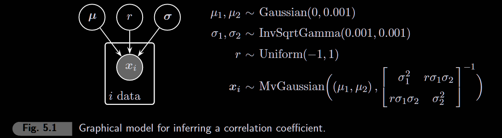
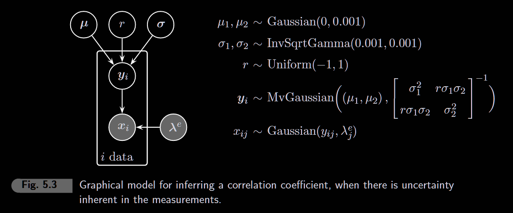
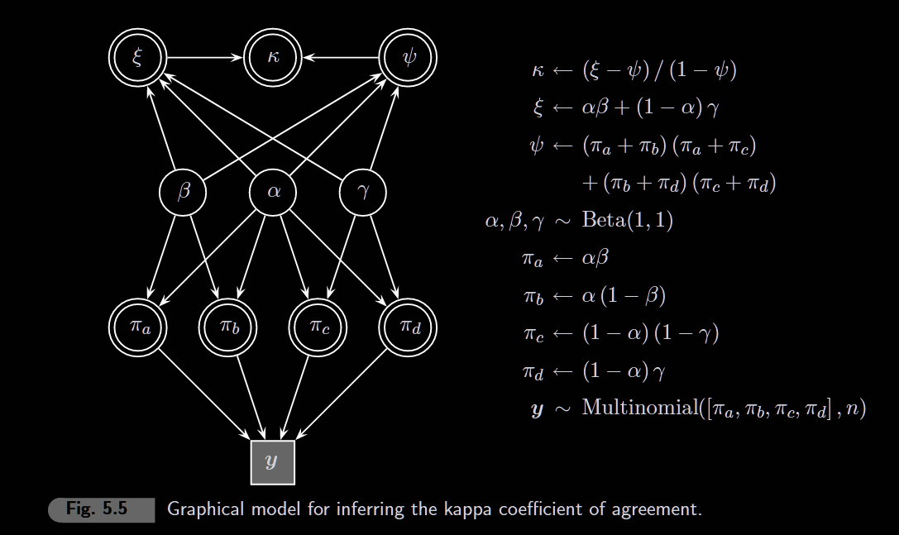
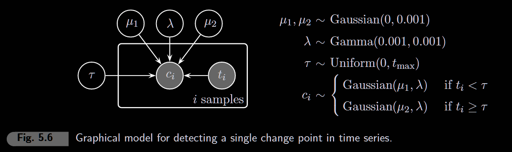
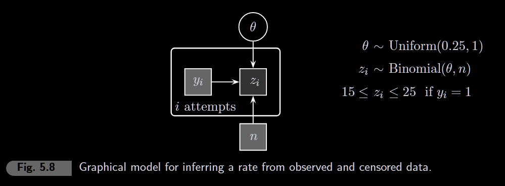

```{r setup, include=FALSE}
knitr::opts_chunk$set(echo = TRUE, fig.width = 5, fig.height = 4)

library(rjags)
library(coda)
library(ggplot2)
library(tidyverse)
library(patchwork)
```

# 5.1 Pearson correlation



We want to infer the correlation between two variables from paired observations. The bivariate normal distribution models both variables jointly, allowing us to estimate their correlation coefficient r.

```{r, fig.width = 4, fig.height = 2}
# Data: paired observations as n x 2 matrix (required for dmnorm)
x <- matrix(c(
  0.8, 1.0,   # pair 1
  1.0, 1.3,   # pair 2
  0.5, 0.6,   # pair 3
  0.9, 1.1,   # ...
  0.7, 0.9,  
  0.4, 0.5,   
  1.2, 1.5,   
  1.4, 1.8,   
  0.6, 0.7,   
  1.1, 1.4    
), nrow = 10)

n <- nrow(x)

# Visualize the data
ggplot(data.frame(x1 = x[,1], x2 = x[,2]), aes(x1, x2)) +
  geom_point(size = 2) +
  theme_minimal() +
  labs(title = "Paired observations", x = "x1", y = "x2")
```

```{r}
model_string <- "
model {
  # Likelihood: each row of x is a bivariate observation
  for (i in 1:n) {
    x[i, 1:2] ~ dmnorm(mu[], TI[,])
    # dmnorm takes: mean vector, PRECISION matrix (not covariance!)
  }

  # Priors on means (vague normal priors)
  mu[1] ~ dnorm(0, 0.001)  # mean of variable 1
  mu[2] ~ dnorm(0, 0.001)  # mean of variable 2

  # Priors on precisions (gamma is conjugate for normal precision)
  lambda[1] ~ dgamma(0.001, 0.001)  # precision of variable 1
  lambda[2] ~ dgamma(0.001, 0.001)  # precision of variable 2

  # Prior on correlation (uniform from -1 to 1)
  r ~ dunif(-1, 1)

  # Reparameterization: derive sigmas from precisions
  # This is DETERMINISTIC (<-) not stochastic (~)
  sigma[1] <- 1 / sqrt(lambda[1])
  sigma[2] <- 1 / sqrt(lambda[2])

  # Build the COVARIANCE matrix T (2x2)
  # Diagonal: variances
  T[1,1] <- 1 / lambda[1]             # = sigma[1]^2
  T[2,2] <- 1 / lambda[2]             # = sigma[2]^2
  # Off-diagonal: covariance = r * sigma1 * sigma2
  T[1,2] <- r * sigma[1] * sigma[2]
  T[2,1] <- r * sigma[1] * sigma[2]   # symmetric

  # Invert covariance matrix to get PRECISION matrix
  TI[1:2, 1:2] <- inverse(T[1:2, 1:2])
}
"
```

```{r}
# Run JAGS
model <- jags.model(
  textConnection(model_string),
  data = list(x = x, n = n),   # x is now matrix, no separate y
  n.chains = 4,
  quiet = TRUE
)

update(model, 1000)  # Burn-in

samples <- coda.samples(
  model,
  variable.names = c("r", "mu", "sigma"),  # arrays: mu[1], mu[2], sigma[1], sigma[2]
  n.iter = 10000
)
```

```{r}
# Summarize posterior
#summary(samples)
```

```{r}
# Plot posterior of correlation coefficient
posterior_df <- as.data.frame(as.matrix(samples))

ggplot(posterior_df, aes(x = r)) +
  geom_histogram(aes(y = after_stat(density)), bins = 50, fill = "steelblue", alpha = 0.7) +
  geom_vline(xintercept = cor(x[,1], x[,2]), color = "red", linetype = "dashed", linewidth = 1) +
  theme_minimal() +
  labs(title = "Posterior distribution of correlation r",
       subtitle = "Red line = sample correlation",
       x = "r", y = "Density")
```

“Today one wonders how it is possible that orthodox logic continues to be taught in some places year after year and praised as ‘objective’, while Bayesians are charged with ‘subjectivity’. Orthodoxians, preoccupied with fantasies about nonexistent data sets and, in principle, unobservable limiting frequencies—while ignoring relevant prior information—are in no position to charge anybody with ‘subjectivity’.” (Jaynes, 2003, p. 550).

# 5.2 Pearson correlation with measurement uncertainty



Now we account for measurement error. The observed data x are noisy versions of the true latent values y. The measurement precisions λe are assumed **known**.

```{r, fig.width = 4, fig.height = 2}
# Data: observed (noisy) measurements as n x 2 matrix
x <- matrix(c(
  0.8, 102,   # person 1: response time, IQ
  1.0, 98,    # person 2
  0.5, 112,   # person 3
  0.9, 105,   # ...
  0.7, 108,
  0.4, 115,
  1.2, 95,
  1.4, 89,
  0.6, 110,
  1.1, 100
), nrow = 10, byrow = TRUE)

n <- nrow(x)
# KNOWN measurement precisions (assumed known, not estimated)
# Higher precision = more accurate measurement
lambda_e <- c(100, 0.1)  # precision for response time, precision for IQ

# Visualize the observed data
ggplot(data.frame(rt = x[,1], iq = x[,2]), aes(rt, iq)) +
  geom_point(size = 2) +
  theme_minimal() +
  labs(title = "Observed (noisy) measurements", x = "Response Time", y = "IQ")
```

```{r}
model_string <- "
model {

  # Likelihood: two layers
  for (i in 1:n) {
    # Layer 1: true values from bivariate normal
    y[i, 1:2] ~ dmnorm(mu[], TI[,])  # note: TI[,] not TI[]

    # Layer 2: observed = true + measurement noise
    for (j in 1:2) {
      x[i, j] ~ dnorm(y[i, j], lambda_e[j]) 
    }
  }

  # Priors on means
  mu[1] ~ dnorm(0, 0.001)
  mu[2] ~ dnorm(0, 0.001)

  # Priors on PRECISIONS (not sigma directly!)
  lambda[1] ~ dgamma(0.001, 0.001)
  lambda[2] ~ dgamma(0.001, 0.001)

  # Prior on correlation
  r ~ dunif(-1, 1)

  # Derive sigmas from precisions (deterministic, not stochastic)
  sigma[1] <- 1 / sqrt(lambda[1])
  sigma[2] <- 1 / sqrt(lambda[2])

  # Build COVARIANCE matrix T (not precision!)
  T[1,1] <- sigma[1]^2
  T[2,2] <- sigma[2]^2
  T[1,2] <- r * sigma[1] * sigma[2]
  T[2,1] <- r * sigma[1] * sigma[2]

  # Invert to get PRECISION matrix for dmnorm
  TI[1:2, 1:2] <- inverse(T[1:2, 1:2])
}
"
```

```{r}
# Run JAGS
model <- jags.model(
  textConnection(model_string),
  data = list(x = x, n = n, lambda_e = lambda_e),
  n.chains = 4,
  quiet = TRUE
)

update(model, 1000)  # Burn-in

samples <- coda.samples(
  model,
  variable.names = c("r", "mu", "sigma"),
  n.iter = 10000
)
```

```{r}
# Summarize posterior
#summary(samples)
```

```{r, fig.width = 7, fig.height = 3}
posterior_df <- as.data.frame(as.matrix(samples))

# Calculate standard errors from known precisions (for error bars)
se_rt <- 1 / sqrt(lambda_e[1])   # SE for response time
se_iq <- 1 / sqrt(lambda_e[2])   # SE for IQ

# Left panel: scatter plot with error bars
p1 <- ggplot(data.frame(rt = x[,1], iq = x[,2]), aes(rt, iq)) +
  geom_errorbar(aes(ymin = iq - se_iq, ymax = iq + se_iq), width = 0.02) +
  geom_errorbarh(aes(xmin = rt - se_rt, xmax = rt + se_rt), height = 1) +
  geom_point(size = 1.5) +
  theme_minimal() +
  labs(x = "Response Time (sec)", y = "IQ")

# Right panel: posterior density (smooth line, not histogram)
p2 <- ggplot(posterior_df, aes(x = r)) +
  geom_density(linewidth = 0.8) +
  geom_vline(xintercept = cor(x[,1], x[,2]), linetype = "dashed") +
  theme_minimal() +
  labs(x = "Correlation", y = "Posterior Density")

p1 + p2
```

------------------------------------------------------------------------

# 5.3 The kappa coefficient of agreement



Kappa (κ) measures agreement between two raters beyond chance. Given a contingency table of ratings, we infer the underlying agreement rate.

```{r}
# Data: contingency table (2 raters x 2 categories)
# Rows = Rater 1's decisions, Columns = Rater 2's decisions
#
#              Rater 2
#              Yes   No
# Rater 1 Yes   a     b
#         No    c     d

# Example: two clinicians diagnosing patients
y <- c(20, 7, 103, 417)  # flattened: [a, b, c, d] for dmulti

n <- sum(y)  # total number of items rated
```

```{r}
model_string <- "
model {
  # Likelihood: multinomial over 4 cells
  y[1:4] ~ dmulti(pi[], n)

  # Priors (uniform = no prior preference)
  alpha ~ dbeta(1, 1)  # P(Gold says 1)
  beta ~ dbeta(1, 1)   # P(Surrogate says 1 | Gold says 1) = agreement on 1s
  gamma ~ dbeta(1, 1)  # P(Surrogate says 0 | Gold says 0) = agreement on 0s

  # Cell probabilities (JAGS needs array, not c())
  pi[1] <- alpha * beta              # a: both say 1
  pi[2] <- alpha * (1 - beta)        # b: Gold=1, Surrogate=0
  pi[3] <- (1 - alpha) * (1 - gamma) # c: Gold=0, Surrogate=1
  pi[4] <- (1 - alpha) * gamma       # d: both say 0

  # Kappa = (observed agreement - chance agreement) / (1 - chance agreement)
  xi <- pi[1] + pi[4]  # observed agreement: P(both 1) + P(both 0)
  psi <- (pi[1] + pi[2]) * (pi[1] + pi[3]) + (pi[3] + pi[4]) * (pi[2] + pi[4])  # chance agreement
  kappa <- (xi - psi) / (1 - psi)
}
"
```

```{r}
# Run JAGS
model <- jags.model(
  textConnection(model_string),
  data = list(y = y, n = n),
  n.chains = 4,
  quiet = TRUE
)

update(model, 1000)  # Burn-in

samples <- coda.samples(
  model,
  variable.names = c("kappa", "alpha", "beta", "gamma"),
  n.iter = 10000
)
```

```{r}
# Summarize posterior
#summary(samples)
```

```{r, fig.width = 6, fig.height = 4}
posterior_df <- as.data.frame(as.matrix(samples))

# Kappa: agreement beyond chance
p1 <- ggplot(posterior_df, aes(x = kappa)) +
  geom_density(fill = "steelblue", alpha = 0.4) +
  theme_minimal() +
  labs(x = "κ", y = "Density", title = "Kappa")

# Alpha: P(Gold says 1)
p2 <- ggplot(posterior_df, aes(x = alpha)) +
  geom_density(fill = "coral", alpha = 0.4) +
  theme_minimal() +
  labs(x = "α", y = "Density", title = "P(Gold = 1)")

# Beta: agreement rate on 1s
p3 <- ggplot(posterior_df, aes(x = beta)) +
  geom_density(fill = "seagreen", alpha = 0.4) +
  theme_minimal() +
  labs(x = "β", y = "Density", title = "P(Surr=1 | Gold=1)")

# Gamma: agreement rate on 0s
p4 <- ggplot(posterior_df, aes(x = gamma)) +
  geom_density(fill = "orchid", alpha = 0.4) +
  theme_minimal() +
  labs(x = "γ", y = "Density", title = "P(Surr=0 | Gold=0)")

(p1 + p2) / (p3 + p4)
```

"β≈0.8 and γ≈0.8 mean 'when Gold picks a category, Surrogate agrees 80% of time.' But since Gold almost always picks 0, that agreement would largely happen anyway by chance!"

------------------------------------------------------------------------

# 5.4 Change detection in time series data



Detect when a time series changes its mean. The changepoint τ divides the data into two regimes: mean μ₁ before, mean μ₂ after, with shared variance σ².

```{r, fig.width = 6, fig.height = 2.5}
# Real fNIRS data: oxygenated hemoglobin counts during attention task (ADHD adults)
c <- scan("data/changepointdata.txt")

n <- length(c)
t <- 1:n

# Visualize the time series
ggplot(data.frame(t, c), aes(t, c)) +
  geom_line(linewidth = 0.3) +
  theme_minimal() +
  labs(x = "Time sample", y = "Hemoglobin count",
       title = "fNIRS frontal lobe activity during attention task (ADHD)",
       subtitle = paste("n =", n, "samples"))
```

```{r}
model_string <- "
model {
  # Likelihood: data from Gaussian with switching mean
  for (i in 1:n) {
    c[i] ~ dnorm(mu[z1[i]], lambda)  # z1 indexes which mean to use
  }

  # Priors on means
  mu[1] ~ dnorm(0, 0.001)  # mean before changepoint
  mu[2] ~ dnorm(0, 0.001)  # mean after changepoint

  # Common precision (shared variance)
  lambda ~ dgamma(0.001, 0.001)
  sigma <- 1 / sqrt(lambda)  # derive SD for output

  # Switching logic: which side of changepoint?
  for (i in 1:n) {
    z[i] <- step(t[i] - tau)  # 0 if t[i] < tau, 1 if t[i] >= tau
    z1[i] <- z[i] + 1         # convert to index: 1 or 2
  }

  # Prior on changepoint (continuous uniform)
  tau ~ dunif(0, n)
}
"
```

```{r}
# Run JAGS
model <- jags.model(
  textConnection(model_string),
  data = list(c = c, n = n, t = t),  # t = time index needed for step()
  n.chains = 4,
  quiet = TRUE
)

update(model, 1000)  # Burn-in

samples <- coda.samples(
  model,
  variable.names = c("tau", "mu", "sigma"),  # mu gives mu[1] and mu[2]
  n.iter = 10000
)
```

```{r}
# Summarize posterior
plot(samples, density = FALSE)
```

```{r, fig.width = 6, fig.height = 5}
posterior_df <- as.data.frame(as.matrix(samples))

# Tau: changepoint time
p1 <- ggplot(posterior_df, aes(x = tau)) +
  geom_histogram(bins = 50, fill = "steelblue", alpha = 0.7) +
  theme_minimal() +
  labs(x = "Time sample", y = "Count", title = "Changepoint τ")

# Mu[1]: mean before change (use backticks for bracket names)
p2 <- ggplot(posterior_df, aes(x = `mu[1]`)) +
  geom_density(fill = "coral", alpha = 0.4) +
  theme_minimal() +
  labs(x = "μ₁", y = "Density", title = "Mean before change")

# Mu[2]: mean after change
p3 <- ggplot(posterior_df, aes(x = `mu[2]`)) +
  geom_density(fill = "seagreen", alpha = 0.4) +
  theme_minimal() +
  labs(x = "μ₂", y = "Density", title = "Mean after change")

# Sigma: shared standard deviation
p4 <- ggplot(posterior_df, aes(x = sigma)) +
  geom_density(fill = "orchid", alpha = 0.4) +
  theme_minimal() +
  labs(x = "σ", y = "Density", title = "Shared SD")

(p1) / (p2 + p3) / (p4)
```

------------------------------------------------------------------------

# 5.5 Censored data: The Cha Sa-soon problem

**The story**: Cha Sa-soon from Korea finally passed her driver's theory exam on her **950th attempt**. What can we infer about θ, her probability of answering any one question correctly?

**Why this is censored data**: - She **failed 949 times** → we don't know exact scores, only that they were **below the passing threshold** (e.g., \< 30 out of 50) - She **passed once** → we know she scored **at least 30/50**



**Key JAGS concept: `dinterval()`**

`dinterval(z, c(low, high))` handles interval censoring: - Returns 0 if z \< low - Returns 1 if low ≤ z \< high - Returns 2 if z ≥ high

The model uses this to say "we only know z fell within this range, not the exact value."

**Prior on θ**: Since she eventually passed, θ must be at least 0.25 (you can't pass with θ \< 0.25 by pure luck on 50 questions). The model uses `dinterval` to constrain θ ∈ [0.25, 1].

**Option A: Create constants in R (easier to understand)**

```{r}
nattempts  <- 950
nfails     <- 949
n          <- 50    # Number of questions
z <- c(rep(NA, nfails), 30)  # NA = censored (unknown), 30 = observed passing score
y <- c(rep(1, nfails), 0)    # 1 = fail (censored), 0 = pass (observed)

# Create censoring indicators in R
is.censored <- rep(1, nattempts)  # all are "censored" (constrained)
is.cnsrd <- 1                      # for theta constraint
```

```{r}
model_string <- "
model {
  for (i in 1:nattempts) {
    # Set censoring bounds based on pass/fail
    # y[i]=1 means fail: score was in [15, 25) (below 50% passing threshold)
    # y[i]=0 means pass: score was in [0, n] (effectively uncensored)
    z.low[i]  <- 15 * equals(y[i], 1) + 0 * equals(y[i], 0)
    z.high[i] <- 25 * equals(y[i], 1) + n * equals(y[i], 0)  # 25 not 29!
    lim[i, 1] <- z.low[i]
    lim[i, 2] <- z.high[i]

    # dinterval: tells JAGS that z[i] is censored to [lim[i,1], lim[i,2]]
    is.censored[i] ~ dinterval(z[i], lim[i, ])

    # Each score z[i] comes from binomial with probability theta
    z[i] ~ dbin(theta, n)
  }

  # Constrain theta to [0.25, 1] using dinterval
  x[1] <- 0.25
  x[2] <- 1
  is.cnsrd ~ dinterval(theta, x)

  # Prior on theta (will be truncated to [0.25, 1] by dinterval)
  theta ~ dbeta(1, 1)
}
"
```

```{r}
# Run JAGS - include is.censored and is.cnsrd from R!
model <- jags.model(
  textConnection(model_string),
  data = list(nattempts = nattempts, n = n, z = z, y = y,
              is.censored = is.censored, is.cnsrd = is.cnsrd),
  n.chains = 4,
  quiet = TRUE
)

update(model, 1000)  # Burn-in

samples <- coda.samples(
  model,
  variable.names = c("theta"),
  n.iter = 10000
)
```

```{r}
#summary(samples)
```

```{r, fig.width = 5, fig.height = 3}
posterior_df <- as.data.frame(as.matrix(samples))

# Calculate 95% credible interval
ci <- quantile(posterior_df$theta, c(0.025, 0.975))

ggplot(posterior_df, aes(x = theta)) +
  geom_density(fill = "steelblue", alpha = 0.4, linewidth = 0.8) +
  geom_vline(xintercept = ci, linetype = "dashed", color = "red") +
  annotate("text", x = mean(ci), y = 0, label = paste0("95% CI: [",
           round(ci[1], 3), ", ", round(ci[2], 3), "]"), vjust = -15) +
  theme_minimal() +
  scale_x_continuous(limits = c(0.25, 0.75))
  labs(x = "θ (probability of correct answer)",
       y = "Posterior Density",
       title = "Cha Sa-soon's ability parameter",
       subtitle = "After 949 failures and 1 pass on 50-question exam")
```

------------------------------------------------------------------------
