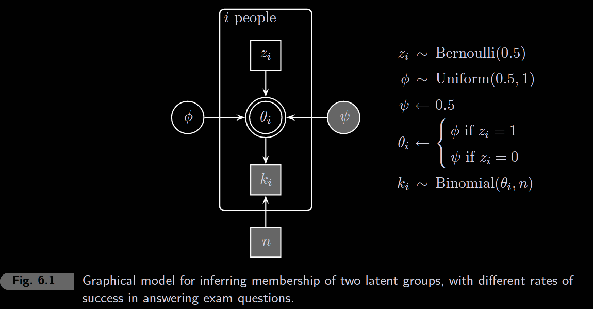
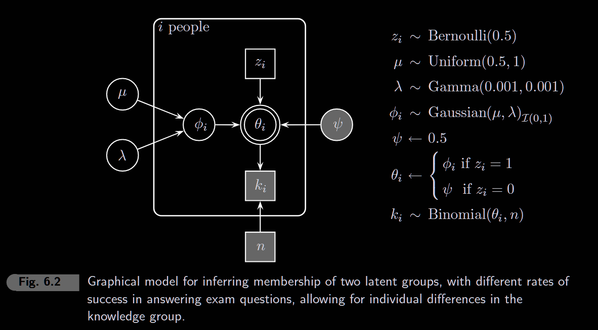
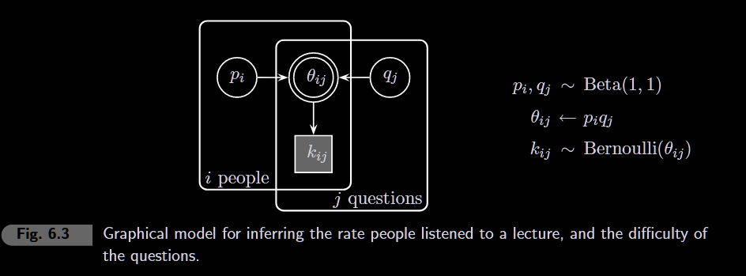
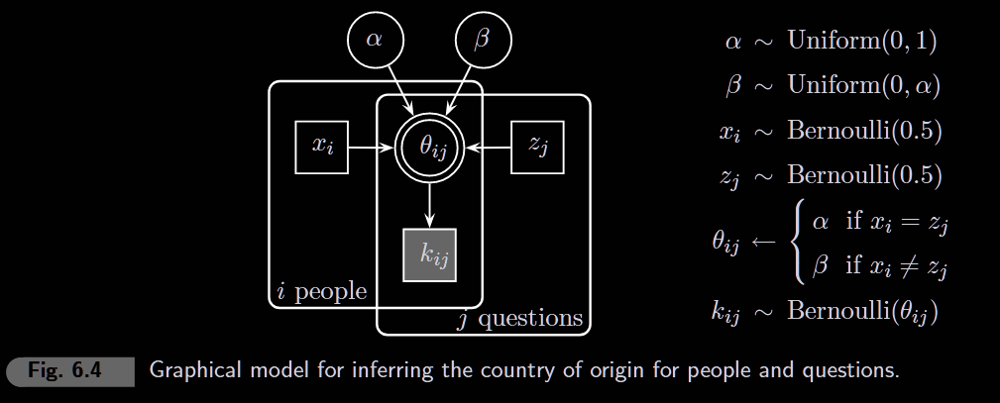

```{r setup, include=FALSE}
knitr::opts_chunk$set(echo = TRUE, warning = FALSE, message = FALSE)
```

```{r}
library(rjags)
library(coda)
library(ggplot2)
library(tidyverse)
library(patchwork)
```

------------------------------------------------------------------------

# 6.1 Exam Scores



**Data**: 15 students took a 40-question exam. Their scores:

```{r}
# Exam scores (number correct out of 40)
k <- c(21, 17, 21, 18, 22, 31, 31, 34, 34, 35, 35, 36, 39, 36, 35, 28)
p <- length(k)  # number of people
n <- 40         # number of questions

# Visualize the scores
data.frame(student = 1:p, score = k) %>%
  ggplot(aes(x = score)) +
  geom_histogram(binwidth = 2, fill = "steelblue", alpha = 0.7, color = "white") +
  geom_vline(xintercept = n * 0.5, linetype = "dashed", color = "red") +
  annotate("text", x = 20, y = 3.5, label = "Chance level (50%)", color = "red") +
  theme_minimal() +
  labs(x = "Score (out of 40)", y = "Count",
       title = "Distribution of Exam Scores",
       subtitle = "Notice the two clusters: guessers (~20) vs knowers (~35)")
```

```{r}
model_string <- "
model {
  # Likelihood
  for (i in 1:p) {
    beta[i] <- equals(z[i], 0) * psi + equals(z[i], 1) * phi
    
    k[i] ~ dbin(beta[i], n)
  }
  
  # Priors
  for (i in 1:p) {
    z[i] ~ dbern(0.5)
  }
  
  psi <- 0.5
  phi ~ dunif(0.5, 1) # We can also dbeta(1,1)I(0.5, 1) --> I() works like domain
}
"
```

```{r}
# Run JAGS
model <- jags.model(
  textConnection(model_string),
  data = list(p = p, k = k, n = n),
  inits = list(z = rep(1, p)),  # Initialize all as knowers
  n.chains = 4,
  quiet = TRUE
)

update(model, 1000)  # Burn-in

samples <- coda.samples(
  model,
  variable.names = c("phi", "z"),
  n.iter = 10000
)
```

```{r}
#summary(samples)
```

```{r, fig.width = 7, fig.height = 4}
posterior_df <- as.data.frame(as.matrix(samples))

# Phi: knower's ability
p1 <- ggplot(posterior_df, aes(x = phi)) +
  geom_density(fill = "steelblue", alpha = 0.5) +
  theme_minimal() +
  labs(x = "φ (knower's ability)", y = "Density",
       title = "Posterior: Knower's Success Rate")

# Z indicators: probability each student is a knower
z_cols <- grep("^z\\[", names(posterior_df), value = TRUE)
z_means <- colMeans(posterior_df[, z_cols])

p2 <- data.frame(
  student = 1:p,
  score = k,
  p_knower = z_means
) %>%
  ggplot(aes(x = factor(student), y = p_knower, fill = score)) +
  geom_col() +
  scale_fill_gradient(low = "coral", high = "seagreen") +
  geom_hline(yintercept = 0.5, linetype = "dashed") +
  theme_minimal() +
  labs(x = "Student", y = "P(Knower)", fill = "Score",
       title = "Posterior Probability of Being a Knower")

p1 + p2
```

```{r}
# Summary table
# data.frame(
#   Student = 1:p,
#   Score = k,
#   P_Knower = round(z_means, 3),
#   Classification = ifelse(z_means > 0.5, "Knower", "Guesser")
# ) %>%
#   knitr::kable()
```

# 6.2 Exam scores with individual differences



**Extension**: Instead of all knowers sharing one ability φ, each knower has their **own ability φ[i]** drawn from a group-level distribution.

**Hierarchical structure**: - Guessers: ψ = 0.5 (fixed) - Knowers: φ[i] \~ Normal(μ, σ) truncated to [0, 1] - μ = mean ability of knowers (\> 0.5) - σ = individual variation among knowers

```{r}
# Same data as 6.1
k <- c(21, 17, 21, 18, 22, 31, 31, 34, 34, 35, 35, 36, 39, 36, 35, 28)
p <- length(k)
n <- 40
```

```{r}
model_string <- "
model {
  # Likelihood
  for (i in 1:p) {
    beta[i] <- equals(z[i], 0) * psi + equals(z[i], 1) * phi[i]
    
    k[i] ~ dbin(beta[i], n)
  }

  # Priors
  mu ~ dunif(0.5, 1)
  lambda ~ dgamma(0.001, 0.001)
  
  psi <- 0.5
  
  for (i in 1:p) {
    z[i] ~ dbern(0.5)
  }
  for (i in 1:p) {
    phi[i] ~ dnorm(mu, lambda)T(0, 1) # new syntax is T(a,b) for truncation
  }
  
  # More output from the book
  sigma <- 1/sqrt(lambda) # Convert precision to SD
  
  predphi ~ dnorm(mu, lambda)T(0, 1) # Posterior predictive for new knower
}
"
```

```{r}
model <- jags.model(
  textConnection(model_string),
  data = list(p = p, k = k, n = n),
  inits = list(z = rep(1, p), mu = 0.75, lambda = 1),
  n.chains = 4,
  quiet = TRUE
)

update(model, 1000)

samples <- coda.samples(
  model,
  variable.names = c("mu", "sigma", "phi", "z", "predphi"),
  n.iter = 10000
)
```

```{r}
#summary(samples)
```

```{r, fig.width = 8, fig.height = 8}
posterior_df <- as.data.frame(as.matrix(samples))

# Extract z and phi estimates
z_cols <- grep("^z\\[", names(posterior_df), value = TRUE)
z_means <- colMeans(posterior_df[, z_cols])

phi_cols <- grep("^phi\\[", names(posterior_df), value = TRUE)
phi_means <- colMeans(posterior_df[, phi_cols])
phi_lower <- apply(posterior_df[, phi_cols], 2, quantile, 0.025)
phi_upper <- apply(posterior_df[, phi_cols], 2, quantile, 0.975)

# P(Knower) for each student - THE KEY PLOT
p1 <- data.frame(
  Student = 1:p,
  Score = k,
  P_Knower = z_means
) %>%
  ggplot(aes(x = factor(Student), y = P_Knower, fill = Score)) +
  geom_col() +
  geom_hline(yintercept = 0.5, linetype = "dashed", color = "black") +
  scale_fill_gradient(low = "coral", high = "seagreen") +
  theme_minimal() +
  labs(x = "Student", y = "P(Knower)", fill = "Score",
       title = "Group Assignment: P(z = 1)",
       subtitle = "Students 1-5 are guessers, 6-16 are knowers")

# Mu: group mean for knowers
p2 <- ggplot(posterior_df, aes(x = mu)) +
  geom_density(fill = "steelblue", alpha = 0.5) +
  theme_minimal() +
  labs(x = "μ (mean knower ability)", y = "Density",
       title = "Group Mean for Knowers")

# Sigma: individual differences SD
p3 <- ggplot(posterior_df, aes(x = sigma)) +
  geom_density(fill = "coral", alpha = 0.5) +
  theme_minimal() +
  labs(x = "σ (SD of knower abilities)", y = "Density",
       title = "Individual Differences (σ)")

# Posterior predictive for new knower
p4 <- ggplot(posterior_df, aes(x = predphi)) +
  geom_density(fill = "seagreen", alpha = 0.5) +
  geom_vline(xintercept = 0.5, linetype = "dashed", color = "red") +
  theme_minimal() +
  labs(x = "φ (predicted ability)", y = "Density",
       title = "Posterior Predictive: New Knower")

# Individual phi estimates - ONLY FOR KNOWERS (z > 0.5)
p5 <- data.frame(
  Student = 1:p,
  Score = k,
  phi = phi_means,
  lower = phi_lower,
  upper = phi_upper,
  P_Knower = z_means,
  Group = ifelse(z_means > 0.5, "Knower", "Guesser")
) %>%
  ggplot(aes(x = factor(Student), y = phi, color = Group)) +
  geom_point(size = 3) +
  geom_errorbar(aes(ymin = lower, ymax = upper), width = 0.2) +
  geom_hline(yintercept = 0.5, linetype = "dashed", color = "red") +
  scale_color_manual(values = c("Guesser" = "coral", "Knower" = "seagreen")) +
  theme_minimal() +
  labs(x = "Student", y = "φ[i]", color = "",
       title = "Individual φ[i] Estimates",
       subtitle = "Note: φ[i] for guessers is meaningless (not used in likelihood)")

p1 / (p2 + p3) / (p4 + p5)
```

"For the first 15 participants the results are essentially unchanged. The new participant with a score of 28 is now inferred to be in the knowledge group with probability 0.8, compared to the original 0.5. This happens because the new participant is more likely to be a low-knowledge member of the knowledge group than a member of the guessing group. The fact that the current model allows for individual differences helps it account for the relatively low score of 28."

# 6.3 Twenty questions



**The problem**: 10 people answer 20 true/false questions. Can we estimate both: - **p[i]** — each person's ability - **q[j]** — each question's easiness

**Key insight**: The probability of person i answering question j correctly is: $$\theta_{i,j} = p_i \times q_j$$

This is a **multiplicative model** — a high-ability person on an easy question has high θ, but even good people can miss hard questions (low q).

```{r}
# Data: 10 people × 20 questions (1 = correct, 0 = incorrect)
k <- c(1,1,1,1,0,0,1,1,0,1,0,0,1,0,0,1,0,1,0,0,
        0,1,1,0,0,0,0,0,0,0,0,0,0,0,0,0,0,0,0,0,
        0,0,1,0,0,0,1,1,0,0,0,0,1,0,0,0,0,0,0,0,
        0,0,0,0,0,0,1,0,1,1,0,0,0,0,0,0,0,0,0,0,
        1,0,1,1,0,1,1,1,0,1,0,0,1,0,0,0,0,1,0,0,
        1,1,0,1,0,0,0,1,0,1,0,1,1,0,0,1,0,1,0,0,
        0,0,0,0,0,0,0,0,0,0,0,1,0,0,0,0,0,0,0,0,
        0,0,0,0,0,0,0,0,0,0,0,0,0,0,0,0,0,0,0,0,
        0,1,1,0,0,0,0,1,0,1,0,0,1,0,0,0,0,1,0,1,
        1,0,0,0,0,0,1,0,0,1,0,0,1,0,0,0,0,0,0,0)

k <- matrix(k, nrow = 10, byrow = TRUE)

np <- nrow(k)  # 10 people
nq <- ncol(k)  # 20 questions
```

```{r, fig.width = 4, fig.height = 3}
# Visualize the response matrix
k_df <- as.data.frame(k)
colnames(k_df) <- paste0("Q", 1:nq)
k_df$Person <- factor(1:np)

k_long <- k_df %>%
  pivot_longer(cols = starts_with("Q"), names_to = "Question", values_to = "Correct") %>%
  mutate(Question = factor(Question, levels = paste0("Q", 1:nq)))

ggplot(k_long, aes(x = Question, y = Person, fill = factor(Correct))) +
  geom_tile(color = "white") +
  scale_fill_manual(values = c("0" = "coral", "1" = "seagreen"),
                    labels = c("Wrong", "Correct")) +
  theme_minimal() +
  theme(axis.text.x = element_text(angle = 45, hjust = 1)) +
  labs(fill = "", title = "Response Matrix: 10 People × 20 Questions",
       subtitle = "Person 8 got everything wrong; Q14-15, Q19-20 are very hard")
```

```{r}
# Person and question totals
cat("Person scores (out of 20):", rowSums(k), "\n")
cat("Question correct (out of 10):", colSums(k), "\n")
```

```{r}
model_string <- "
model {
  # Likelihood
  for (i in 1:np) {
    for (j in 1:nq) {
      theta[i, j] <- p[i] * q[j]
      
      k[i, j] ~ dbern(theta[i, j])
    }
  }
  
  # Priors
  for (i in 1:np) {
    p[i] ~ dbeta(1, 1)
  }
  
  for (j in 1:nq) {
    q[j] ~ dbeta(1, 1)
  }
  
  
}
"
```

```{r}
# Find which entries are missing (NA)
missing_idx <- which(is.na(k), arr.ind = TRUE)
cat("Missing data locations:\n")
for (i in 1:nrow(missing_idx)) {
  cat(sprintf("  k[%d, %d] = Person %d, Question %d\n",
              missing_idx[i,1], missing_idx[i,2],
              missing_idx[i,1], missing_idx[i,2]))
}
```

```{r}
model <- jags.model(
  textConnection(model_string),
  data = list(np = np, nq = nq, k = k),
  inits = list(p = runif(np), q = runif(nq)),
  n.chains = 4,
  quiet = TRUE
)

update(model, 1000)

# Monitor k to get posterior predictions for missing values!
samples <- coda.samples(
  model,
  variable.names = c("p", "q", "k"),
  n.iter = 10000
)
```

```{r, fig.width = 8, fig.height = 4}
posterior_df <- as.data.frame(as.matrix(samples))

# Extract p and q estimates
p_cols <- grep("^p\\[", names(posterior_df), value = TRUE)
p_means <- colMeans(posterior_df[, p_cols])

q_cols <- grep("^q\\[", names(posterior_df), value = TRUE)
q_means <- colMeans(posterior_df[, q_cols])

# Simple side-by-side: Person abilities and Question easiness
p1 <- data.frame(Person = 1:np, Ability = p_means) %>%
  ggplot(aes(x = factor(Person), y = Ability)) +
  geom_col(fill = "steelblue", alpha = 0.7) +
  theme_minimal() +
  labs(x = "Person", y = "p[i]", title = "Person Abilities")

p2 <- data.frame(Question = 1:nq, Easiness = q_means) %>%
  ggplot(aes(x = factor(Question), y = Easiness)) +
  geom_col(fill = "coral", alpha = 0.7) +
  theme_minimal() +
  labs(x = "Question", y = "q[j]", title = "Question Easiness")

p1 + p2
```

**Conclusions:** Person 8 has p≈0 (not listening). Q5, Q14, Q15, Q19, Q20 have q≈0 (very hard).

# 6.4 The two-country quiz



**The problem**: 8 people answer 8 questions about two countries. Each person and question belongs to one country (latent). People do better on questions about "their" country.

-   **x[i]** = person i's country (0 or 1)
-   **z[j]** = question j's country (0 or 1)
-   **α** = P(correct) when person & question match (same country)
-   **β** = P(correct) when mismatch (β \< α)

```{r}
# Data: 8 people × 8 questions
k <- c(1,0,0,1,1,0,0,1,
       1,0,0,1,1,0,0,1,
       0,1,1,0,0,1,0,0,
       0,1,1,0,0,1,1,0,
       1,0,0,1,1,0,0,1,
       0,0,0,1,1,0,0,1,
       0,1,0,0,0,1,1,0,
       0,1,1,1,0,1,1,0)
k <- matrix(k, nrow = 8, byrow = TRUE)

nx <- nrow(k)  # 8 people
nz <- ncol(k)  # 8 questions
```

```{r}
model_string <- "
model {
  
}
"
```

```{r}
model <- jags.model(
  textConnection(model_string),
  data = list(nx = nx, nz = nz, k = k),
  inits = list(x = round(runif(nx)), z = round(runif(nz)), alpha = 0.5, beta = 0.25),
  n.chains = 4,
  quiet = TRUE
)

update(model, 1000)

samples <- coda.samples(
  model,
  variable.names = c("alpha", "beta", "x", "z"),
  n.iter = 10000
)
```

```{r, fig.width = 8, fig.height = 4}
posterior_df <- as.data.frame(as.matrix(samples))

# Alpha and Beta posteriors
p1 <- posterior_df %>%
  select(alpha, beta) %>%
  pivot_longer(everything(), names_to = "param", values_to = "value") %>%
  ggplot(aes(x = value, fill = param)) +
  geom_density(alpha = 0.5) +
  theme_minimal() +
  labs(x = "Probability", y = "Density", fill = "",
       title = "α (match) vs β (mismatch)")

# Group assignments
x_cols <- grep("^x\\[", names(posterior_df), value = TRUE)
z_cols <- grep("^z\\[", names(posterior_df), value = TRUE)
x_means <- colMeans(posterior_df[, x_cols])
z_means <- colMeans(posterior_df[, z_cols])

p2 <- data.frame(
  ID = c(1:nx, 1:nz),
  P_country1 = c(x_means, z_means),
  Type = c(rep("Person", nx), rep("Question", nz))
) %>%
  ggplot(aes(x = factor(ID), y = P_country1, fill = Type)) +
  geom_col(position = "dodge") +
  geom_hline(yintercept = 0.5, linetype = "dashed") +
  theme_minimal() +
  labs(x = "ID", y = "P(Country 1)", fill = "", title = "Group Assignments")

p1 + p2
```
