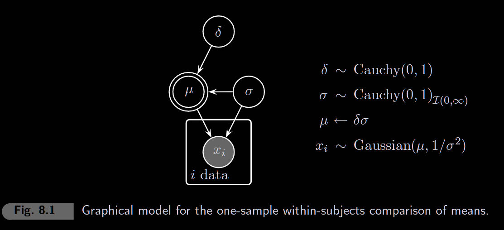
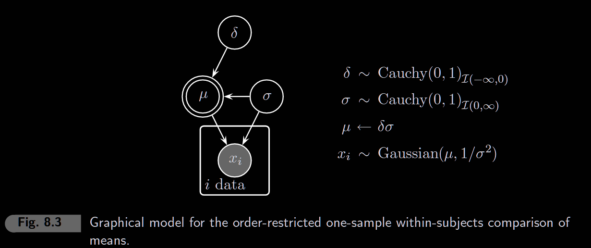
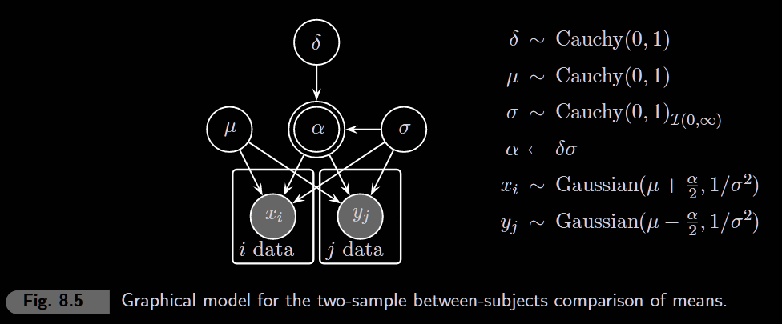

```{r setup, include=FALSE}
knitr::opts_chunk$set(echo = TRUE, warning = FALSE, message = FALSE)
```

```{r}
library(rjags)
library(coda)
library(ggplot2)
library(tidyverse)
library(patchwork)
library(polspline)  # for Savage-Dickey density estimation
```

------------------------------------------------------------------------

# 8.1 One-sample comparison



**Question**: Do people gain weight in winter compared to summer? (Dr. Smith's data)

This is a within-subjects design, so we compute difference scores and test if the mean effect size δ = 0.

```{r}
# Dr. Smith's seasonal weight data (in pounds, relative to baseline)
winter <- c(-0.05, 0.41, 0.17, -0.13, 0.00, -0.05, 0.00, 0.17, 0.29, 0.04,
            0.21, 0.08, 0.37, 0.17, 0.08, -0.04, -0.04, 0.04, -0.13, -0.12,
            0.04, 0.21, 0.17, 0.17, 0.17, 0.33, 0.04, 0.04, 0.04, 0.00,
            0.21, 0.13, 0.25, -0.05, 0.29, 0.42, -0.05, 0.12, 0.04, 0.25, 0.12)

summer <- c(0.00, 0.38, -0.12, 0.12, 0.25, 0.12, 0.13, 0.37, 0.00, 0.50,
            0.00, 0.00, -0.13, -0.37, -0.25, -0.12, 0.50, 0.25, 0.13, 0.25,
            0.25, 0.38, 0.25, 0.12, 0.00, 0.00, 0.00, 0.00, 0.25, 0.13,
            -0.25, -0.38, -0.13, -0.25, 0.00, 0.00, -0.12, 0.25, 0.00, 0.50, 0.00)

# Difference scores (winter - summer), then standardize
x <- winter - summer
x <- x / sd(x)  # standardize to get effect size scale

ndata <- length(x)

cat("n =", ndata, "subjects\n")
cat("Mean difference (standardized):", round(mean(x), 3), "\n")
cat("Frequentist t-test p-value:", round(t.test(x)$p.value, 4))
```

### Model

The model estimates effect size δ where μ = δσ. We use a Cauchy prior on δ (implemented via normal-chisquare trick in JAGS).

```{r}
model_string <- "
model {
  # Likelihood
  for (i in 1:ndata) {
    x[i] ~ dnorm(mu, sigma^(-2))
  }
  
  # Priors
  sigma ~ dnorm(0,lambdasigma)T(0, )
  delta ~  dnorm(0, lambdadelta)
  deltaprior ~ dnorm(0, lambdadeltaprior)
  lambdadelta ~ dchisqr(1)
  lambdasigma ~ dchisqr(1)
  lambdadeltaprior ~ dchisqr(1)
  
  mu <- delta*sigma

}
"
```

```{r eval=FALSE}
# Run the model (will work once you fill in model_string above)
model <- jags.model(
  textConnection(model_string),
  data = list(x = x, ndata = ndata),
  n.chains = 4
)

update(model, 1000)  # burn-in

samples <- coda.samples(
  model,
  variable.names = c("delta", "deltaprior"),
  n.iter = 10000
)
```

```{r eval=FALSE}
# Posterior analysis and Bayes Factor
#summary(samples)
#plot(samples)

# Extract samples
posterior_df <- as.data.frame(as.matrix(samples))

# Savage-Dickey density ratio
fit_posterior <- logspline(posterior_df$delta)
fit_prior <- logspline(posterior_df$deltaprior)

posterior_at_0 <- dlogspline(0, fit_posterior)
prior_at_0 <- dcauchy(0)  # Cauchy(0,1) density at 0

BF01 <- posterior_at_0 / prior_at_0
cat("BF01 =", round(BF01, 3), "\n")
cat("BF10 =", round(1/BF01, 3), "(evidence for effect)\n")
```

```{r eval=FALSE}
# Visualize prior vs posterior
ggplot() +
  stat_function(fun = dcauchy, args = list(location = 0, scale = 1),
                aes(color = "Prior"), linewidth = 1) +
  geom_density(data = posterior_df, aes(x = delta, color = "Posterior"), linewidth = 1) +
  geom_vline(xintercept = 0, linetype = "dashed") +
  geom_point(aes(x = 0, y = posterior_at_0), size = 3) +
  geom_point(aes(x = 0, y = prior_at_0), size = 3) +
  annotate("text", x = 0.2, y = prior_at_0, label = paste("Prior at 0:", round(prior_at_0, 3))) +
  annotate("text", x = 0.2, y = posterior_at_0 + 0.1, label = paste("Posterior at 0:", round(posterior_at_0, 3))) +
  scale_color_manual(values = c("Prior" = "gray50", "Posterior" = "steelblue")) +
  #coord_cartesian(xlim = c(-3, 3), ylim = c(0, 2.5)) +
  theme_minimal() +
  labs(title = "Savage-Dickey: Prior vs Posterior at δ = 0",
       subtitle = paste("BF01 =", round(BF01, 2), "| BF10 =", round(1/BF01, 2)),
       x = "Effect size (δ)", y = "Density", color = "")
```

# 8.2 Order-restricted one-sample comparison



**Question**: Same data, but now we test a *directional* hypothesis: Do people gain weight in winter (δ \> 0) or lose weight (δ \< 0)?

Order restriction means we only consider one direction. This gives more power when the prediction is correct.

```{r}
# Same data as 8.1 - already standardized difference scores
cat("Mean effect (standardized):", round(mean(x), 3), "\n")
cat("Direction:", ifelse(mean(x) < 0, "Winter < Summer (δ < 0)", "Winter > Summer (δ > 0)"))
```

### Key Difference from 8.1

-   **8.1 (two-sided)**: H₀: δ = 0 vs H₁: δ ≠ 0
-   **8.2 (one-sided)**: H₀: δ = 0 vs H₊: δ \< 0 (directional prediction)

When truncating to δ \< 0: - Prior density at 0 **doubles**: `prior_at_0 = 2 * dcauchy(0)` - Posterior is fit with `ubound = 0`

### Model

```{r}
model_string_restricted <- "
model {

  # Likelihood
  for (i in 1:ndata) {
    x[i] ~ dnorm(mu, sigma^(-2))
  }
  
  
  # Priors
  sigma ~ dnorm(0,lambdasigma)T(0, )
  delta ~  dnorm(0, lambdadelta)T(, 0)
  deltaprior ~ dnorm(0, lambdadeltaprior)T(, 0)
  lambdadelta ~ dchisqr(1)
  lambdasigma ~ dchisqr(1)
  lambdadeltaprior ~ dchisqr(1)
  
  mu <- delta*sigma

}
"
```

```{r eval=FALSE}
# Run the order-restricted model
model_r <- jags.model(
  textConnection(model_string_restricted),
  data = list(x = x, ndata = ndata),
  inits = function() list(delta = -abs(rnorm(1))),  # initialize in valid range
  n.chains = 4
)

update(model_r, 1000)

samples_r <- coda.samples(
  model_r,
  variable.names = c("delta", "deltaprior"),
  n.iter = 10000
)
```

```{r eval=FALSE}
# Bayes Factor for order-restricted hypothesis
posterior_df_r <- as.data.frame(as.matrix(samples_r))

# Fit with upper bound at 0 (order restriction)
fit_posterior_r <- logspline(posterior_df_r$delta, ubound = 0)

posterior_at_0_r <- dlogspline(0, fit_posterior_r)
prior_at_0_r <- 2 * dcauchy(0)  # doubled because half-Cauchy

BF01_r <- posterior_at_0_r / prior_at_0_r
cat("Order-restricted BF01 =", round(BF01_r, 3), "\n")
cat("Order-restricted BF10 =", round(1/BF01_r, 3), "(evidence for δ < 0)\n")
```

```{r eval=FALSE}
# Compare unrestricted vs restricted posterior
# Use logspline fit for posterior (matches boundary constraint)
ggplot(data.frame(x = c(-3, 1)), aes(x = x)) +
  # Unrestricted prior (full Cauchy) - for reference
  stat_function(fun = dcauchy, args = list(location = 0, scale = 1),
                aes(color = "Prior (unrestricted)"), linewidth = 1, linetype = "dashed") +
  # Restricted prior (half-Cauchy, δ < 0)
  stat_function(fun = function(x) ifelse(x <= 0, 2*dcauchy(x), 0),
                aes(color = "Prior (δ < 0)"), linewidth = 1) +
  # Restricted posterior - use logspline fit so curve matches the dot!
  stat_function(fun = function(x) dlogspline(x, fit_posterior_r),
                aes(color = "Posterior (δ < 0)"), linewidth = 1, xlim = c(-3, 0)) +
  geom_vline(xintercept = 0, linetype = "dashed") +
  geom_point(aes(x = 0, y = posterior_at_0_r), size = 3, color = "steelblue") +
  geom_point(aes(x = 0, y = prior_at_0_r), size = 3, color = "coral") +
  scale_color_manual(values = c("Prior (unrestricted)" = "gray70",
                                 "Prior (δ < 0)" = "coral",
                                 "Posterior (δ < 0)" = "steelblue")) +
  theme_minimal() +
  labs(title = "Order-Restricted Savage-Dickey",
       subtitle = paste("BF01 =", round(BF01_r, 2), "| BF10 =", round(1/BF01_r, 2)),
       x = "Effect size (δ)", y = "Density", color = "")
```

------------------------------------------------------------------------

# 8.3 Two-sample comparison



**Question**: Are two independent groups different? (Bayesian independent-samples t-test)

Unlike 8.1-8.2 (within-subjects), this compares two separate groups.

```{r}
# Two independent groups
group_x <- c(70, 80, 79, 83, 77, 75, 84, 78, 75, 75,
             78, 82, 74, 81, 72, 70, 75, 72, 76, 77)

group_y <- c(56, 80, 63, 62, 67, 71, 68, 76, 79, 67,
             76, 74, 67, 70, 62, 65, 72, 72, 69, 71)

n1 <- length(group_x)
n2 <- length(group_y)

# Standardize both groups relative to group_x (pooled reference)
y_scaled <- (group_y - mean(group_x)) / sd(group_x)
x_scaled <- (group_x - mean(group_x)) / sd(group_x)

cat("Group X: n =", n1, ", mean =", round(mean(group_x), 2), ", sd =", round(sd(group_x), 2), "\n")
cat("Group Y: n =", n2, ", mean =", round(mean(group_y), 2), ", sd =", round(sd(group_y), 2), "\n")
cat("Raw difference:", round(mean(group_x) - mean(group_y), 2), "\n")
cat("Frequentist t-test p-value:", round(t.test(group_x, group_y)$p.value, 4))
```

### Model

Key difference from one-sample: - Two means: μₓ = μ + α/2 and μᵧ = μ - α/2 - Effect: α = δσ (so δ is in standardized effect size units) - Both groups share the same σ (pooled variance assumption)

```{r}
model_string_twosample <- "
model {
  # Likelihood
  for (i in 1:n1) {
    x[i] ~ dnorm(mu + alpha/2, sigma^(-2))
  }
  for (i in 1:n2) {
    y[i] ~ dnorm(mu - alpha/2, sigma^(-2))
  }
  
  # Priors
  delta ~ dnorm(0, deltalambda)
  deltalambda ~ dchisqr(1)
  
  mu ~ dnorm(0, mulambda)
  mulambda ~ dchisqr(1)
  
  sigma ~ dnorm(0, sigmalambda)T(0, )
  sigmalambda ~ dchisqr(1)
  
  
  # Derived
  alpha <- delta*sigma

  # Prior sampling for Savage-Dickey
  deltaprior ~ dnorm(0, deltapriorlambda)
  deltapriorlambda ~ dchisqr(1)
  
}
"
```

```{r eval=FALSE}
# Run the two-sample model
model_2s <- jags.model(
  textConnection(model_string_twosample),
  data = list(x = x_scaled, y = y_scaled, n1 = n1, n2 = n2),
  n.chains = 4
)

update(model_2s, 1000)

samples_2s <- coda.samples(
  model_2s,
  variable.names = c("delta", "deltaprior"),
  n.iter = 10000
)
```

```{r eval=FALSE}
# Bayes Factor for two-sample comparison
posterior_df_2s <- as.data.frame(as.matrix(samples_2s))

fit_posterior_2s <- logspline(posterior_df_2s$delta)

posterior_at_0_2s <- dlogspline(0, fit_posterior_2s)
prior_at_0_2s <- dcauchy(0)

BF01_2s <- posterior_at_0_2s / prior_at_0_2s
cat("Two-sample BF01 =", round(BF01_2s, 3), "\n")
cat("Two-sample BF10 =", round(1/BF01_2s, 3), "(evidence for group difference)\n")
```

```{r eval=FALSE}
# Visualize prior vs posterior
ggplot(data.frame(x = c(-3, 3)), aes(x = x)) +
  stat_function(fun = dcauchy, args = list(location = 0, scale = 1),
                aes(color = "Prior"), linewidth = 1) +
  stat_function(fun = function(x) dlogspline(x, fit_posterior_2s),
                aes(color = "Posterior"), linewidth = 1) +
  geom_vline(xintercept = 0, linetype = "dashed") +
  geom_point(aes(x = 0, y = posterior_at_0_2s), size = 3, color = "steelblue") +
  geom_point(aes(x = 0, y = prior_at_0_2s), size = 3, color = "coral") +
  scale_color_manual(values = c("Prior" = "coral", "Posterior" = "steelblue")) +
  theme_minimal() +
  labs(title = "Two-Sample Savage-Dickey",
       subtitle = paste("BF01 =", round(BF01_2s, 2), "| BF10 =", round(1/BF01_2s, 2)),
       x = "Effect size (δ)", y = "Density", color = "")
```

------------------------------------------------------------------------

"Exercise 8.3.1 The two-sample comparison of means outlined above assumes that the two groups have equal variance. How can you extend the model when this assumption is not reasonable?

This is the Behrens-Fisher problem. See Wetzels, Raaijmakers, Jakab, and Wagenmakers (2009, p. 757), available at <http://www.ejwagenmakers.com/> 2009/WetzelsEtAl2009Ttest.pdf. In a nutshell, the idea is to define two sigma parameters, one per group, and then use a single, pooled sigma parameter in the computation of α ← δ ∗ σpooled."
