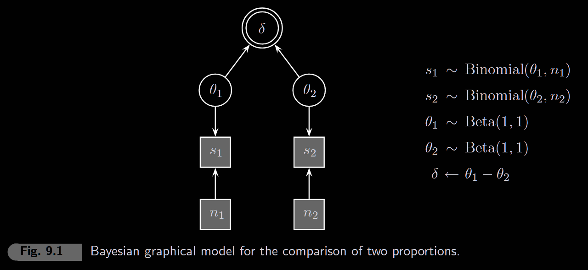
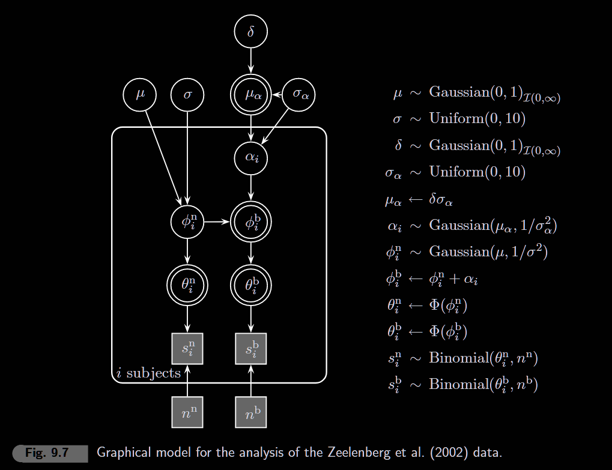

```{r setup, include=FALSE}
knitr::opts_chunk$set(echo = TRUE, warning = FALSE, message = FALSE)
```

```{r}
library(rjags)
library(coda)
library(ggplot2)
library(tidyverse)
library(patchwork)
library(polspline)
```

------------------------------------------------------------------------

# 9.1 Equality of Proportions

**Question**: Do two groups have the same success rate? (Pledgers data)

This is the binomial equivalent of the two-sample t-test — comparing two proportions.

```{r}
# Pledgers data
# Group 1: People who made a public pledge
# Group 2: People who did not pledge
s1 <- 424   # successes in group 1
n1 <- 777   # total in group 1
s2 <- 5416  # successes in group 2
n2 <- 9072  # total in group 2

# Proportions
p1 <- s1 / n1
p2 <- s2 / n2

cat("Group 1 (pledgers):     ", s1, "/", n1, "=", round(p1, 3), "\n")
cat("Group 2 (non-pledgers): ", s2, "/", n2, "=", round(p2, 3), "\n")
cat("Difference (p1 - p2):   ", round(p1 - p2, 3), "\n")
cat("\nFrequentist prop.test p-value:",
    round(prop.test(c(s1, s2), c(n1, n2))$p.value, 5))
```

### Model

Test H₀: θ₁ = θ₂ (δ = 0) vs H₁: θ₁ ≠ θ₂ (δ ≠ 0)



```{r}
model_string <- "
model {
  # Data
  s1 ~ dbin(theta1, n1)
  s2 ~ dbin(theta2, n2)
  
  # Priors
  theta1 ~ dbeta(1, 1)
  theta2 ~ dbeta(1, 1)
  delta <- theta1 - theta2
  
  # Prior Sampling 
  theta1prior ~ dbeta(1,1) 
  theta2prior ~ dbeta(1,1) 
  deltaprior <- theta1prior - theta2prior 
}
"
```

```{r eval=FALSE}
# Run the model
model <- jags.model(
  textConnection(model_string),
  data = list(s1 = s1, s2 = s2, n1 = n1, n2 = n2),
  n.chains = 4
)

update(model, 1000)

samples <- coda.samples(
  model,
  variable.names = c("theta1", "theta2", "delta", "deltaprior"),
  n.iter = 10000
)
```

### Analytical Bayes Factor

For this special case (uniform priors on both rates), the BF has a closed-form solution:

$$BF_{01} = \frac{\binom{n_1}{s_1}\binom{n_2}{s_2}}{\binom{n_1+n_2}{s_1+s_2}} \cdot \frac{(n_1+1)(n_2+1)}{n_1+n_2+1}$$

```{r eval=FALSE}
# Posterior analysis + Savage-Dickey + Comparison
# (Run this AFTER the MCMC model chunk above)
posterior_df <- as.data.frame(as.matrix(samples))

# Savage-Dickey with bounds (delta is between -1 and 1)
fit_posterior <- logspline(posterior_df$delta, lbound = -1, ubound = 1)
fit_prior <- logspline(posterior_df$deltaprior, lbound = -1, ubound = 1)

posterior_at_0 <- dlogspline(0, fit_posterior)
prior_at_0 <- dlogspline(0, fit_prior)  # should be ~1 (triangular peak)

BF01_sd <- posterior_at_0 / prior_at_0

# Analytical BF (exact solution)
log_BF01 <- lchoose(n1, s1) + lchoose(n2, s2) - lchoose(n1 + n2, s1 + s2) +
            log(n1 + 1) + log(n2 + 1) - log(n1 + n2 + 1)
BF01_analytical <- exp(log_BF01)

# Compare methods
cat("--- Comparison ---\n")
cat("Analytical BF01:    ", round(BF01_analytical, 4), "\n")
cat("Savage-Dickey BF01: ", round(BF01_sd, 4), "\n")
cat("Difference:         ", round(abs(BF01_analytical - BF01_sd), 4), "\n")
```

```{r eval=FALSE}
# Visualize prior vs posterior for delta
ggplot(data.frame(x = c(-1, 1)), aes(x = x)) +
  # Triangular prior
  stat_function(fun = function(x) 1 - abs(x),
                aes(color = "Prior"), linewidth = 1) +
  # Posterior from logspline
  stat_function(fun = function(x) dlogspline(x, fit_posterior),
                aes(color = "Posterior"), linewidth = 1) +
  geom_vline(xintercept = 0, linetype = "dashed") +
  geom_point(aes(x = 0, y = posterior_at_0), size = 3, color = "steelblue") +
  geom_point(aes(x = 0, y = prior_at_0), size = 3, color = "coral") +
  scale_color_manual(values = c("Prior" = "coral", "Posterior" = "steelblue")) +
  theme_minimal() +
  labs(title = "Savage-Dickey: Comparing Proportions",
       subtitle = paste("BF01 =", round(BF01, 2), "| BF10 =", round(1/BF01, 2)),
       x = "δ = θ1 - θ2", y = "Density", color = "")
```

------------------------------------------------------------------------

# 9.3 Comparing Within-Subject Proportions 

**Question:** Does studying "both" items improve recall compared to studying "neither"? (Within-subjects design)

Unlike 9.1 (between-subjects), here **each participant** is tested under both conditions.

```{r}
# Zeelenberg data: 74 subjects, each recalled items from two conditions
# sb = "Study Both" condition (number correct out of 21)
# sn = "Study Neither" condition (number correct out of 21)

sb <- c(15,11,15,14,15,18,16,16,18,16,15,13,18,12,11,13,17,18,16,11,17,18,12,18,18,14,21,18,17,10,
        11,12,16,18,17,15,19,12,21,15,16,20,15,19,16,16,14,18,16,19,17,11,19,18,16,16,11,19,18,12,
        15,18,20,8,12,19,16,16,16,12,18,17,11,20)

sn <- c(15,12,14,15,13,14,10,17,13,16,16,10,15,15,10,14,17,18,19,12,19,18,10,18,16,13,15,20,13,15,
        13,14,19,19,19,18,13,12,19,16,14,17,15,16,15,16,13,15,14,19,12,11,17,13,18,13,13,19,18,13,
        13,16,18,14,14,17,12,12,16,14,16,18,13,13)

nb <- 21  # max items per condition
nn <- 21
ns <- length(sb)  # number of subjects

cat("Number of subjects:", ns, "\n")
cat("Items per condition:", nb, "\n\n")
cat("Study Both - Mean:", round(mean(sb), 2), "SD:", round(sd(sb), 2), "\n")
cat("Study Neither - Mean:", round(mean(sn), 2), "SD:", round(sd(sn), 2), "\n")
cat("Mean difference:", round(mean(sb - sn), 2), "\n")
cat("\nPaired t-test p-value:", round(t.test(sb, sn, paired = TRUE)$p.value, 4))
```

### Model Structure

This is a **hierarchical model** with:

\- Each subject has their own rate parameters (θᵦ, θₙ)

\- Probit link: θ = Φ(φ) where Φ is the normal CDF

\- Effect size δ \> 0 (order-restricted: we predict "Both" \> "Neither")

\- Half-normal prior on δ



```{r}
model_string_zeelenberg <- "
model {
  # Data
  
  # Priors
  mu ~ dnorm(0, 1)T(0, )
  sigma ~ dunif(0, 10)
  delta ~ dnorm(0, 1)T(0, )
  
  sigmaalpha ~ dunif(0, 10)
  
  mualpha <- delta * sigmaalpha
  
  for (i in 1:ns) {
    alpha[i] ~ dnorm(mualpha, sigmaalpha^(-2))
    
    phi_n[i] ~ dnorm(mu, sigma^(-2))
    phi_b[i] <- phi_n[i] + alpha[i]
    
    theta_n[i] <- phi(phi_n[i])
    theta_b[i] <- phi(phi_b[i])
    
    # Data
    sn[i] ~ dbin(theta_n[i], nn)
    sb[i] ~ dbin(theta_b[i], nb)
  }
  
  # Sampling from Prior Distribution for Delta 
  deltaprior ~ dnorm(0,1)I(0,)
}
"
```

```{r eval=FALSE}
# Run the hierarchical model
model_z <- jags.model(
  textConnection(model_string_zeelenberg),
  data = list(sb = sb, sn = sn, nb = nb, nn = nn, ns = ns),
  n.chains = 4
)

update(model_z, 1000)

samples_z <- coda.samples(
  model_z,
  variable.names = c("delta", "deltaprior"),
  n.iter = 10000
)
```

```{r eval=FALSE}
# Savage-Dickey for order-restricted test (δ > 0)
posterior_df_z <- as.data.frame(as.matrix(samples_z))

fit_posterior_z <- logspline(posterior_df_z$delta, lbound = 0)

posterior_at_0_z <- dlogspline(0, fit_posterior_z)
prior_at_0_z <- 2 * dnorm(0)  # half-normal prior, doubled at 0

BF01_z <- posterior_at_0_z / prior_at_0_z
cat("Zeelenberg BF01 =", round(BF01_z, 3), "\n")
cat("Zeelenberg BF10 =", round(1/BF01_z, 3), "(evidence for δ > 0)\n")
```

```{r eval=FALSE}
# Visualize prior vs posterior
ggplot(data.frame(x = c(0, 4)), aes(x = x)) +
  # Half-normal prior
  stat_function(fun = function(x) 2 * dnorm(x),
                aes(color = "Prior (δ > 0)"), linewidth = 1) +
  # Posterior
  stat_function(fun = function(x) dlogspline(x, fit_posterior_z),
                aes(color = "Posterior"), linewidth = 1) +
  geom_vline(xintercept = 0, linetype = "dashed") +
  geom_point(aes(x = 0, y = posterior_at_0_z), size = 3, color = "steelblue") +
  geom_point(aes(x = 0, y = prior_at_0_z), size = 3, color = "coral") +
  scale_color_manual(values = c("Prior (δ > 0)" = "coral", "Posterior" = "steelblue")) +
  theme_minimal() +
  labs(title = "Zeelenberg: Order-Restricted Test (δ > 0)",
       subtitle = paste("BF01 =", round(BF01_z, 2), "| BF10 =", round(1/BF01_z, 2)),
       x = "Effect size (δ)", y = "Density", color = "")
```

------------------------------------------------------------------------
